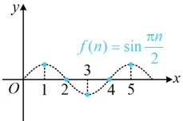
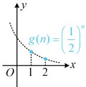
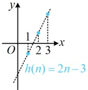
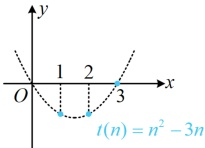

A.  $ a_{n}=\sin\frac{\pi n}{2} $ B.  $ a_{n}=\left(\frac{1}{2}\right)^{n} $ C.  $ a_{n}=2n-3 $ D.  $ a_{n}=n^{2}-3n $

解析：观察选项发现四个数列的图象均容易画出，故可考虑画图分析数列的单调性，

A 项，对于  $ y = \sin \frac{\pi x}{2} $， $ \omega = \frac{\pi}{2} $，所以其周期  $ T = \frac{2\pi}{\omega} = 4 $，所以  $ f(n) = \sin \frac{\pi n}{2} $ 的部分图象如图 1，

由图 1 可知数列  $ \{a_n\} $ 不是递增数列，故 A 项错误；

B 项， $ y=\left(\frac{1}{2}\right)^x $ 在  $ \mathbb{R} $ 上  $ \searrow $，所以  $ g(n)=\left(\frac{1}{2}\right)^n $ 的图象如图 2，数列  $ \{a_n\} $ 是递减数列，故 B 项错误；

C 项， $ y=2x-3 $ 在  $ \mathbb{R} $ 上  $ \nearrow $，所以  $ h(n)=2n-3 $ 的图象如图 3，从而数列  $ \{a_n\} $ 是递增数列，故 C 项正确；

D 项， $ y=x^2-3x $ 是开口向上，对称轴为  $ x=\frac{3}{2} $ 的二次函数，所以  $ t(n)=n^2-3n $ 的图象如图 4，

从而  $ t(1)=t(2) $。即  $ a=a $，故数列  $ \{a_n\} $ 不是递增数列，故 D 项错误

从而  $ t(1)=t(2) $，即  $ a_{1}=a_{2} $，故数列  $ \{a_{n}\} $ 不是递增数列，故 D 项错误.

图2

图3

图4

答案：C

【反思】若已知数列$\{a_n\}$的通项公式且容易画出数列的图象，则可考虑通过画图判断数列的单调性；若不方便画出数列的图象，则常用作差法或作商法证明数列的单调性，我们来看下面的变式1.

【变式1】已知在数列$\{a_n\}$中，$0 < a_n < 1 (n \in \mathbb{N}^*)$，$a_{n+1} = \frac{na_n + a_n^2}{n+1}$，求证：$\{a_n\}$是单调递减数列。

证法1：（要证$\{a_n\}$是单调递减数列，只需证$a_{n+1}<a_n$，即证$a_{n+1}-a_n<0$，题干给出了$a_{n+1}$与$a_n$的递推关系，可将该关系代入，消去$a_{n+1}$，化简证明）

由题意，$a_{n+1}-a_n=\frac{na_n+a_n^2}{n+1}-a_n=\frac{na_n+a_n^2-(n+1)a_n}{n+1}=\frac{a_n^2-a_n}{n+1}=\frac{a_n(a_n-1)}{n+1}$，

因为  $ 0 < a_{n} < 1 $，所以  $ \frac{a_{n}(a_{n}-1)}{n+1} < 0 $，从而  $ a_{n+1} - a_{n} < 0 $，故  $ a_{n+1} < a_{n} $，所以  $ \{a_{n}\} $ 是单调递减数列.

证法2：（由题设条件不难发现 $ \{a_{n}\} $是正项数列，于是也可考虑作商比较，即通过证明 $ \frac{a_{n+1}}{a_{n}}<1 $来证 $ a_{n+1}<a_{n} $，观察发现由所给递推关系式刚好也容易构造出 $ \frac{a_{n+1}}{a_{n}} $这一结构，故按此处理）

由题意， $ a_{n+1}=\frac{na_n+a_n^2}{n+1} $，所以 $ \frac{a_{n+1}}{a_n}=\frac{n+a_n}{n+1} $，因为 $ 0<a_n<1 $，所以 $ n+a_n<n+1 $，且 $ n+a_n $和 $ n+1 $都是正数，所以 $ 0<\frac{n+a_n}{n+1}<1 $，从而 $ 0<\frac{a_{n+1}}{a_n}<1 $，故 $ a_{n+1}<a_n $，所以 $ \{a_n\} $是单调递减数列.

【变式 2】数列 $\{a_n\}$ 中，$a_n = n^2 - kn (n \in \mathbf{N}^*)$，且 $\{a_n\}$ 为单调递增数列，则 $k$ 的取值范围是（ ）

A. $(-\infty, 2]$ B. $(-\infty, 3)$ C. $(-\infty, 2)$ D. $(-\infty, 3]$

解法1：数列$\{a_n\}$的通项公式已知，差值$a_{n+1} - a_n$容易计算与分析，故可考虑作差处理，因为$a_n = n^2 - kn$，所以$a_{n+1} = (n+1)^2 - k(n+1)$，故$a_{n+1} - a_n = (n+1)^2 - k(n+1) - (n^2 - kn) = 2n + 1 - k$，