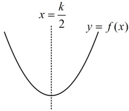
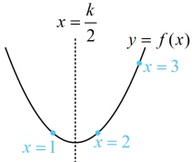
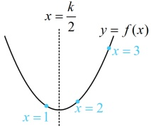
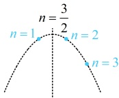

又 $\{a_n\}$ 为单调递增数列，所以 $a_{n+1} - a_n > 0$ 对任意的 $n \in \mathbb{N}^*$ 恒成立，故 $2n+1 - k > 0$ 恒成立，上述不等式中的 $k$ 是孤立的，容易分离出来，故先分离，再作分析，所以 $k < 2n+1$ 对任意的 $n \in \mathbb{N}^*$ 恒成立，从而 $k < (2n+1)_{\min} = 3$，故 $k$ 的取值范围是 $(-\infty, 3)$。

解法2：观察发现数列$\{a_n\}$的通项公式是关于$n$的二次函数，容易画图，故也可考虑画图分析$\{a_n\}$的单调性。

二次函数$f(x)=x^2-kx$的草图如图1，因为$a_n=f(n)$，所以要使$\{a_n\}$为单调递增数列，

则对称轴$x=\frac{k}{2}$的临界状态如图2，此时$\frac{k}{2}=\frac{3}{2}$，$k=3$，将对称轴$x=\frac{k}{2}$在图2的基础上往左移动，

可以满足$f(1)<f(2)<f(3)<\cdots$，即$\{a_n\}$为单调递增数列，如图3，所以$\frac{k}{2}<\frac{3}{2}$，故$k<3$。

图1

图2

图3

答案：B

【例 16】已知数列 $\{a_n\}$ 的通项公式 $a_n = -n^2 + 3n + \frac{3}{4}$，则数列 $\{a_n\}$ 的最大值是（ ）

A. 3

B. 2

C. $\frac{11}{4}$

D. $\frac{3}{4}$

解析：$\{a_n\}$ 的通项公式对应的是二次函数，故可直接画图分析单调性，从而求出最值，令 $f(n) = -n^2 + 3n + \frac{3}{4}$，其开口向下，且对称轴为 $n = \frac{3}{2}$，如图，有 $f(1) = f(2) > f(3) > f(4) > \cdots$，所以当 $n=1$ 或 $n=2$ 时，$f(n)$ 取最大值，且最大值为 $f(1) = -1^2 + 3 \times 1 + \frac{3}{4} = \frac{11}{4}$，即数列 $\{a_n\}$ 的最大值是 $\frac{11}{4}$。

答案：C

【反思】求数列的最大（小）项，常先分析数列的单调性，本题是通过画图分析单调性，有时也会遇到不好画图的情况，我们再来看一个变式.

【变式】已知数列$\{a_n\}$的通项公式为$a_n=\frac{2n-5}{2^n}$，求数列$\{a_n\}$的最大项。

解法1：（虽然 $ \{a_{n}\} $的通项公式已知，但不易画图，可考虑通过作差研究单调性）

因为 $ a_n = \frac{2n-5}{2^n} $，所以 $ a_{n+1} = \frac{2(n+1)-5}{2^{n+1}} $，故 $ a_{n+1} - a_n = \frac{2(n+1)-5}{2^{n+1}} - \frac{2n-5}{2^n} = \frac{2(n+1)-5 - 2(2n-5)}{2^{n+1}} = \frac{7-2n}{2^{n+1}} $，当 $ 1 \le n \le 3 $时， $ 7-2n > 0 $，所以 $ a_{n+1} > a_n $，此时 $ \{a_n\} $单调递增，所以 $ a_1 < a_2 < a_3 < a_4 $，当 $ n \ge 4 $时， $ 7-2n < 0 $，所以 $ a_{n+1} < a_n $，此时 $ \{a_n\} $单调递减，所以 $ a_4 > a_5 > a_6 > \cdots $，所以 $ a_1 < a_2 < a_3 < a_4 > a_5 > a_6 > \cdots $，故数列 $ \{a_n\} $的最大项为 $ a_4 = \frac{2 \times 4 - 5}{2^4} = \frac{3}{16} $。

解法2：（可以想象，数列 $ \{a_{n}\} $的最大项必定不小于它的前一项和后一项，故也可抓住这一特征建立不等式组并