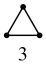
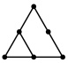
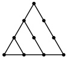
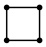
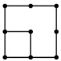
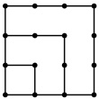
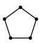
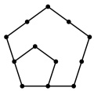
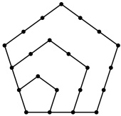

### 7. （2025·湖北期中）

传说古希腊毕达哥拉斯学派的数学家用沙粒和小石子来研究数，他们根据沙粒或小石子所排列的形状把数分成许多类，如图中第一行的1，3，6，10称为三角形数，第二行的1，4，9，16称为正方形数，第三行的1，5，12，22称为五边形数，则正方形数、五边形数所构成的数列的第5项分别为（）

6

10

4

9

16

5

A. 24, 34 B. 25, 35 C. 25, 34 D. 24, 35

12

22

8.（2025·河北期末）

在数列 $\{a_n\}$ 中，$a_1=0$，$a_{n+1}=a_n+\ln\left(1+\frac{1}{n}\right)$，则 $\{a_n\}$ 的通项公式为（ ）

A. $a_n=\ln n$          B. $a_n=(n-1)\ln(n+1)$

C. $a_n=n\ln n$        D. $a_n=\ln n+n-1$

9. (2025·云南期末)

在数列 $ \{a_{n}\} $中，若 $ a_{1}=3 $， $ a_{n}=n(a_{n+1}-a_{n}) $，则666是 $ \{a_{n}\} $的（）

A. 第111项 B. 第222项

C. 第333项 D. 第666项