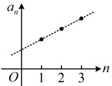
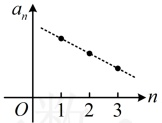
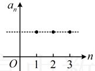

## 知识点 4：等差数列与一次函数的关系

### 1. 等差数列与一次函数

由知识点 3 可知  $ a_n = dn + (a_1 - d) $，当  $ d \ne 0 $ 时，等差数列  $ \{a_n\} $ 的第  $ n $ 项  $ a_n $ 是一次函数  $ f(x) = dx + (a_1 - d) $ 在  $ x = n $ 处的函数值，即  $ a_n = f(n) $，故从图象上看，表示数列  $ \{a_n\} $ 的各点  $ (n, f(n)) $ 均匀分布在直线  $ y = dx + (a_1 - d) $ 上。

### 2. 等差数列的单调性

由等差数列和一次函数的关系可知等差数列的单调性

受公差 d 的影响.

当 d > 0 时，如图 1，数列  $ \{a_{n}\} $ 为递增数列；

当 d < 0 时，如图 2，数列  $ \{a_{n}\} $ 为递减数列；

当 d = 0 时，如图 3，数列  $ \{a_{n}\} $ 为常数列.

图1

图2

图3

## 知识点 5：等差数列的性质

若数列 $\{a_n\}$ 是公差为 $d$ 的等差数列，由等差数列的定义可得 $\{a_n\}$ 具有如下性质：

① $a_p = a_q + (p-q)d(p,q \in \mathbb{N}^*)$，$d = \frac{a_p - a_q}{p-q} (p \ne q)$，其中 $a_p$ 与 $a_q$ 是等差数列 $\{a_n\}$ 中的任意两项。

②若  $ m+n=p+q $，则  $ a_m + a_n = a_p + a_q $（ $ m,n,p,q \in \mathbb{N}^* $）。

特别地，若  $ m+n=2p $，则  $ a_m + a_n = 2a_p $。

③下标成等差数列的项  $ a_k $， $ a_{k+m} $， $ a_{k+2m} $，… 组成以  $ md $ 为公差的等差数列。特别地，数列  $ \{a_n\} $ 中所有的偶数项构成的数列  $ \{a_{2n}\} $ 或所有的奇数项构成的数列  $ \{a_{2n-1}\} $ 都是公差为  $ 2d $ 的等差数列。

④数列 $ \{ta_{n}+\lambda\}(t,\lambda $是常数 $ ) $是公差为td的等差数列.

所以 $ a_{n}=a_{1}+(n-1)d=20+(n-1)\times(-9) $

=29-9n.

答案：a=29-9n

【例4】若公差为-3的等差数列 $ \{a_{n}\} $

满足 $ a_{1}=3 $，a_{n}=-18，则n=（ ）

A. 7 B. 8 C. 9 D. 10

解析：由题意，$\{a_n\}$ 的公差 $d = -3$，

则 $a_n = a_1 + (n-1)d = 3 + (n-1) \cdot (-3)$

$= 6 - 3n$，又 $a_n = -18$，所以 $6 - 3n = -18$，

解得：$n = 8$。

答案：B

【例 5】在数列 $\{a_n\}$ 中，已知 $a_1 = 2$，$a_{n+1} - a_n = 1$ ($n \in \mathbb{N}^*$)，则 $a_{100} = $___。

解析：由 $a_{n+1} - a_n = 1$ 可知 $\{a_n\}$ 是公差 $d = 1$ 的等差数列，所以 $a_n = a_1 + (n-1)d$

$= 2 + (n-1) = n + 1$，故 $a_{100} = 100 + 1 = 101$。

答案：101

## 知识点5

【例6】在等差数列 $ \{a_{n}\} $中， $ a_{7}+a_{8}=16 $，则 $ a_{2}+a_{13}= $（）

A. 12 B. 16 C. 20 D. 24

解析：因为 $ 7+8=2+13 $，所以根据知识点5的性质②可知， $ a_{2}+a_{13}=a_{7}+a_{8}=16 $。

答案：B

【例 7】已知等差数列 $\{a_n\}$ 中，$a_2=1$，$a_5=7$，则公差 $d=$___.

解析：由知识点5的性质①可知，

 $ d=\frac{a_{5}-a_{2}}{5-2}=\frac{7-1}{3}=2 $

答案：2