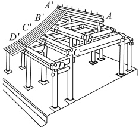
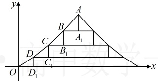

## C组 拓展提升

### 17. （2022·新课标Ⅱ卷）

图1 是中国古代建筑中的举架结构， $ AA^{\prime} $， $ BB^{\prime} $， $ CC^{\prime} $， $ DD^{\prime} $ 是桁，相邻桁的水平距离称为步，垂直距离称为举，图2 是某古代建筑屋顶截面的示意图。其中  $ DD_{1} $， $ CC_{1} $， $ BB_{1} $， $ AA_{1} $ 是举， $ OD_{1} $， $ DC_{1} $， $ CB_{1} $， $ BA_{1} $ 是相等的步，相邻桁的举步之比分别为  $ \frac{DD_{1}}{OD_{1}}=0.5 $， $ \frac{CC_{1}}{DC_{1}}=k_{1} $， $ \frac{BB_{1}}{CB_{1}}=k_{2} $， $ \frac{AA_{1}}{BA_{1}}=k_{3} $。已知  $ k_{1} $， $ k_{2} $， $ k_{3} $ 成公差为 0.1 的等差数列，且直线 OA 的斜率为 0.725，则  $ k_{3}= $（ ）

A. 0.75 B. 0.8 C. 0.85 D. 0.9

图1

图2

### 18. （2025·广东深圳模拟（节选））

设正项数列 $\{a_n\}$ 的前 $n$ 项和为 $S_n$，满足 $2S_n = a_n + \frac{1}{a_n} (n \in \mathbb{N}^*)$，求证：数列 $\left\{a_n^2 + \frac{1}{a_n^2}\right\}$ 为等差数列，并求该数列的通项公式。