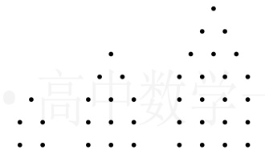
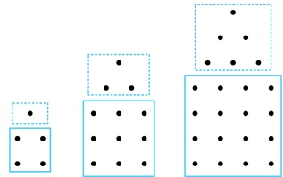

第（2）小问中正负号交替出现的情况除了用 $ (-1)^n $或 $ (-1)^{n+1} $表示外，也可用 $ \cos n\pi $或 $ \cos(n+1)\pi $表示，那么第（2）小问中数列 $ \{a_n\} $的通项公式也可写成 $ a_n=(2n-1)\cos(n+1)\pi $。

【变式1】已知数列 $ \frac{1}{1} $， $ \frac{2}{1} $， $ \frac{1}{2} $， $ \frac{3}{1} $， $ \frac{2}{2} $， $ \frac{1}{3} $， $ \frac{4}{1} $， $ \frac{3}{2} $， $ \frac{2}{3} $， $ \frac{1}{4} $，…，则该数列的第17项 $ a_{17}= $___。

解析：经尝试，每个数之间的整体规律不易表示，可尝试分别找分子、分母的规律，以分母为例，观察发现可按(1)，(1,2)，(1,2,3)，(1,2,3,4)，… 来分组，则第 $n$ 组即为 $(1,2,\cdots,n)$，相应的分子即为 $(n,n-1,\cdots,2,1)$，该数列可以分组为 $\left(\frac{1}{1}\right)$，$\left(\frac{2}{1},\frac{1}{2}\right)$，$\left(\frac{3}{1},\frac{2}{2},\frac{1}{3}\right)$，$\left(\frac{4}{1},\frac{3}{2},\frac{2}{3},\frac{1}{4}\right)$，…，

要求 $a_{17}$，需先找到该数列的第17项在第几组，通过简单预估，可尝试算一算前5组和前6组共几项，因为第 $n$ 组有 $n$ 个数，所以前5组共 $1+2+3+4+5=15$ 个数，前6组共 $1+2+3+4+5+6=21$ 个数，所以该数列的第17项是第6组 $\left(\frac{6}{1},\frac{5}{2},\frac{4}{3},\frac{3}{4},\frac{2}{5},\frac{1}{6}\right)$ 的第2个数，故 $a_{17}=\frac{5}{2}$。

答案： $ \frac{5}{2} $

【变式2】如果数列1，5，12，22，…中的每一项都可用如图所示的图形表示出来，那么这个数列的第8项为（）

A. 70 B. 92 C. 105 D. 118

解法1：题干给出了数列的前4项，可考虑从中寻找规律，但经尝试，直接从给的4项找规律不易，怎么办呢？

仔细观察会发现，将相邻两项作差，差值有明显的规律，故按此分析，

记所给数列为$\{a_n\}$，则$a_2 - a_1 = 4$，$a_3 - a_2 = 7$，$a_4 - a_3 = 10$，

以此类推，$a_5 - a_4 = 13$，$a_6 - a_5 = 16$，$a_7 - a_6 = 19$，$a_8 - a_7 = 22$，

$a_8$出现了，怎样求它？要依次求出$a_5$，$a_6$，$a_7$，再求$a_8$吗？这样做可行，但偏麻烦，观察发现把前面的7个

式子相加，就能抵消诸多项，余下$a_8$，故按此处理，简化计算，

将前面得到的7个式子相加得$(a_2 - a_1) + (a_3 - a_2) + (a_4 - a_3) + (a_5 - a_4) + (a_6 - a_5) + (a_7 - a_6) + (a_8 - a_7) =$

$4 + 7 + 10 + 13 + 16 + 19 + 22$，化简得：$a_8 - a_1 = 91$，所以$a_8 = a_1 + 91 = 92$。

解法2：题干也给了该数列的图形表示，故可尝试从图形寻找规律。如图，对于每个图形，整体观察不易看出规律，但若将图形（从第2个图开始）分割成上面的“三角形”和下面的“正方形”，规律就比较明显了，如图，第2个图由上面的1个圆点和下面的2×2=4个圆点构成，第3个图由上面的1+2=3个圆点和下面的3×3=9个圆点构成，第4个图由上面的1+2+3=6个圆点和下面的4×4=16个圆点构成，以此类推，第8个图由上面的1+2+3+4+5+6+7=28个圆点和下面的8×8=64个圆点构成，所以第8个图的圆点个数为28+64=92，即原数列的第8项为92。

答案：B