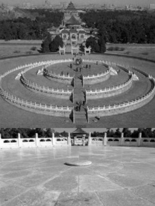

又  $ S_{2}=4 $， $ S_{4}=16 $，所以  $ S_{4}-S_{2}=16-4=12 $，故上述等差数列是4，12，20，28，怎样求  $ S_{8} $？观察发现把  $ S_{2} $， $ S_{4}-S_{2} $， $ S_{6}-S_{4} $， $ S_{8}-S_{6} $ 相加，即可得到  $ S_{8} $，所以  $ S_{8}=S_{2}+S_{4}-S_{2}+S_{6}-S_{4}+S_{8}-S_{6}=4+12+20+28=64 $。

答案：C

【反思】若条件和所求涉及的前n项和的下标都是常数k的倍数，则常考虑利用片段和性质处理。本题下标的倍数关系比较明显，有时这一特征是隐藏在题干中的，这就需要我们自己去发现，比如下面的变式。

【变式】（2020·新课标Ⅱ卷）北京天坛的圜丘坛为古代祭天的场所，分上、中、下三层。上层中心有一块圆形石板（称为天心石）。环绕天心石砌9块扇面形石板构成第一环，向外每环依次增加9块，下一层的第一环比上一层的最后一环多9块，向外每环依次也增加9块，已知每层环数相同，且下层比中层多729块，则三层共有扇面形石板（不含天心石）（）

A. 3699 块 B. 3474 块 C. 3402 块 D. 3339 块

解析：先把文字信息翻译成数列问题，建立数学模型，

由题意，可设上层从内到外每一环的扇形石板块数分别为  $ a_1, a_2, \cdots, a_m $，中层分别为  $ a_{m+1}, a_{m+2}, \cdots, a_{2m} $，下层分别为  $ a_{2m+1}, a_{2m+2}, \cdots, a_{3m} $，则  $ a_1, a_2, \cdots, a_{3m} $ 构成首项  $ a_1 = 9 $，公差  $ d = 9 $ 的等差数列，设  $ \{a_n\} $ 的前  $ n $ 项和为  $ S_n $，

注意到上、中、下三层扇形石板块数之和分别为  $ S_{im} $， $ S_{2m} - S_m $， $ S_{3m} - S_{2m} $，故想到等差数列片段和性质，

因为  $ \{a_n\} $ 是等差数列，所以  $ S_m $， $ S_{2m} - S_m $， $ S_{3m} - S_{2m} $ 构成公差为  $ m^2 d $ 的等差数列，

因为下层比中层多 729 块，所以  $ (S_{3m} - S_{2m}) - (S_{2m} - S_m) = m^2 \times 9 = 729 $，故  $ m = 9 $，

于是每层有 9 环，三层共有 27 环，代等差数列前  $ n $ 项和公式即可求得问题答案，

所以三层共有扇面形石板的块数为  $ S_{27} = 27 \times 9 + \frac{27 \times 26}{2} \times 9 = 3402 $。

答案：C

【例9】已知等差数列 $ \{a_{n}\} $的前n项和为 $ S_{n} $，且 $ \frac{S_{5}}{5}-\frac{S_{2}}{2}=6 $，则 $ a_{7}-a_{4}= $（）

A. 9 B. 10 C. 11 D. 12

解法1：已知和所求的直接联系不明显，但它们都容易用公式翻译，故可考虑直接代公式处理，由题意， $ \frac{S_5}{5} - \frac{S_2}{2} = \frac{1}{5}\left(5a_1 + \frac{5 \times 4}{2}d\right) - \frac{1}{2}(2a_1 + d) = \frac{3}{2}d = 6 $，所以 $ d = 4 $，故 $ a_7 - a_4 = 3d = 12 $。

解法2：出现了 $ \frac{S_n}{n} $这一结构，联想到数列 $ \left\{\frac{S_n}{n}\right\} $是公差为 $ \frac{d}{2} $的等差数列，由此可快速求解，

设 $ \{a_n\} $的公差为 $ d $，因为 $ \{a_n\} $为等差数列，且 $ S_n $为其前 $ n $项和，所以 $ \left\{\frac{S_n}{n}\right\} $是公差为 $ \frac{d}{2} $的等差数列，

所以 $ \frac{S_5}{5}-\frac{S_2}{2}=(5-2)\times\frac{d}{2}=6 $，解得： $ d=4 $，所以 $ a_7-a_4=3d=3\times4=12 $。

答案：D

【反思】若等差数列的前 $n$ 项和为 $S_n$，则数列 $\left\{\frac{S_n}{n}\right\}$ 是首项为 $a_1$，公差为 $\frac{d}{2}$ 的等差数列，这个结论在小题中可直接使用，若大题涉及该结论，可用 $S_n = na_1 + \frac{n(n-1)}{2}d$ 进行推导。