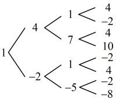

解：（1）（条件给出  $ S_n $ 与  $ a_n $ 混搭的关系式，要求  $ a_n $，可考虑退  $ n $ 相减，消去  $ S_n $，下面我们先通过赋值求  $ q $）

在  $ \frac{S_n}{a_n} = pn + q $ 中令  $ n=1 $ 可得  $ \frac{S_1}{a_1} = p + q $，又因为  $ S_1 = a_1 $ 且  $ p=1 $，所以  $ 1=1+q $，解得： $ q=0 $，

所以  $ \frac{S_n}{a_n} = pn + q $ 即为  $ \frac{S_n}{a_n} = n $，从而  $ S_n = na_n $，故当  $ n \geq 2 $ 时， $ S_{n-1} = (n-1)a_{n-1} $，

两式作差得： $ S_n - S_{n-1} = a_n = na_n - (n-1)a_{n-1} $，整理得： $ (n-1)(a_n - a_{n-1}) = 0 (n \geq 2) $，所以  $ a_n - a_{n-1} = 0 $，

从而  $ a_n = a_{n-1} $，故数列  $ \{a_n\} $ 为常数列，所以  $ a_n = a_1 = 2025 $。

（2）（求 $p$，$q$ 的值考虑建立关于 $p$，$q$ 的方程，如何建立？条件 $\frac{S_n}{a_n} = pn + q$ 涉及 $S_n$ 和 $a_n$，可考虑代公式系比较系数）设 $\{a_n\}$ 的公差为 $d$，则 $S_n = na_1 + \frac{n(n-1)d}{2} = \frac{d}{2}n^2 + \left(a_1 - \frac{d}{2}\right)n$，$a_n = a_1 + (n-1)d = dn + a_1 - d$，由题意，$\frac{S_n}{a_n} = pn + q$，所以 $S_n = (pn + q)a_n$，从而 $\frac{d}{2}n^2 + \left(a_1 - \frac{d}{2}\right)n = (pn + q)(dn + a_1 - d)$，故 $\frac{d}{2}n^2 + \left(a_1 - \frac{d}{2}\right)n = pdn^2 + [(a_1 - d)p + qd]n + q(a_1 - d)$，所以 $\begin{cases} \frac{d}{2} = pd \\ a_1 - \frac{d}{2} = (a_1 - d)p + qd \end{cases}$ ①，$q(a_1 - d) = 0$ ③

（观察发现式①和式③最好处理，故任选其一出发分析，不妨选择式①）

由①可知 $d=0$ 或 $\begin{cases} d \neq 0 \\ p=\dfrac{1}{2} \end{cases}$，若 $d=0$，则分别代入②③可得 $\begin{cases} a_1 = a_1 p \\ q a_1 = 0 \end{cases}$，解得：$a_1 = 0$ 或 $\begin{cases} p = 1 \\ q = 0 \end{cases}$，

因为 $a_1 = 0$ 不满足 $\{a_n\}$ 为正项数列，所以舍去，故 $p = 1$，$q = 0$；

若 $\begin{cases} d \neq 0 \\ p = \dfrac{1}{2} \end{cases}$，则分别代入②③化简得：$\begin{cases} a_1 = 2qd & \textcircled{4} \\ q(a_1 - d) = 0 & \textcircled{5} \end{cases}$，

因为 $a_1 > 0$，所以由④可得 $q \neq 0$，故式⑤可化为 $d = a_1$，代入④得 $a_1 = 2qa_1$，解得：$q = \dfrac{1}{2}$；

综上所述，$p = 1$，$q = 0$ 或 $p = q = \dfrac{1}{2}$。

## 类型VI：等差数列有关的新定义问题

【例 13】任取数列 $\{a_n\}$ 中相邻的两项，若这两项之差的绝对值为 3，则称数列 $\{a_n\}$ 具有“P 性质”。已知具有“P 性质”的数列 $\{a_n\}$ 共有 $n$ 项，且所有项之和为 $S_n$。

（1）若 n=4，且  $ a_{1}=1 $， $ a_{4}=4 $，求  $ S_{4} $ 的所有可能值；

（2）若 $ a_{1}=2025 $，n=675，且 $ a_{k}>a_{k+1}(k=1,2,\cdots,674) $恒成立，求 $ a_{675} $；

（3）若 $ a_{1}=1,\quad n\geq2,\quad S_{n}=0 $，证明： $ n^{2}+n $能被4整除.

解：（1）（由题设条件，具有“P性质”的数列 $ a_n $应满足 $ \left|a_n - a_{n-1}\right| = 3(n \geq 2) $，由此结合 $ a_1 = 1 $可画出接下来3项的树状图，再看哪些满足 $ a_1 = 4 $即可）

如图，满足 $ n = 4 $， $ a_1 = 1 $， $ a_4 = 4 $，且具有“P性质”的数列有1，4，1，4，或1，4，7，4，或1，-2，1，4，所以 $ S_4 $所有可能的值为10，16，或4.

（2）由题意， $ \left|a_{k}-a_{k+1}\right|=3 $，又因为 $ a_{k}>a_{k+1} $，所以 $ \left|a_{k}-a_{k+1}\right|=a_{k}-a_{k+1}=3 $，

