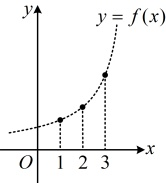

### 2. 等比数列的证明

除了等比数列的定义，等比数列还有以下两种常见的证明方式：

①通项公式法：等比数列的通项公式  $ a_n = a_1 q^{n-1} $ 可整理为  $ a_n = \frac{a_1}{q} \cdot q^n $，设  $ k = \frac{a_1}{q} (k \neq 0) $，则  $ a_n = k q^n $，故若数列  $ \{a_n\} $ 的通项公式为形如  $ a_n = k q^n $ 的形式，则该数列为等比数列。

②等比中项法：若  $ a_n^2 = a_{n-1}a_{n+1}(a_n \neq 0) $（或  $ \frac{a_{n+1}}{a_n} = \frac{a_n}{a_{n-1}} $）对任意的  $ n \geq 2 $ ( $ n \in \mathbb{N}^* $) 均成立，则数列  $ \{a_n\} $ 为等比数列。

知识点 4：等比数列与指数函数的关系

## 知识点 4：等比数列与指数函数的关系

### 1. 等比数列的图象

由知识点 3 可知，等比数列 \{a_n\} 的通项公式可整理为

 $ a_n = \frac{a_1}{q} \cdot q^n $，所以  $ a_n $ 是函数  $ f(x) = \frac{a_1}{q} \cdot q^x $ 在  $ x = n $ 时的函数

值，即  $ a_n = f(n) $，如图，等比数列 \{a_n\} 的图象是函数  $ f(x) $

 $ = \frac{a_1}{q} \cdot q^x $ 图象上的一些孤立点.

### 2. 等比数列的单调性

设等比数列$\{a_n\}$的首项为$a_1$，公比为$q(a_1, q \ne 0)$，则：

解得：$a = -1$或$-4$，两个结果都可取吗？

还需检验这三项是否为0，

当$a = -1$时，$2a + 2 = 3a + 3 = 0$，二者不可能是等比数列中的项，不合题意；

当$a = -4$时，$2a + 2 \ne 0$，$3a + 3 \ne 0$，符合题意，所以$a = -4$。

答案：B

<table border=1 style='margin: auto; word-wrap: break-word;'><tr><td style='text-align: center; word-wrap: break-word;'>条件</td><td style='text-align: center; word-wrap: break-word;'>单调性</td></tr><tr><td style='text-align: center; word-wrap: break-word;'>$ \begin{cases} a_1 &gt; 0 \\ q &gt; 1 \end{cases} $ 或  $ \begin{cases} a_1 &lt; 0 \\ 0 &lt; q &lt; 1 \end{cases} $</td><td style='text-align: center; word-wrap: break-word;'>$ \{a_n\} $ 为递增数列</td></tr><tr><td style='text-align: center; word-wrap: break-word;'>$ \begin{cases} a_1 &gt; 0 \\ 0 &lt; q &lt; 1 \end{cases} $ 或  $ \begin{cases} a_1 &lt; 0 \\ q &gt; 1 \end{cases} $</td><td style='text-align: center; word-wrap: break-word;'>$ \{a_n\} $ 为递减数列</td></tr><tr><td style='text-align: center; word-wrap: break-word;'>q=1</td><td style='text-align: center; word-wrap: break-word;'>$ \{a_n\} $ 为常数列，不存在单调性</td></tr><tr><td style='text-align: center; word-wrap: break-word;'>q&lt;0</td><td style='text-align: center; word-wrap: break-word;'>$ \{a_n\} $ 为摆动数列（即所有奇数项同号，所有偶数项也同号，但奇数项和偶数项异号），不存在单调性</td></tr></table>

## 知识点3

【例4】在数列 $ \{a_{n}\} $中， $ a_{n+1}=2a_{n} $，

且 $ a_{1}=1 $，则 $ a_{4} $等于（）

A. 4 B. 6

C. 8 D. 16

解析：因为 $ a_{n+1}=2a_n $，且 $ a_1=1 $，所以 $ \{a_n\} $是首项为1，公比为2的等比数列，故 $ a_4=a_1q^{4-1}=a_1q^3=1\times2^3=8 $。

答案：C

【例5】在等比数列$\{a_n\}$中，$a_3=3$，$a_7=27$，则数列$\{a_n\}$的公比是（ ）

A. $\sqrt{3}$    B. 3

C. $\pm\sqrt{3}$    D. $\pm3$

解析：由题意， $ \frac{a_7}{a_3} = \frac{a_1 q^6}{a_1 q^2} = q^4 = \frac{27}{3} = 9 $，

所以  $ q = \pm \sqrt{3} $。

答案：C

【反思】一般地，若  $ \{a_n\} $ 是公比为  $ q $ 的等比

数列，则对  $ \forall m, n \in \mathbb{N}^* $，都有  $ \frac{a_m}{a_n} = q^{m-n} $。

## 知识点4

【例 6】已知数列 $\{a_n\}$ 满足 $a_1 > 0$，对一切 $n \in \mathbb{N}^*$，$\frac{a_{n+1}}{a_n} = \frac{1}{2}$，则数列 $\{a_n\}$ 是（ ）

A. 递增数列    B. 递减数列

C. 摆动数列    D. 不确定