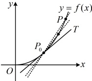
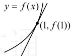
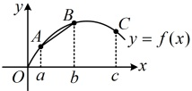

$f(x)$ 在 $x=x_0$ 处的导数（也称为瞬时变化率），记作 $f'(x_0)$

或 $y'|_{x=x_0}$，即 $f'(x_0) = \lim_{\Delta x \to 0} \frac{\Delta y}{\Delta x} = \lim_{\Delta x \to 0} \frac{f(x_0 + \Delta x) - f(x_0)}{\Delta x}$。

注： $ \Delta x $ 无限趋近于 0 即  $ \Delta x $ 无限接近于 0，但  $ \Delta x \neq 0 $

## 知识点2：导数的几何意义

### 1. 切线的定义

如图，在曲线  $ y = f(x) $ 上任取一点  $ P(x, f(x)) $，如果当点  $ P(x, f(x)) $ 沿着曲线  $ y = f(x) $ 无限趋近于点  $ P_0(x_0, f(x_0)) $ 时，割线  $ P_0P $ 无限趋近于一个确定的位置，这个确定位置的直线  $ P_0T $ 称为曲线  $ y = f(x) $ 在点  $ P_0 $ 处的切线。

### 2. 导数的几何意义

容易知道，割线  $ P_0P $ 的斜率  $ k = \frac{f(x) - f(x_0)}{x - x_0} $。记  $ \Delta x = x - x_0 $，当点  $ P $ 沿着曲线  $ y = f(x) $ 无限趋近于点  $ P_0 $ 时，即当  $ \Delta x \to 0 $ 时， $ k $ 无限趋近于函数  $ y = f(x) $ 在  $ x = x_0 $ 处的导数。因此，函数  $ y = f(x) $ 在  $ x = x_0 $ 处的导数  $ f'(x_0) $ 就是切线  $ P_0T $ 的斜率  $ k_0 $，即  $ k_0 = \lim_{\Delta x \to 0} \frac{f(x_0 + \Delta x) - f(x_0)}{\Delta x} = f'(x_0) $，这就是导数的几何意义。

### 3. 导数与函数图象的关系

<table border=1 style='margin: auto; word-wrap: break-word;'><tr><td style='text-align: center; word-wrap: break-word;'></td><td style='text-align: center; word-wrap: break-word;'>$ f(x) $ 在  $ x=x_0 $ 附近的升降情况</td><td style='text-align: center; word-wrap: break-word;'>切线斜率 k</td><td style='text-align: center; word-wrap: break-word;'>切线倾斜角</td></tr><tr><td style='text-align: center; word-wrap: break-word;'>$ f&#x27;(x_0)&gt;0 $</td><td style='text-align: center; word-wrap: break-word;'>上升</td><td style='text-align: center; word-wrap: break-word;'>k&gt;0</td><td style='text-align: center; word-wrap: break-word;'>锐角</td></tr><tr><td style='text-align: center; word-wrap: break-word;'>$ f&#x27;(x_0)&lt;0 $</td><td style='text-align: center; word-wrap: break-word;'>下降</td><td style='text-align: center; word-wrap: break-word;'>k&lt;0</td><td style='text-align: center; word-wrap: break-word;'>钝角</td></tr></table>

## 知识点3：导函数

### 1. 导函数的概念

从求函数  $ y = f(x) $ 在  $ x = x_{0} $ 处导数的过程可以看到，当

由题意， $  f'(1) = \lim_{\Delta x \to 0} \frac{f(1 + \Delta x) - f(1)}{\Delta x}  $

 $ = \lim_{\Delta x \to 0} \frac{(1 + \Delta x)^2 - 1^2}{\Delta x} = \lim_{\Delta x \to 0} \frac{1 + 2\Delta x + (\Delta x)^2 - 1}{\Delta x} $

 $ = \lim_{\Delta x \to 0} (2 + \Delta x) = 2 $.

答案：2

## 知识点2

【例 4】若曲线  $ y = f(x) $ 在 x = 1 处的切线方程为 y = 2x - 3，则  $ f(1) + f'(1) = $ ___.

解析: 看到切线方程, 联想到导数的几何意义,  $ f'(1) $ 等于  $ f(x) $ 在 x=1 处的切线斜率, 由题意, 在 x=1 处的切线斜率 k=2, 所以  $ f'(1)=2 $,

没给  $ f(x) $ 的解析式，怎么求  $ f(1) $？如图，切点是  $ f(x) $ 的图象与切线的公共点，故利用切线方程求出切点的纵坐标即为  $ f(1) $，

在 $ y=2x-3 $中令 $ x=1 $得 $ y=-1 $，

所以 $ f(1)=-1 $，故 $ f(1)+f'(1)=-1+2=1 $.

答案：1

【例5】设 $ y=f(x) $的导函数为 $ f'(x) $，

根据图中的函数图象，下列数值最小

的是（）

A.  $ f'(a) $ B.  $ f'(b) $

C.  $ f'(c) $ D.  $ \frac{f(b)-f(a)}{b-a} $

解析：设  $ f(x) $ 在 A, B, C 三点处的切线斜率分别为  $ k_{A} $,  $ k_{B} $,  $ k_{C} $，则  $ k_{A} = f'(a) $,

 $ k_{B}=f'(b) $， $ k_{C}=f'(c) $，

由图可知， $ k_{A}>k_{B}>0>k_{C} $

所以  $ f'(a) > f'(b) > 0 > f'(c) $