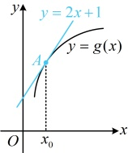

解析：显然(0,-4)不是切点，不知道切点，常先设出切点，写出切线方程，再将(0,-4)代入该方程求切点坐标，设过点(0,-4)的直线与 $ f(x) $相切于点 $ \left(x_{0},x_{0}-\frac{4}{x_{0}}\right) $，由题意， $ f'(x)=x'-\left(\frac{4}{x}\right)'=1+\frac{4}{x^{2}} $，所以该切线斜率 $ k=f'(x_{0})=1+\frac{4}{x_{0}^{2}} $，故切线方程为 $ y-\left(x_{0}-\frac{4}{x_{0}}\right)=\left(1+\frac{4}{x_{0}^{2}}\right)(x-x_{0}) $，整理得： $ y=\left(1+\frac{4}{x_{0}^{2}}\right)x-\frac{8}{x_{0}} $，把(0,-4)代入上述切线方程得 $ -4=-\frac{8}{x_{0}} $，解得： $ x_{0}=2 $，所以切线方程为 $ y=2x-4 $。

答案：D

【变式2】过坐标原点作曲线  $ y=(x-a)e^{x}(a\neq0) $ 的切线，若切线有且只有一条，那么  $ a= $ （ ）

A. -2              B. -4              C. 2              D. 4

解析：过原点作  $ y=(x-a)e^x $ 的切线，不知道谁是切点，所以先设出切点，写出切线方程，

设切点为 $ (x_0, (x_0 - a)e^{x_0}) $，由题意， $ y' = (x - a)' e^x + (x - a)(e^x)' = e^x + (x - a)e^x = (x - a + 1)e^x $，

所以切线方程为 $ y - (x_0 - a)e^{x_0} = (x_0 - a + 1)e^{x_0} \cdot (x - x_0) $，把原点坐标代入得 $ -(x_0 - a)e^{x_0} = (x_0 - a + 1)e^{x_0} \cdot (-x_0) $，

整理得： $ x_0^2 - ax_0 + a = 0 $ ①，怎样翻译“切线有且只有一条”？切线有且只有一条意味着切点有且只有一个，

于是方程①有唯一解，所以应有 $ \Delta = 0 $，由此可建立方程求 $ a $，

由题意，方程①的判别式 $ \Delta = (-a)^2 - 4 \times 1 \times a = 0 $，结合 $ a \neq 0 $可得 $ a = 4 $。

答案：D

【反思】当条件涉及过某点 $P$ 能作 $f(x)$ 的切线条数时，常设切点的横坐标为 $x_0$，写出切线方程，再把点 $P$ 的坐标代入切线方程，建立关于 $x_0$ 的方程，那么过 $P$ 能作 $f(x)$ 几条切线，该关于 $x_0$ 的方程就有几个解。

【变式 3】若  $ f(x)=x+2\sqrt{x} $ 在点  $ (1,3) $ 处的切线也是  $ g(x)=\ln x+x+a $ 的切线，则  $ a= $ ___.

由题意， $ f'(x)=(x+2\sqrt{x})'=x'+(2\sqrt{x})'=1+2\cdot\frac{1}{2\sqrt{x}}=1+\frac{1}{\sqrt{x}} $，所以 $ f'(1)=2 $，

故 $f(x)$ 在点 $(1,3)$ 处的切线方程为 $y-3=2(x-1)$，整理得：$y=2x+1$，

怎样翻译该直线与 $g(x)$ 也相切？此时的切点不知道了，可考虑设切点处理，

设 $y=2x+1$ 与 $g(x)$ 相切于点 $A(x_0,g(x_0))$，由题意，$g'(x)=\frac{1}{x}+1$，

所以如图，$\begin{cases}\frac{1}{x_0}+1=2(g(x)\text{在}x_0\text{处的导数值等于切线斜率})\\2x_0+1=\ln x_0+x_0+a(\text{切点是切线与}g(x)\text{图象的公共点})\end{cases}$，解得：$x_0=1$，$a=2$。

答案：2

【反思】①已知某直线与函数  $ g(x) $ 相切，常设切点的横坐标为  $ x_{0} $，再抓住两点建立方程组求  $ x_{0} $ 和参数的值，一是  $ g'(x_{0}) $ 等于切线斜率，二是  $ g(x_{0}) $ 等于切线在  $ x_{0} $ 处的纵坐标（即切点是切线与函数图象的公共点）；②前面几道题题干都明确提及了切线，有时题干可能不会提及切线，但也能用切线来解决问题，比如下面的变式4.

【变式4】M，N分别为曲线  $ y=e^{x}+2x $ 与直线 y=3x-1 上的点，则  $ \left|MN\right| $ 的最小值为 ___.

解析：若直接设 $M, N$ 的坐标来表示 $|MN|$，则可以想象，所得式子较复杂，不方便求最值，怎么办呢？不妨先画图看看，因为 $y = e^x$ 和 $y = 2x$ 在 $\mathbf{R}$ 上都 $\nearrow$，所以 $y = e^x + 2x$ 在 $\mathbf{R}$ 上 $\nearrow$，又当 $x \to -\infty$ 时，$e^x + 2x \to -\infty$，当 $x \to +\infty$ 时，$e^x + 2x \to +\infty$，所以曲线 $y = e^x + 2x$ 大致如图，

何时 |MN| 最小？可以想象，将直线 y = 3x - 1 上移至恰好与曲线  $ y = e^x + 2x $ 相切，M 恰好为切点，且 MN 垂直于