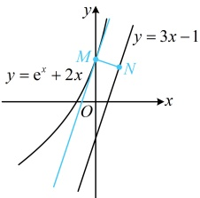
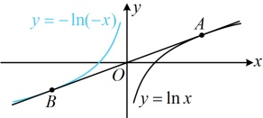
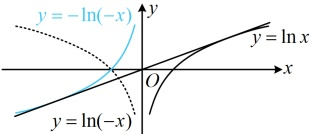

直线  $ y = 3x - 1 $ 时， $ |MN| $ 最小。下面求此时的  $ |MN| $，可先利用切线斜率为 3 求点  $ M $ 的坐标，再用点到直线的距离公式求  $ |MN| $，

 $ y = e^x + 2x \Rightarrow y' = e^x + 2 $，令  $ e^x + 2 = 3 $ 得  $ x = 0 $，

所以  $ y = e^0 + 2 \times 0 = 1 $，故切点为  $ M(0,1) $，直线  $ y = 3x - 1 $ 可化为  $ 3x - y - 1 = 0 $，

所以点  $ M $ 到该直线的距离  $ d = \frac{|-1 - 1|}{\sqrt{3^2 + (-1)^2}} = \frac{\sqrt{10}}{5} $，故  $ |MN|_{\min} = \frac{\sqrt{10}}{5} $。

答案： $ \frac{\sqrt{10}}{5} $

【例 9】已知直线  $ y = kx + b $ 既是曲线  $ y = \ln x $ 的切线，也是曲线  $ y = -\ln(-x) $ 的切线，则（ ）

A.  $ k = \frac{1}{e} $， $ b = 0 $    B.  $ k = 1 $， $ b = 0 $    C.  $ k = \frac{1}{e} $， $ b = -1 $    D.  $ k = 1 $， $ b = -1 $

解法1：直线  $ y = kx + b $ 与两曲线的切点均未知，可设两个切点，分别写出切线  $ l $ 的斜截式方程，再作观察，如图1，设  $ A(x_1, \ln x_1) $， $ B(x_2, -\ln(-x_2)) $ 分别为  $ y = kx + b $ 与  $ y = \ln x $ 和  $ y = -\ln(-x) $ 的切点，因为  $ (\ln x)' = \frac{1}{x} $，所以  $ y = \ln x $ 在点  $ A $ 处的切线方程为  $ y - \ln x_1 = \frac{1}{x_1}(x - x_1) $，即  $ y = \frac{1}{x_1}x + \ln x_1 - 1 $ ①，因为  $ [-\ln(-x)]' = -\frac{-1}{-x} = -\frac{1}{x} $，所以  $ y = -\ln(-x) $ 在点  $ B $ 处的切线方程为  $ y + \ln(-x_2) = -\frac{1}{x_2}(x - x_2) $，即  $ y = -\frac{1}{x_2}x - \ln(-x_2) + 1 $ ②，怎样求  $ k $ 和  $ b $？可以想象，只要求出  $ x_1 $ 或  $ x_2 $，就能代入①或②得到切线的方程，和  $ b $ 也就有了，由于①和②是同一条直线的方程，所以对应系数应相等，由此可建立方程组求  $ x_1 $ 和  $ x_2 $，因为①和②都是直线  $ y = kx + b $ 的方程，所以  $ \begin{cases} \frac{1}{x_1} = -\frac{1}{x_2} \\ \ln x_1 - 1 = -\ln(-x_2) + 1 \end{cases} $ ③，由③可得  $ x_2 = -x_1 $，代入④得  $ \ln x_1 - 1 = -\ln x_1 + 1 $，解得： $ x_1 = e $，代入①得切线的方程为  $ y = \frac{1}{e}x $，又由题意，该切线的方程为  $ y = kx + b $，所以  $ k = \frac{1}{e} $， $ b = 0 $。

图1

图2

解法 2：若注意到  $ y = -\ln(-x) $ 和  $ y = \ln x $ 的图象关于原点对称，则也可考虑从这一特征出发分析，看能否找到解题的突破口，如图 2，我们将  $ y = \ln x $ 沿 y 轴翻折，得到  $ y = \ln(-x) $，再沿 x 轴翻折，得到  $ y = -\ln(-x) $，所以  $ y = -\ln(-x) $ 与  $ y = \ln x $ 关于原点对称，若  $ y = kx + b $ 是两曲线的公切线，则可想象，切点必定也关于原点对称，所以  $ y = kx + b $ 过原点，故问题转化为求  $ y = \ln x $ 的过原点的切线，这可通过设切点来处理，设过原点的直线与  $ y = \ln x $ 相切于点  $ (x_0, \ln x_0) $，因为  $ (\ln x)' = \frac{1}{x} $，所以该直线的方程为  $ y - \ln x_0 = \frac{1}{x_0}(x - x_0) $ ⑤，将原点代入得  $ 0 - \ln x_0 = \frac{1}{x_0}(0 - x_0) $，解得： $ x_0 = e $，代入⑤整理得： $ y = \frac{1}{e}x $，与  $ y = kx + b $ 对比得  $ k = \frac{1}{e} $， $ b = 0 $。

答案：A

【反思】不同切点处的公切线问题的通用思路：先设两个切点，分别写出切线 l 的方程，再比较系数建立方程组并求解.