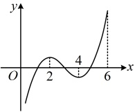

# 5.3.1 函数的单调性

## 知识梳理

## 知识点 1：函数的单调性与导数

### 1. 函数的单调性与导数正负的关系

一般地，函数  $ f(x) $ 的单调性与导函数  $ f'(x) $ 的正负之间具有如下关系：

在某个区间 $ (a,b) $上，若 $ f'(x)>0 $，则函数 $ y=f(x) $在区间 $ (a,b) $上单调递增；若 $ f'(x)<0 $，则函数 $ y=f(x) $在区间 $ (a,b) $上单调递减。

注：①当  $ f'(x) \geq 0 $ 在  $ (a,b) $ 上恒成立时，只要使  $ f'(x) = 0 $ 的点是“孤立”的，也即没有连成区间，那么  $ f(x) $ 在  $ (a,b) $ 上仍然单调递增。例如，对于  $ f(x) = x^3 $，有  $ f'(x) = 3x^2 \geq 0 $，但使  $ f'(x) = 0 $ 的点只有  $ x = 0 $，是孤立的，而不是在某个区间上恒有  $ f'(x) = 0 $，所以  $ f(x) $ 在  $ \mathbb{R} $ 上单调递增。 $ f'(x) \leq 0 $ 时有类似的结论。

②初等函数中，除常值函数外，都能满足使 $ f'(x)=0 $的点是“孤立”的，所以当题干给出非常值函数 $ f(x) $在 $ (a,b) $上单调递增时，需将其翻译为 $ f'(x)\geq0 $在 $ (a,b) $上恒成立，而不是 $ f'(x)>0 $在 $ (a,b) $上恒成立.

### 2. 函数值变化快慢与导数的关系

一般地，如果一个函数在某一范围内导数的绝对值较大，那么函数在这个范围内变化较快，这时函数的图象就会比较“陡峭”（向上或向下）；反之，如果导数的绝对值较小，那么函数在这个范围内变化较慢，函数的图象就会比较“平缓”。

## 知识点 2：利用导数判断函数的单调性

一般情况下，可以通过如下步骤判断函数  $ y = f(x) $ 的单调性：

## 知识点1

【例1】若定义在(0,6]上的函数 $ f(x) $的图象如图，则不等式 $ f'(x)<0 $的解集为___.

A. (2,4) B. (0,2)

C. (4,6) D. (2,6)

解析：由所给图象可以看出  $ f(x) $ 的单调递减区间，从而推断出满足  $ f'(x) < 0 $ 的区间，由图可知， $ f(x) $ 的单调递减区间是  $ (2,4) $，所以不等式  $ f'(x) < 0 $ 的解集为  $ (2,4) $.

答案：A

【例2】如果函数 $ f(x)=2x+\frac{a}{x} $在区间[1,2]上单调递增，则实数a的取值范围为___.

解析：条件给出 $f(x)$ 在 $[1,2]$ 上 $\nearrow$，可翻译为 $f'(x) \ge 0$ 在 $[1,2]$ 上恒成立，

由题意，$f'(x) = 2 - \frac{a}{x^2} \ge 0$ 在区间 $[1,2]$ 上恒成立，观察发现上述不等式中的参数 $a$ 容易分离出来，故可考虑用参变分离处理，

当 $x \in [1,2]$ 时，$2 - \frac{a}{x^2} \ge 0 \Leftrightarrow \frac{a}{x^2} \le 2$

$\Leftrightarrow a \le 2x^2$，

当 $x \in [1,2]$ 时，$(2x^2)_{\min} = 2 \times 1^2 = 2$，

所以要使 $a \le 2x^2$ 恒成立，应有 $a \le 2$。

答案：$(-\infty,2]$