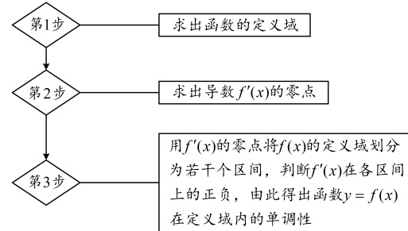
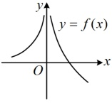
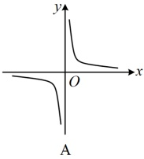
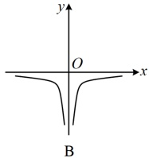
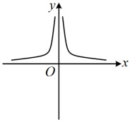
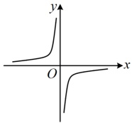

求出函数的定义域

求出导数 $ f'(x) $的零点

用 $ f'(x) $的零点将 $ f(x) $的定义域划分为若干个区间，判断 $ f'(x) $在各区间上的正负，由此得出函数 $ y=f(x) $在定义域内的单调性

注：①对于间隔开的具有相同单调性的单调区间，这些区间一般不能用“ $ \cup $”连接，可用“，”或“和”连接.

## 知识点2

②在对函数划分单调区间时，除了注意使导数为0的点，还要注意在定义域内的间断点。

【例3】函数 $ f(x)=x\ln x $的单调递增区间为___。

解析：由题意， $ f(x) $的定义域是 $ (0,+\infty) $，

且 $ f'(x)=1\cdot\ln x+x\cdot\frac{1}{x}=\ln x+1 $，

令 $ f'(x)>0 $可得 $ \ln x+1>0 $，

所以 $ \ln x>-1 $，解得： $ x>\frac{1}{e} $，

故 $ f(x) $的单调递增区间为 $ \left(\frac{1}{e},+\infty\right) $。

答案： $ \left(\frac{1}{e},+\infty\right) $

## 本节核心题型

用导数研究函数的单调性，在高中数学中有着广泛的应用。本节我们先通过类型Ⅰ来给大家强化导函数与原函数图象的关系；接着又设计了类型Ⅱ和类型Ⅲ这两组题分别针对无参函数和含参函数的单调性分析；有时我们也会遇到给出函数的单调性，让求参数范围的问题，这在类型Ⅳ中会有详细的分析；最后，研究函数零点时，往往也需要先分析函数的单调性，所以我们通过类型V来给大家讲解如何用导数研究较复杂的函数的零点。

类型Ⅰ：导函数与原函数图象关联的分析

【例4】函数  $ y = f(x) $ 的图象如图（最左边的图）所示，则  $ y = f'(x) $ 的图象可能是（）

A

B

C

D

解析：给出  $ f(x) $ 的图象，让选  $ f'(x) $ 的图象，可由  $ f(x) $ 的图象得到其单调性，该单调性与  $ f'(x) $ 的正负有关，由此推断  $ f'(x) $ 的图象，由所给图象可知  $ f(x) $ 在  $ (-\infty, 0) $ 上  $ \nearrow $，在  $ (0, +\infty) $ 上  $ \searrow $，所以在  $ (-\infty, 0) $ 上， $ f'(x) > 0 $，在  $ (0, +\infty) $ 上， $ f'(x) < 0 $，结合选项可知选 D.

答案：D

【反思】对于给出  $ f(x) $ 的图象，让选  $ f'(x) $ 的图象这类题，常由所给图象分析出  $ f(x) $ 的单调区间，进而得到  $ f'(x) $ 在对应区间上的正负情况，并由此判断选项。那如果是给出  $ f'(x) $ 的图象，让选  $ f(x) $ 的图象呢？这就需要由所给图象分析出  $ f'(x) $ 在哪些区间为正，哪些区间为负，得到  $ f(x) $ 在对应区间上的单调性，并由此判断选项，我们来看下面的变式1.

【变式1】已知函数  $ y=f(x) $ 的导函数  $ y=f'(x) $ 的图象如图（最左边的图）所示，则  $ f(x) $ 的图象