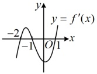
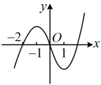
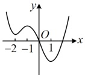
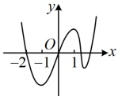
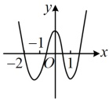
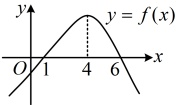

可能是（）

A

B

C

D

解析：给出  $ f'(x) $ 的图象，可以看看它在哪些区间为正，哪些区间为负，得到  $ f(x) $ 的单调性，由所给图象可知当 x < -2 或 -1 < x < 1 时， $ f'(x) < 0 $，当 -2 < x < -1 或 x > 1 时， $ f'(x) > 0 $，所以  $ f(x) $ 在  $ (-∞, -2) $ 上↘，在  $ (-2, -1) $ 上↗，在  $ (-1, 1) $ 上↘，在  $ (1, +∞) $ 上↗，故选 B.

答案：B

【变式 2】函数  $ f(x) $ 的图象如图所示，设  $ f(x) $ 的导函数为  $ f'(x) $，则  $ \frac{f'(x)}{f(x)} > 0 $ 的解集为（ ）

A.  $ (1,6) $ \quad B.  $ (1,4) $ \quad C.  $ (-\infty,1) $ \quad D.  $ (1,4) \cup (6,+\infty) $

解析： $ \frac{f'(x)}{f(x)} > 0 \Leftrightarrow \begin{cases} f(x) > 0 \\ f'(x) > 0 \end{cases} $ 或  $ \begin{cases} f(x) < 0 \\ f'(x) < 0 \end{cases} $，

$f(x)$ 的正负情况容易由图直接看出，那 $f'(x)$ 的正负呢？可结合单调性来看，

由图可知，$f(x)>0\Leftrightarrow1<x<6$，$f(x)<0\Leftrightarrow x<1$ 或 $x>6$，

另一方面，$f(x)$ 在 $(-\infty,4)$ 上 $\nearrow$，在 $(4,+\infty)$ 上 $\searrow$，所以 $f'(x)>0\Leftrightarrow x<4$，$f'(x)<0\Leftrightarrow x>4$，

所以 $\begin{cases} f(x)>0 \\ f'(x)>0 \end{cases}$ 即为 $\begin{cases} 1<x<6 \\ x<4 \end{cases}$，取交集得 $1<x<4$；$\begin{cases} f(x)<0 \\ f'(x)<0 \end{cases}$ 即为 $\begin{cases} x<1\text{ 或 } x>6 \\ x>4 \end{cases}$，取交集得 $x>6$；故选 D.

答案：D

类型Ⅱ：用导数研究无参函数的单调性

【例 5】已知函数  $ f(x)=\frac{1}{3}x^{3}-x^{2}+ax+b $ 的图象在点  $ (0,f(0)) $ 处的切线方程是  $ 3x+y-2=0 $.

（1）求a，b的值：

（2）求函数  $ f(x) $ 的单调区间.

解：（1）（条件给出  $ f(x) $ 在  $ (0,f(0)) $ 处的切线方程，可按  $ f'(0) $ 等于切线斜率，建立一个方程）由题意， $ f'(x)=x^{2}-2x+a $，所以  $ f'(0)=a $，又  $ f(x) $ 在  $ (0,f(0)) $ 处的切线方程为  $ 3x+y-2=0 $ 该直线的方程可化为  $ y=-3x+2 $，所以斜率为 -3，故 a=-3，

（再求b，注意到点 $ (0,f(0)) $也在切线上，故考虑将其代入切线方程求b）

由题意， $ f(0)=b $，所以点 $ (0,b) $在切线 $ 3x+y-2=0 $上，故b-2=0，解得：b=2。

（2）（已求得 $a$, $b$, 则 $f'(x)$ 不含参，故可直接分析 $f'(x)$ 的正负，得到 $f(x)$ 的单调区间）

由（1）可得 $f'(x) = x^2 - 2x - 3 = (x+1)(x-3)$，所以 $f'(x) > 0 \Leftrightarrow x < -1$ 或 $x > 3$，

$f'(x) < 0 \Leftrightarrow -1 < x < 3$，故 $f(x)$ 的单调递增区间是 $(-\infty, -1)$，$(3, +\infty)$，单调递减区间是 $(-1, 3)$。

【反思】若函数  $ f(x) $ 的解析式较复杂，不易通过简单的观察就得到其单调性，此时可用导函数来进行判断，具体步骤为：①求出导函数  $ f'(x) $；②将  $ f'(x) $ 变形（如分解因式），使其容易判断正负；③求解不等式  $ f'(x)>0 $ 和  $ f'(x)<0 $，分别得到  $ f(x) $ 的单调递增区间和单调递减区间。本题的  $ f(x) $ 是三次函数，导数也可以用于研究含指数、对数、三角函数结构的函数的单调性，下面我们再来看几个变式。