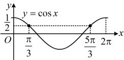

【变式1】已知函数  $ f(x)=\frac{2+\ln x}{x} $，讨论  $ f(x) $ 的单调性.

解：（函数  $ f(x) $ 的解析式较复杂，不易直接看出其单调性，考虑求导，用导函数来判断）

解：（四数  $ f(x) $ 的解析式按要求，不易直接看出其单调性，考虑求导，用导函数来判断）

由题意，函数  $ f(x) $ 的定义域是  $ (0,+\infty) $，且  $ f'(x)=\frac{\frac{1}{x}\cdot x-(2+\ln x)}{x^2}=-\frac{1+\ln x}{x^2} $，

所以  $ f'(x)>0\Leftrightarrow 1+\ln x<0\Leftrightarrow \ln x<-1\Leftrightarrow 0<x<\frac{1}{e} $，  $ f'(x)<0\Leftrightarrow 1+\ln x>0\Leftrightarrow \ln x>-1\Leftrightarrow x>\frac{1}{e} $，

故  $ f(x) $ 在区间  $ \left(0,\frac{1}{e}\right) $ 上单调递增，在区间  $ \left(\frac{1}{e},+\infty\right) $ 上单调递减.

【反思】①若题干让求  $ f(x) $ 的单调区间，则应回答 “ $ f(x) $ 的单调递增区间是⋯，单调递减区间是⋯”；若让讨论  $ f(x) $ 的单调性，则应回答 “ $ f(x) $ 在⋯单调递增，在⋯单调递减”；②若连续的函数  $ f(x) $ 在其单调性的转折点处有定义，则写单调区间时，该点处可以写成开区间，也可以写成闭区间。以本题为例，也可以写成 “ $ f(x) $ 在区间  $ \left(0, \frac{1}{e}\right] $ 上单调递增，在区间  $ \left[\frac{1}{e}, +\infty\right) $ 上单调递减”。

【变式2】已知函数  $ f(x)=\frac{e^{x}}{x^{2}-x+1} $，讨论函数  $ f(x) $ 的单调性.

解：（定义域不易直接看出，先分析定义域）因为 $ x^2 - x + 1 = \left(x - \frac{1}{2}\right)^2 + \frac{3}{4} \geq \frac{3}{4} > 0 $，所以 $ f(x) $的定义域为 $ \mathbb{R} $，

（解析式较复杂，不易直接看出单调性，考虑求导分析）由题意， $ f'(x) = \frac{e^x(x^2 - x + 1) - (2x - 1)e^x}{(x^2 - x + 1)^2} = \frac{(x^2 - 3x + 2)e^x}{(x^2 - x + 1)^2} = \frac{(x - 1)(x - 2)e^x}{(x^2 - x + 1)^2} $，所以 $ f'(x) > 0 \Leftrightarrow x < 1 $或 $ x > 2 $， $ f'(x) < 0 \Leftrightarrow 1 < x < 2 $，

故 $ f(x) $在 $ (-\infty, 1) $上单调递增，在 $ (1, 2) $上单调递减，在 $ (2, +\infty) $上单调递增。

【变式 3】已知函数  $ f(x)=x+a\sin x $ 在 x=0 处的切线方程为  $ x+y=0 $.

（1）求 a 的值：

（2）当 $ x\in[0,2\pi] $时，求函数 $ f(x) $的单调区间.

解：（1） $ f(x) $ 在 x=0 处的切线方程  $ x+y=0 $ 可化为 y=-x，其斜率为 -1，所以  $ f'(0)=-1 $，又由题意， $ f'(x)=1+a\cos x $，所以  $ f'(0)=1+a $，故 1+a=-1，解得：a=-2。

（2）由（1）可得  $ f'(x)=1-2\cos x $

（要判断  $ f'(x) $ 在  $ [0,2\pi] $ 上的正负，就看  $ \cos x $ 与  $ \frac{1}{2} $ 的大小关系，可借助  $ y = \cos x $ 的图象来看）

（要判断 $f'(x)$ 在 $[0,2\pi]$ 上的正负，就看 $\cos x$ 与 $\frac{1}{2}$ 的大小关系，可借助 $y=c$ 如图，当 $0 \leq x < \frac{\pi}{3}$ 或 $\frac{5\pi}{3} < x \leq 2\pi$ 时，$\cos x > \frac{1}{2}$，所以 $f'(x) = 1 - 2\cos x < 0$，当 $\frac{\pi}{3} < x < \frac{5\pi}{3}$ 时，$\cos x < \frac{1}{2}$，所以 $f'(x) = 1 - 2\cos x > 0$，故 $f(x)$ 的单调递增区间是 $\left(\frac{\pi}{3}, \frac{5\pi}{3}\right)$，单调递减区间是 $\left[0, \frac{\pi}{3}\right)$，$\left(\frac{5\pi}{3}, 2\pi\right]$。

【变式4】已知函数  $ f(x)=(x-2)e^{x}-\frac{1}{2}x^{2}+x $，求  $ f(x) $ 的单调区间.