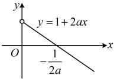

解：由题意， $ f(x) $的定义域为 $ \mathbb{R} $， $ f'(x) = \mathrm{e}^x + (x-2)\mathrm{e}^x - x + 1 = (x-1)\mathrm{e}^x - (x-1) = (x-1)(\mathrm{e}^x - 1) $，

解：由题意， $ f(x) $ 的定义域为  $ \mathbb{R} $， $ f'(x) = e^x + (x-2)e^x - x + 1 = (x-1)e^x - (x-1) = (x-1)(e^x - 1) $，

（如何分析  $ f'(x) $ 的正负？观察发现当  $ x=0 $ 或 1 时，都有  $ f'(x)=0 $，而  $ f'(x) $ 的零点很可能是其正负分界点，故

按 0，1 将  $ \mathbb{R} $ 划分成三段区间来讨论，分别分析  $ f'(x) $ 的正负）

当  $ x<0 $ 时， $ x-1<0 $， $ \mathrm{e}^x - 1<0 $，所以  $ f'(x)>0 $；当  $ 0<x<1 $ 时， $ x-1<0 $， $ \mathrm{e}^x - 1>0 $，所以  $ f'(x)<0 $；

当  $ x>1 $ 时， $ x-1>0 $， $ \mathrm{e}^x - 1>0 $，所以  $ f'(x)>0 $；

故  $ f(x) $ 的单调递增区间是  $ (-∞,0) $ 和  $ (1,+∞) $，单调递减区间是  $ (0,1) $.

【反思】①用 $ f'(x) $的零点来划分定义域，再判断 $ f'(x) $在各区间上的正负，这是研究单调性时常用的分析方法；②像 $ e^x - 1 $这种结构，它是单调的，且在 $ x=0 $左侧为负，右侧为正，这与 $ x $本身的正负特性完全相同，所以本题在判断 $ f'(x) $的正负情况时，完全可将其等效成 $ f'(x)=(x-1)x $来分析，从而使问题简化；③上面的几道题求出 $ f'(x) $后，都能直接判断其正负，若 $ f'(x) $不容易直接判断正负，又怎么办呢？我们来看下面的变式5.

【变式5】已知函数  $ f(x)=x\ln x-\frac{1}{2}x^{2} $，讨论  $ f(x) $ 的单调性.

解：由题意， $ f(x) $ 的定义域为  $ (0,+\infty) $， $ f'(x) = \ln x - x + 1 $，（不易直接看出  $ f'(x) $ 的正负，怎么办呢？可将  $ f'(x) $ 看成函数，再求导分析）令  $ g(x) = f'(x) = \ln x - x + 1 $，则  $ g'(x) = \frac{1}{x} - 1 = \frac{1 - x}{x} $，

所以  $ g'(x) > 0 \Leftrightarrow 0 < x < 1 $， $ g'(x) < 0 \Leftrightarrow x > 1 $，故  $ g(x) $ 在  $ (0,1) $ 上单调递增，在  $ (1,+\infty) $ 上单调递减，

所以  $ g(x) \leq g(1) = \ln 1 - 1 + 1 = 0 $，即  $ f'(x) \leq 0 $，所以  $ f(x) $ 在  $ (0,+\infty) $ 上单调递减。

【反思】①当求出的  $ f'(x) $ 不易判断正负时，可将  $ f'(x) $ 看成新的函数，继续求导分析。本题是将  $ f'(x) $ 重新设成了  $ g(x) $，再求  $ g'(x) $，也可以用  $ f''(x) $ 直接表示  $ f'(x) $ 的导函数，即  $ f''(x) = g'(x) $，这种表示方法更简洁，本书后续内容我们将用  $ f''(x) $ 来表示  $ f'(x) $ 的导函数，类似的，用  $ f'''(x) $ 表示  $ f''(x) $ 的导函数；

②若  $ f'(x) \leq 0 $ 在区间 D 上恒成立，且使  $ f'(x) = 0 $ 的点是孤立的，没有连成区间，则  $ f(x) $ 在 D 上单调递减。例如本题的  $ f'(x) \leq 0 $ 在  $ (0, +\infty) $ 上恒成立，且  $ f'(x) = 0 $ 仅在 x = 1 时成立，所以有  $ f(x) $ 在  $ (0, +\infty) $ 上单调递减。同理，若  $ f'(x) \geq 0 $ 在区间 D 上恒成立，且使  $ f'(x) = 0 $ 的点是孤立的，则  $ f(x) $ 在 D 上单调递增。

## 类型Ⅲ：讨论含参函数的单调性

【例 6】已知函数  $ f(x)=ax-\mathrm{e}^{x} $，讨论函数  $ f(x) $ 的单调性.

解：由题意， $ f(x) $ 的定义域为  $ \mathbb{R} $，且  $ f'(x) = a - e^x $，（观察发现由  $ f'(x) = 0 $ 得  $ a - e^x = 0 \Rightarrow e^x = a \Rightarrow x = \ln a $，但  $ \ln a $ 只在  $ a > 0 $ 时才有意义，故据此讨论）当  $ a > 0 $ 时， $ f'(x) > 0 \Leftrightarrow a - e^x > 0 \Leftrightarrow e^x < a \Leftrightarrow x < \ln a $， $ f'(x) < 0 \Leftrightarrow x > \ln a $，所以  $ f(x) $ 在  $ (-\infty, \ln a) $ 上单调递增，在  $ (\ln a, +\infty) $ 上单调递减；

当 $ a \leq 0 $时， $ f'(x) = a - e^x < 0 $，所以 $ f(x) $在 $ \mathbb{R} $上单调递减。

【反思】求出  $ f'(x) $ 后，一般先令  $ f'(x)=0 $，求出  $ f'(x) $ 的零点，分析何时该零点有意义，找到讨论的分界点。有时尽管由  $ f'(x)=0 $ 求得的解有意义，但该解可能在定义域范围内，也可能不在定义域范围内，此时就可以此为依据讨论，比如下面的两个变式。

【变式1】已知函数  $ f(x)=x\ln x+ax^{2} $，设  $ g(x)=f'(x) $，讨论  $ g(x) $ 的单调性.

解：由题意， $ g(x)=f'(x)=\ln x+x\cdot\frac{1}{x}+2ax=\ln x+1+2ax $，所以 $ g'(x)=\frac{1}{x}+2a=\frac{1+2ax}{x} $，x>0，

（令 $ g'(x)=0 $得 $ 1+2ax=0\Rightarrow x=-\frac{1}{2a} $，但 $ -\frac{1}{2a} $只在 $ a\neq0 $时才有意义，且只有当a<0时， $ -\frac{1}{2a} $才在定义域内，

故据此讨论）当a≥0时，因为x>0，所以 $ 1+2ax\geq1>0 $，从而 $ g'(x)>0 $，故 $ g(x) $在 $ (0,+\infty) $上单调递增；

当a<0时，直线y=1+2ax在 $ (0,+\infty) $上的部分图象如图所示，

