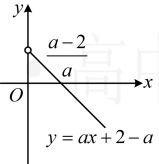
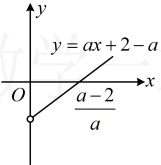
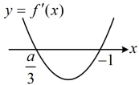
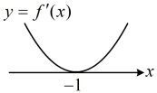
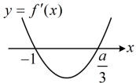

由图可知  $ g'(x) > 0 \Leftrightarrow 0 < x < -\frac{1}{2a} $， $ g'(x) < 0 \Leftrightarrow x > -\frac{1}{2a} $，

所以  $ g(x) $ 在  $ \left(0,-\frac{1}{2a}\right) $ 上单调递增，在  $ \left(-\frac{1}{2a},+\infty\right) $ 上单调递减，

【变式 2】已知函数  $ f(x)=ax+(2-a)\ln x+1 $ ( $ a\in\mathbf{R} $)，讨论  $ f(x) $ 的单调性.

解：由题意， $ f'(x) = a + \frac{2 - a}{x} = \frac{ax + 2 - a}{x} $， $ x > 0 $，（由  $ f'(x) = 0 $ 可得  $ x = \frac{a - 2}{a} $，若导函数在定义域内有零点，则  $ \frac{a - 2}{a} > 0 $，故  $ a < 0 $ 或  $ a > 2 $，余下即为  $ f'(x) $ 在定义域内没有零点的情形，讨论的标准就有了）

①当 $a<0$ 时，直线 $y=ax+2-a$ 在 $(0,+\infty)$ 上的部分图象如图 1，由图 1 可知，$f'(x)>0 \Leftrightarrow 0<x<\frac{a-2}{a}$，$f'(x)<0 \Leftrightarrow x>\frac{a-2}{a}$，所以 $f(x)$ 在 $\left(0,\frac{a-2}{a}\right)$ 上单调递增，在 $\left(\frac{a-2}{a},+\infty\right)$ 上单调递减；

②当 $a>2$ 时，直线 $y=ax+2-a$ 如图2，由图2可知 $f'(x)<0 \Leftrightarrow 0<x<\frac{a-2}{a}$，$f'(x)>0 \Leftrightarrow x>\frac{a-2}{a}$，所以 $f(x)$ 在 $\left(0,\frac{a-2}{a}\right)$ 上单调递减，在 $\left(\frac{a-2}{a},+\infty\right)$ 上单调递增；

（余下的部分就是  $ f'(x) $ 在定义域上无零点的情形，此时  $ f'(x) $ 必定不变号）

③当  $ 0 \leq a \leq 2 $ 时， $ ax \geq 0 $， $ 2 - a \geq 0 $，所以  $ ax + 2 - a \geq 0 $，从而  $ f'(x) \geq 0 $，故  $ f(x) $ 在  $ (0, +\infty) $ 上单调递增.

图1

图2

【例 7】已知函数  $ f(x)=x^3-\frac{1}{2}(a-3)x^2 - ax+1 $，其中  $ a \in \mathbb{R} $，讨论  $ f(x) $ 的单调性.

解：由题意， $ f(x) $的定义域为 $ \mathbb{R} $，且 $ f'(x)=3x^2-(a-3)x-a=(3x-a)(x+1) $，

（观察发现  $ f'(x) $ 有零点  $ \frac{a}{3} $ 和 -1，这两个零点的大小关系不确定，且该大小关系会影响  $ f'(x) $ 在各段上的正负情况，故应讨论两个零点的大小，即讨论 a 与 -3 的大小）

当 $a < -3$ 时，$\frac{a}{3} < -1$，如图 1，$f'(x) > 0 \Leftrightarrow x < \frac{a}{3}$ 或 $x > -1$，$f'(x) < 0 \Leftrightarrow \frac{a}{3} < x < -1$，

图1

图2

图3

所以  $ f(x) $ 在  $ \left(-\infty, \frac{a}{3}\right) $ 上单调递增，在  $ \left(\frac{a}{3}, -1\right) $ 上单调递减，在  $ (-1, +\infty) $ 上单调递增；

当 a = -3 时，如图 2， $ f'(x) = 3(x + 1)^2 \geq 0 $，所以  $ f(x) $ 在  $ \mathbb{R} $ 上单调递增；

当 a > -3 时， $ \frac{a}{3} > -1 $，如图 3， $ f'(x) > 0 \Leftrightarrow x < -1 $ 或  $ x > \frac{a}{3} $， $ f'(x) < 0 \Leftrightarrow -1 < x < \frac{a}{3} $，