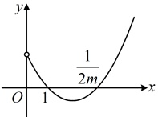
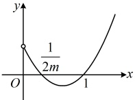

所以  $ f(x) $ 在  $ (-\infty,-1) $ 上单调递增，在  $ \left(-1,\frac{a}{3}\right) $ 上单调递减，在  $ \left(\frac{a}{3},+\infty\right) $ 上单调递增.

【反思】若 $ f'(x) $有2个零点，则这两个零点的大小关系往往会影响 $ f'(x) $在各段上的正负，故讨论的依据往往是两个零点的大小。有时 $ f'(x) $的两个零点中，有一个可能不在定义域内，此时又怎么处理？我们来看下面的变式1和变式2。

【变式1】已知函数  $ f(x)=m(x^{2}-2x)+\ln x-x $ ，讨论  $ f(x) $ 的单调性.

解：由题意， $ f(x) $的定义域为 $ (0,+\infty) $，且 $ f'(x)=m(2x-2)+\frac{1}{x}-1=2m(x-1)-\frac{x-1}{x}=\frac{(x-1)(2mx-1)}{x} $，

（令 $f'(x)=0$ 得 $(x-1)(2mx-1)=0 \Rightarrow x=1$ 或 $\frac{1}{2m}$，其中 $\frac{1}{2m}$ 是否在定义域内由 $m$ 的正负决定，故先据此讨论）当 $m \leq 0$ 时，因为 $x > 0$，所以 $2mx - 1 < 0$，从而 $f'(x) > 0 \Leftrightarrow \begin{cases} x - 1 < 0 \\ x > 0 \end{cases} \Leftrightarrow 0 < x < 1$，$f'(x) < 0 \Leftrightarrow x > 1$，所以 $f(x)$ 在 $(0,1)$ 上单调递增，在 $(1,+\infty)$ 上单调递减；

（再看 m>0 的情况，此时  $ f'(x) $ 的零点 1 和  $ \frac{1}{2m} $ 都在定义域内，且它们的大小对  $ f'(x) $ 在各段上的正负情况有影响，故又讨论 1 和  $ \frac{1}{2m} $ 的大小，即讨论 m 与  $ \frac{1}{2} $ 的大小）

当  $ 0 < m < \frac{1}{2} $ 时， $ \frac{1}{2m} > 1 $，函数  $ y = (x-1)(2mx-1) $ 在  $ (0, +\infty) $ 上的草图如图 1，

由图1可知  $ f'(x) > 0 \Leftrightarrow 0 < x < 1 $ 或  $ x > \frac{1}{2m} $， $ f'(x) < 0 \Leftrightarrow 1 < x < \frac{1}{2m} $，

所以  $ f(x) $ 在  $ (0,1) $ 上单调递增，在  $ \left(1,\frac{1}{2m}\right) $ 上单调递减，在  $ \left(\frac{1}{2m},+\infty\right) $ 上单调递增；

当  $ m = \frac{1}{2} $ 时， $ f'(x) = \frac{(x-1)^2}{x} \geq 0 $，当且仅当 x=1 时取等号，所以  $ f(x) $ 在  $ (0, +\infty) $ 上单调递增；

当  $ m > \frac{1}{2} $ 时， $ 0 < \frac{1}{2m} < 1 $，函数  $ y = (x-1)(2mx-1) $ 在  $ (0, +\infty) $ 上的草图如图 2，

由图2可知  $ f'(x) > 0 \Leftrightarrow 0 < x < \frac{1}{2m} $ 或  $ x > 1 $， $ f'(x) < 0 \Leftrightarrow \frac{1}{2m} < x < 1 $，

所以  $ f(x) $ 在  $ \left(0,\frac{1}{2m}\right) $ 上单调递增，在  $ \left(\frac{1}{2m},1\right) $ 上单调递减，在  $ (1,+\infty) $ 上单调递增.

图1

图2

【反思】当  $ f'(x) $ 的 2 个零点中有一个可能不在定义域内时，则先按  $ f'(x) $ 有 1 个、2 个零点这两大类讨论，而对于  $ f'(x) $ 有 2 个零点的情况，则又细分讨论两个零点的大小.

【变式 2】已知函数  $ f(x)=\frac{e^x - a}{x} - a \ln x $，其中  $ a \in \mathbb{R} $，讨论  $ f(x) $ 的单调性。

解：由题意， $ f(x) $的定义域为 $ (0,+\infty) $，且 $ f'(x)=\frac{e^x \cdot x - (e^x - a)}{x^2} - \frac{a}{x} = \frac{(x-1)e^x + a - ax}{x^2} = \frac{(x-1)(e^x - a)}{x^2} $，

（观察发现  $ f'(x) $ 必有 x=1 这个零点，但由于 x>0，所以  $ e^x>1 $，于是只有当 a>1 时， $ e^x - a = 0 $ 的解才有意义