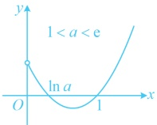
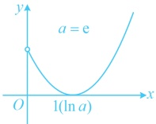
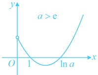
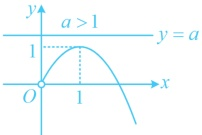
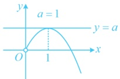
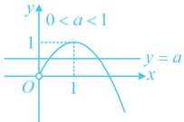
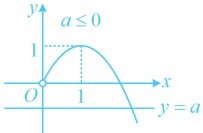

且在定义域内，于是分 $ a \leq 1 $和 $ a > 1 $考虑）

当 $ a \leq 1 $时，因为 $ x > 0 $，所以 $ \mathrm{e}^x - a > 1 - a \geq 0 $，从而 $ f'(x) < 0 \Leftrightarrow \begin{cases} x - 1 < 0 \\ x > 0 \end{cases} \Leftrightarrow 0 < x < 1 $，

 $ f'(x) > 0 \Leftrightarrow \left\{ \begin{aligned} x - 1 & > 0 \\ x & > 0 \end{aligned} \right. \Leftrightarrow x > 1 $，故  $ f(x) $ 在  $ (0,1) $ 上单调递减，在  $ (1,+\infty) $ 上单调递增；

（再看 $a>1$ 的情形，此时令 $f'(x)=0$ 得 $x=1$ 或 $\ln a$，且 $1$ 和 $\ln a$ 都在定义域内，它们的大小会影响 $f'(x)$ 在各段上的正负情况，故据此讨论，即讨论 $a$ 与 $e$ 的大小，且由于 $e^x - a$ 与 $x - \ln a$ 的正负情况相同，则 $f'(x)$ 与 $y = (x-1)(x - \ln a)$ 的正负情况也相同，故可将 $f'(x)$ 等改成 $(x-1)(x - \ln a)$ 来分析，此时三种情况分别如图）

当 $1 < a < e$ 时，$0 < \ln a < 1$，所以 $f'(x) > 0 \Leftrightarrow 0 < x < \ln a$ 或 $x > 1$，$f'(x) < 0 \Leftrightarrow \ln a < x < 1$，

故 $f(x)$ 在 $(0, \ln a)$ 上单调递增，在 $(\ln a, 1)$ 上单调递减，在 $(1, +\infty)$ 上单调递增；

当 $a = e$ 时，$\ln a = 1$，所以 $f'(x) \geq 0$ 恒成立，当且仅当 $x = 1$ 时取等号，故 $f(x)$ 在 $(0, +\infty)$ 上单调递增；

当 $a > e$ 时，$\ln a > 1$，所以 $f'(x) > 0 \Leftrightarrow 0 < x < 1$ 或 $x > \ln a$，$f'(x) < 0 \Leftrightarrow 1 < x < \ln a$，

故 $f(x)$ 在 $(0, 1)$ 上单调递增，在 $(1, \ln a)$ 上单调递减，在 $(\ln a, +\infty)$ 上单调递增。

【变式 3】已知函数  $ f(x)=\frac{1}{2}x^2 - 2x + a\ln x $，其中  $ a \in \mathbb{R} $，讨论  $ f(x) $ 的单调性.

解：由题意， $ f(x) $的定义域为 $ (0,+\infty) $，且 $ f'(x)=x-2+\frac{a}{x}=\frac{x^2-2x+a}{x} $，

（与前面几道题不同，这里显然不能分解因式，如何寻找讨论的分界点呢？由  $ f'(x)=0 $ 可得  $ 2x - x^2 = a $，所以可考虑画出  $ y = 2x - x^2 $ 和  $ y = a $ 的图象来看。如下图，按二者图象的相对位置，有下面四种情况，其中图1和图2对应的  $ f'(x) $ 都不变号，可合并讨论，分界点就找到了）

图1

图2

图3

图4

当 $ a \geq 1 $时， $ f'(x) = \frac{x^2 - 2x + a}{x} \geq \frac{x^2 - 2x + 1}{x} = \frac{(x-1)^2}{x} \geq 0 $，当且仅当 $ a = x = 1 $时， $ f'(x) = 0 $，所以 $ f(x) $在 $ (0, +\infty) $上单调递增；

 $$ x^{2}-2x+a=0 $$ 

 $$ x=1\pm\sqrt{1-a} $$ 

且  $ f'(x)>0\Leftrightarrow0<x<1-\sqrt{1-a} $ 或  $ x>1+\sqrt{1-a} $， $ f'(x)<0\Leftrightarrow1-\sqrt{1-a}<x<1+\sqrt{1-a} $，

所以 $f(x)$ 在 $(0,1-\sqrt{1-a})$ 上单调递增，在 $(1-\sqrt{1-a},1+\sqrt{1-a})$ 上单调递减，在 $(1+\sqrt{1-a},+\infty)$ 上单调递增；当 $a \leq 0$ 时，令 $f'(x)=0$ 可得 $x^2 - 2x + a = 0$，解得：$x = 1 \pm \sqrt{1-a}$，此时 $1 - \sqrt{1-a} \leq 0$，不在定义域内，

当 $ a \leq x $时，令 $ f'(x) = 0 $可得 $ x^2 - 2x + a = 0 $，解得： $ x = 1 \pm \sqrt{1 - a} $，此时 $ 1 - \sqrt{1 - a} \leq 0 $，不在定义域内，所以 $ f'(x) > 0 \Leftrightarrow x > 1 + \sqrt{1 - a} $， $ f'(x) < 0 \Leftrightarrow 0 < x < 1 + \sqrt{1 - a} $，

故  $ f(x) $ 在  $ (0,1+\sqrt{1-a}) $ 上单调递减，在  $ (1+\sqrt{1-a},+\infty) $ 上单调递增.

【反思】当无法对 $ f'(x) $进行因式分解时，还可考虑通过画图分析来寻找讨论的分界点.