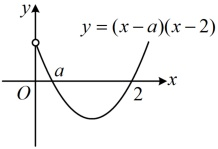
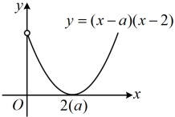
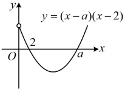

类型IV：已知单调性求参数范围

【例 8】已知函数  $ f(x)=2x^x - ax^x - x $ 在  $ [2,+\infty) $ 上单调递增，求实数  $ a $ 的取值范围。

解：（怎样翻译  $ f(x) $ 在  $ [2,+\infty) $ 上  $ \nearrow $？ $ \nearrow $ 意味着  $ f'(x) \geq 0 $ 恒成立，故可由此建立关于  $ a $ 的不等式来分析）

由题意， $ f'(x)=6x^2 - 2ax - 1 $，因为  $ f(x) $ 在  $ [2,+\infty) $ 上单调递增，所以  $ f'(x) \geq 0 $ 在  $ [2,+\infty) $ 上恒成立，

即当  $ x \in [2,+\infty) $ 时， $ 6x^2 - 2ax - 1 \geq 0 $ ①，（观察发现  $ a $ 只出现一次，容易将其分离出来，故考虑参变分离）

当  $ x \in [2,+\infty) $ 时，不等式①等价于  $ 2ax \leq 6x^2 - 1 \Leftrightarrow a \leq 3x - \frac{1}{2x} $ ②，

设函数  $ g(x) = 3x - \frac{1}{2x} $， $ x \in [2,+\infty) $，则  $ g(x) $ 为增函数，所以  $ g(x)_{\min} = g(2) = 3 \times 2 - \frac{1}{2 \times 2} = \frac{23}{4} $，

由②可知  $ a \leq g(x) $ 恒成立，所以  $ a \leq \frac{23}{4} $，故实数  $ a $ 的取值范围是  $ \left(-\infty, \frac{23}{4}\right] $。

【反思】通常情况下使  $ f'(x) = 0 $ 的点不会连成区间，它们不影响  $ f(x) $ 的单调性，所以  $ f(x) $ 在区间  $ D $ 上  $ \nearrow $ 常翻译为  $ f'(x) \ge 0 $ 在  $ D $ 上恒成立；类似的， $ f(x) $ 在区间  $ D $ 上  $ \searrow $ 则可翻译为  $ f'(x) \le 0 $ 在  $ D $ 上恒成立。有时单调性不会像本题这样直白地给出，需要通过变形才能发现，我们来看下面的变式。

【变式】已知函数  $ f(x)=2a\ln x+\frac{1}{2}x^2-(a+2)x $， $ a\in\mathbf{R} $。

（1）讨论  $ f(x) $ 的单调性；

（2）若对任意的  $ x_1, x_2 \in (0, +\infty) $ 且  $ x_1 \neq x_2 $，都有  $ \frac{f(x_2) - f(x_1)}{x_2 - x_1} > 3 - a $，求  $ a $ 的取值范围。

解：（1）由题意， $ f(x) $的定义域为 $ (0,+\infty) $，且 $ f'(x)=\frac{2a}{x}+x-(a+2)=\frac{x^2-(a+2)x+2a}{x}=\frac{(x-a)(x-2)}{x} $，

（观察发现 $ f'(x) $必有零点 $ x=2 $，至于是否有零点 $ x=a $，由 $ a $的正负决定，故先讨论 $ a $的正负）

当 $ a\leq0 $时，因为 $ x>0 $，所以 $ x-a>0 $，从而 $ f'(x)>0\Leftrightarrow x-2>0\Leftrightarrow x>2 $， $ f'(x)<0\Leftrightarrow 0<x<2 $，

故 $ f(x) $在 $ (0,2) $上单调递减，在 $ (2,+\infty) $上单调递增；

（再看 $a>0$ 的情况，此时 $f'(x)$ 有两个零点 $a$ 与 2，它们的大小关系不确定，且该大小关系会影响 $f'(x)$ 在各段上的正负情况，故又讨论 $a$ 与 2 的大小）

当 $0<a<2$ 时，如图 1，$f'(x)>0 \Leftrightarrow 0<x<a$ 或 $x>2$，$f'(x)<0 \Leftrightarrow a<x<2$，

所以 $f(x)$ 在 $(0,a)$ 上单调递增，在 $(a,2)$ 上单调递减，在 $(2,+\infty)$ 上单调递增；

上段

当 $0 < a < 2$ 时，

所以 $f(x)$ 在 $(0, a)$ 上单调增。

当 $a = 2$ 时，如图 2，$f'(x) = \frac{(x - 2)}{x} \leq 0$，所以 $f(x)$ 在 $(0, +\infty)$ 上单调递增；

当 $a > 2$ 时，如图 3，$f'(x) > 0 \Leftrightarrow 0 < x < 2$ 或 $x > a$，$f(x) < 0 \Leftrightarrow 2 < x < a$，

所以  $ f(x) $ 在  $ (0,2) $ 上单调递增，在  $ (2,a) $ 上单调递减，在  $ (a,+\infty) $ 上单调递增.

图1

图3

（2）（怎样翻译  $ \frac{f(x_2) - f(x_1)}{x_2 - x_1} > 3 - a $？由左边的结构联想到单调性，但右边不是 0，不能直接用单调性，怎么办呢？注意到该不等式关于  $ x_1 $， $ x_2 $ 是对称的，故可想象，若通过等价变形，将  $ x_1 $， $ x_2 $ 分离到不等号两侧，则所得不等式也应关于  $ x_1 $， $ x_2 $ 对称，可以构造函数，用单调性分析，于是按此尝试）