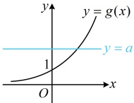
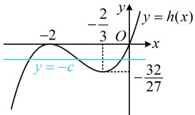

所以  $ g(x) $ 在  $ (-\infty,+\infty) $ 上单调递增，又当  $ x \to -\infty $ 时， $ g(x)=(1+x^2)e^x = \frac{1+x^2}{e^{-x}} \to 0 $，当  $ x \to +\infty $ 时， $ g(x) \to +\infty $，所以函数  $ g(x) $ 的草图如图，因为  $ a > 1 $，所以如图，直线  $ y = a $ 与  $ y = g(x) $ 的图象有且仅有 1 个交点，所以  $ f(x) $ 在  $ (-\infty,+\infty) $ 上有且仅有 1 个零点。

证法2：（已有 $ f(x) $在 $ (-\infty,+\infty) $上单调递增，故也可考虑直接取点论证 $ f(x) $有且仅有1）

个零点，怎么取？先试试简单的，比如看看 $ f(0) $的正负情况）

因为 $ a>1 $，所以 $ f(0)=1-a<0 $ ①，（只要再取出一个满足 $ f(x)\geq0 $的点，就能得出结论成立，怎么取？注意到 $ 1+x^2\geq1 $，所以只要让 $ e^x=a $，则必然就有 $ (1+x^2)e^x\geq a $，于是 $ f(x)\geq0 $，取点的思路就有了）

因为 $ f(\ln a)=(1+\ln^2a)e^{\ln a}-a=(1+\ln^2a)a-a=a\ln^2a>0 $，所以结合①可得 $ f(x) $在 $ (0,\ln a) $上有零点，

又因为 $ f(x) $在 $ \mathbb{R} $上单调递增，所以 $ f(x) $在 $ (-\infty,+\infty) $上有且仅有一个零点.

【反思】①分析含参函数的零点个数，可考虑参变分离，转化为水平直线与函数图象的交点个数问题来研究，也可考虑直接求导分析单调性，再通过取点论证零点个数；②取点的方法不是唯一的，例如本题使 $ f(x)\geq0 $的点，也可取 $ x=a $，即 $ f(a)=(1+a^2)\mathrm{e}^a-a>1+a^2-a=\left(a-\frac{1}{2}\right)^2+\frac{3}{4}>0 $。

【变式2】设函数 $ f(x)=x^{3}+ax^{2}+bx+c $

（1）若a=b=4，且函数 $ f(x) $有三个不同的零点，求实数c的取值范围；

（2）证明：“ $ a^{2}-3b>0 $”是“ $ f(x) $有三个不同的零点”的必要不充分条件.

解：（1）当 $a=b=4$ 时，$f(x)=x^3+4x^2+4x+c$，（观察发现 $c$ 是孤立的，故可考虑将方程 $f(x)=0$ 中的 $c$ 分离出来，以便于画图看交点）$f(x)=0 \Leftrightarrow x^3+4x^2+4x+c=0 \Leftrightarrow x^3+4x^2+4x=-c$，令 $h(x)=x^3+4x^2+4x$，则题设条件等价于 $h(x)$ 的图象与直线 $y=-c$ 有 3 个交点，$h'(x)=3x^2+8x+4=(x+2)(3x+2)$，所以 $h'(x)>0 \Leftrightarrow x<-2$ 或 $x>-\frac{2}{3}$，$h'(x)<0 \Leftrightarrow -2<x<-\frac{2}{3}$，从而 $h(x)$ 在 $(-\infty,-2)$ 上单调递增，在 $\left(-2,-\frac{2}{3}\right)$ 上单调递减，在 $\left(-\frac{2}{3},+\infty\right)$ 上单调递增，又 $h(-2)=(-2)^3+4\times(-2)^2+4\times(-2)=0$，$h\left(-\frac{2}{3}\right)=\left(-\frac{2}{3}\right)^3+4\times\left(-\frac{2}{3}\right)^2+4\times\left(-\frac{2}{3}\right)$ $=-\frac{32}{27}$，所以 $h(x)$ 的大致图象如图，要使 $y=-c$ 与之有 3 个交点，应有 $-\frac{32}{27}<-c<0$，从而 $0<c<\frac{32}{27}$，故 $c$ 的取值范围是 $\left(0,\frac{32}{27}\right)$。

（2）$\forall$ 充分性成立，所以 $f(x)$ 有二个不同的零点，则 $f(x)$ 有三个不同的零点，则 $f(x)$ 必定不单调，又 $f'(x)=3x^2+2ax+b$，所以 $f'(x)$ 有两个不同的零点，否则 $f'(x)\geq0$ 恒成立，$f(x)$ 在 $\mathbf{R}$ 上单调递增，所以 $f(x)$ 最多有 1 个零点，不合题意，所以 $\Delta=(2a)^2-4\times3\times b=4(a^2-3b)>0$，故 $a^2-3b>0$，所以必要性成立；

 $$ a^{2}-3b>0 $$ 

（再证充分性不成立，即证当  $ a^2 - 3b > 0 $ 时， $ f(x) $ 不一定有三个不同的零点，怎么证？只需找个反例，从哪里入手去找？可以想象， $ a^2 - 3b > 0 $ 只能保证  $ f'(x) $ 有两个零点，此时  $ f(x) $ 的单调性必为先  $ \nearrow $ 后  $ \searrow $，但  $ c $ 不确定，故可以通过调整  $ c $ 来对  $ f(x) $ 的图象进行上下平移，零点个数也可能随之改变，所以任取满足  $ a^2 - 3b > 0 $ 的  $ a $ 和  $ b $，都能通过调整  $ c $ 来改变  $ f(x) $ 的零点个数，最简单的取法，就是取第（1）问的  $ a $ 和  $ b $）当  $ a = b = 4 $， $ c = 0 $ 时，满足  $ a^2 - 3b > 0 $，此时  $ f(x) = x^3 + 4x^2 + 4x = x(x + 2)^2 $，令  $ f(x) = 0 $ 可得  $ x = -2 $ 或 0，所以  $ f(x) $ 只有两个零点，故充分性不成立；

综上所述，“ $ a^2 - 3b > 0 $” 是“ $ f(x) $ 有三个不同的零点”的必要不充分条件。