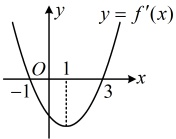
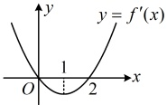
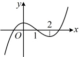
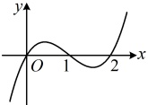
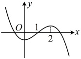
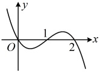

C 项，因为  $ 0 < \frac{\pi}{4} $，所以  $ g(0) < g\left(\frac{\pi}{4}\right) $，即  $ \frac{f(0)}{\cos 0} < \frac{f\left(\frac{\pi}{4}\right)}{\cos \frac{\pi}{4}} $，也即  $ f(0) < \sqrt{2}f\left(\frac{\pi}{4}\right) $，故 C 项正确

D 项，因为  $ 0 < \frac{\pi}{3} $，所以  $ g(0) < g\left(\frac{\pi}{3}\right) $，即  $ \frac{f(0)}{\cos 0} < \frac{f\left(\frac{\pi}{3}\right)}{\cos \frac{\pi}{2}} $，也即  $ f(0) < 2f\left(\frac{\pi}{3}\right) $，故 D 项错误.

答案：AC

## 强化训练

## A 组 夯实基础

1. (2025·广东模拟)

若  $ f'(x) $ 为函数  $ f(x) $ 的导函数， $ f'(x) $ 的图象大致如图所示，则下列关于  $ f(x) $ 的结论正确的是（）

A.  $ f(0) > f(3) $

B.  $ f(3) = f(-1) $

C.  $ f(x) $ 在  $ (-\infty, 1) $ 上单调递减

D.  $ f(x) $ 在  $ (1, +\infty) $ 上单调递增

2.（2025·上海期末）

设  $ f'(x) $ 是函数  $ f(x) $ 的导函数， $ y = f'(x) $ 的图象如图所示，则  $ y = f(x) $ 的图象可能是（）

A

B

