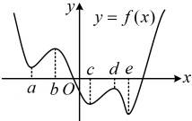
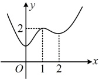

# 5.3.2 函数的极值与最大（小）值

习题：P1

## 知识梳理

## 知识点 1：函数极值的概念

如图，以 $ x=a $，b两点为例，可以发现，函数 $ y=f(x) $在点x=a处的函数值 $ f(a) $比它在点x=a附近其他点处的函数值都小， $ f'(a)=0 $；而且在点x=a附近的左侧 $ f'(x)<0 $，右侧 $ f'(x)>0 $，我们把a叫做函数 $ y=f(x) $的极小值点， $ f(a) $叫做函数 $ y=f(x) $的极小值.

类似地，函数  $ y = f(x) $ 在点  $ x = b $ 处的函数值  $ f(b) $ 比它在点  $ x = b $ 附近其他点处的函数值都大， $ f'(b) = 0 $，而且在点  $ x = b $ 附近的左侧  $ f'(x) > 0 $，右侧  $ f'(x) < 0 $，我们把  $ b $ 叫做函数  $ y = f(x) $ 的极大值点， $ f(b) $ 叫做函数  $ y = f(x) $ 的极大值。极小值点、极大值点统称为极值点，极小值和极大值统称为极值。

注：①极值定义中的“附近”没有规定区间长度，可以是很小很小的区间.

②极值点与函数的零点一样，都不是点，极值点是函数取得极值时自变量的值.

③极值点一定在函数的定义域内，且定义域的端点不能成为极值点.

④一个函数未必存在极值点，存在极值点的函数也未必只有一个极值点，如图，a，c，e都是 $ y=f(x) $的极小值点，b，d都是 $ y=f(x) $的极大值点.

⑤极大值不一定大于极小值，如图中的极大值 $ f(d) $小于极小值 $ f(a) $，只有连续曲线上相邻极值点对应的极值才有极大值大于极小值.

## 知识点1

【例 1】已知函数  $ f(x) $ 的图象如图所示，则  $ f(x) $ 的极大值点为（）

A. 0 B. 1

C. 2 D. 0 或 2

解析：由图可知， $ f(1) $ 比  $ f(x) $ 在 x=1 附近的其它函数值都大，所以 1 是  $ f(x) $ 的极大值点.

答案：B

## 知识点2

【例2】函数 $ f(x)=\frac{3}{2}x^{2}-\ln x $的极值为（ ）

A.  $ \frac{1+\ln3}{2} $ B.  $ \sqrt{3} $

C.  $ 2\ln3 $ D. 3

解析：求函数的极值，先求定义域和导数，

再求出方程  $ f'(x) = 0 $ 的根，以求出的根将定

义域划分成若干个区间，

由题意， $ f(x) $ 的定义域为  $ (0, +\infty) $，

且  $ f'(x) = \frac{3}{2} \cdot 2x - \frac{1}{x} = \frac{3x^2 - 1}{x} $，

令  $ f'(x) = 0 $ 得  $ x = \frac{\sqrt{3}}{3} $，

上面的根  $ \frac{\sqrt{3}}{3} $ 把定义域划分成了  $ \left(0, \frac{\sqrt{3}}{3}\right) $ 和

 $ \left(\frac{\sqrt{3}}{3}, +\infty\right) $，于是接下来需判断  $ f'(x) $ 在两段

上的正负，