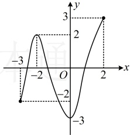

## 知识点2：函数极值与导数的关系

1. 可导函数在某点处取得极值的必要条件和充分条件

①必要条件：可导函数  $ y = f(x) $ 在  $ x = x_{0} $ 处取得极值的

必要条件是  $ f'(x_{0})=0 $;

②充分条件：可导函数  $ y = f(x) $ 在  $ x = x_{0} $ 处取得极值的

充分条件是  $ f'(x) $ 在  $ x = x_{0} $ 附近两侧异号.

注：为什么  $ f'(x_0) = 0 $ 是  $ y = f(x) $ 在  $ x = x_0 $ 处取得极值的必要条件，而非充分条件？例如，设  $ f(x) = x^3 $，则  $ f'(x) = 3x^2 $，有  $ f'(0) = 0 $，但当  $ x < 0 $ 时， $ f'(x) > 0 $， $ f(x) $ 单调递增，当  $ x > 0 $ 时， $ f'(x) > 0 $， $ f(x) $ 单调递增，所以  $ f(x) = x^3 $ 为增函数，因此  $ 0 $ 不是函数  $ f(x) = x^3 $ 的极值点。

2. 函数极值的求解步骤

一般地，求函数  $ y = f(x) $ 的极值的步骤是：

①求出函数的定义域及导数  $ f'(x) $;

②解方程  $ f'(x)=0 $ ，得到方程的根；

③用方程  $ f'(x)=0 $ 的根，顺次将函数的定义域分成若干个区间，由  $ f'(x) $ 在各区间内的符号，判断  $ f(x) $ 在  $ f'(x)=0 $ 的各个根处的极值情况：

若  $ f'(x) $ 在根的附近左正右负，则  $ f(x) $ 在这个根处取得极大值；若  $ f'(x) $ 在根的附近左负右正，则  $ f(x) $ 在这个根处取得极小值；若  $ f'(x) $ 在根的附近左右两侧同号，则这个根不是  $ f(x) $ 的极值点.

## 知识点 3：函数的最大值与最小值

### 1 \. 基于极值概念的再认识

一般地，如果在区间 $ [a,b] $上，函数 $ y=f(x) $的图象是一条连续不断的曲线，那么它必有最大值和最小值，并且函数的最值必在极值点或区间端点处取得.

注：①函数最值的存在条件中，给定函数的区间必须是闭区间，且函数图象必须连续不断，否则不能保证函数当 $ x\in\left(0,\frac{\sqrt{3}}{3}\right) $时， $ 3x^{2}-1<0 $，

所以 $ f'(x)<0 $，故 $ f(x) $单调递减，

当 $ x\in\left(\frac{\sqrt{3}}{3},+\infty\right) $时， $ 3x^{2}-1>0 $，

所以 $ f'(x)>0 $，故 $ f(x) $单调递增，

所以 $ f(x) $有极小值 $ f\left(\frac{\sqrt{3}}{3}\right)=\frac{3}{2}\times\left(\frac{\sqrt{3}}{3}\right)^{2}- $

 $ \ln\frac{\sqrt{3}}{3}=\frac{1+\ln3}{2} $，无极大值.

答案：A

## 知识点3

【例 3】如图所示为函数  $ y = f(x) $， $ x \in [-3, 2] $ 的图象，请说出图中所示的函数  $ f(x) $ 的最值.

解：由图可知， $ y = f(x) $有极值点 -2 和 0，

所以  $ f(x) $ 的极值为  $ f(-2)=2 $， $ f(0)=-3 $，

又因为  $ f(-3)=-2 $， $ f(2)=3 $，

所以  $ f(0)<f(-3)<f(-2)<f(2) $，

故  $ f(x) $ 有最大值 3，最小值 -3。

【例4】下列说法正确的是（）

A. 函数在某区间上的极大值不会小于它的极小值

B．函数在某区间上的最大值不会小于它的最小值

C．函数在某区间上的极大值就是它在该区间上的最大值

D．函数在某区间上的最大值就是它