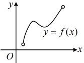
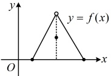
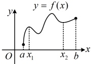
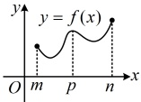
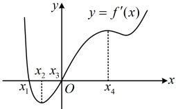

一定有最值，例如图1中的函数无最大、最小值，图2中的函数无最大值.

图1

图2

②若在区间 $ (a,b) $上函数 $ f(x) $的图象连续不断，且 $ f(x) $只有一个极值点，则该极值点就是最值点.

③极值是对某一点附近而言的概念，最值是对定义域内的函数而言的概念，因此给定区间 $ [a,b] $内的极大（小）值可以有多个，但最大（小）值只能有一个.

2. 求函数  $ f(x) $ 在  $ [a,b] $ 上最值的一般步骤

①求函数  $ f(x) $ 在区间  $ (a,b) $ 内的极值；

②将函数  $ f(x) $ 的各极值与端点处的函数值  $ f(a) $,  $ f(b) $ 比较，其中最大的一个是最大值，最小的一个是最小值.

## 在该区间上的极大值

解析：A项，极大值可能小于极小值，如图1，极大值 $ f(x_{1}) $小于极小值 $ f(x_{2}) $，故A项错误；

B 项，最大值是所有函数值中最大的，最小值是所有函数值中最小的，所以最大值不小于最小值，故 B 项正确；

C 项，极大值不一定是区间上的最大值，最大值也可能在区间端点处取得，反例如图2，极大值  $ f(p) $ 不是  $ f(x) $ 的最大值，故 C 项错误；

D 项，最大值不一定是极大值，反例如图2，最大值  $ f(n) $ 不是极大值，故 D 项错误.

图1

图2

答案：B

## 本节核心题型

本节围绕函数的极值与最值展开，我们先用类型Ⅰ这组题，结合图象来帮大家强化对极值有关概念的理解；接着又设计了类型Ⅱ这组题来分析如何求函数的极值；有时题干会给出函数的极值点或极值，让求参数的值或范围，我们在类型Ⅲ中会详细分析这类题的处理方法；最后，我们还设计了类型Ⅳ这组题来给大家讲解如何求函数的最值。通过这些题目的学习，希望大家能深刻理解函数的极值、最值与函数单调性的关系。

类型 I：由图象分析函数的极值情况

【例 5】导函数  $ y = f'(x) $ 的图象如图所示，在标记的点中，函数  $ y = f(x) $ 的极大值点为（）

A.  $ x_{1} $ B.  $ x_{2} $ C.  $ x_{3} $ D.  $ x_{4} $

解析：函数在极大值点左侧↗，右侧↘，于是在该点左侧附近 $ f'(x)>0 $，右侧附近 $ f'(x)<0 $，故从图上找这一特征，由图可知 $ f'(x) $在 $ x=x_1 $的左侧附近为正，右侧附近为负，所以函数 $ y=f(x) $的极大值点为 $ x_1 $。