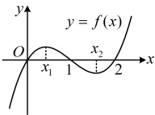

答案：A

【反思】分析函数的极值点，就是分析导数的正负分界点。若  $ f'(x) $ 在  $ x=x_0 $ 左侧附近为正，右侧附近为负，则  $ x_0 $ 是  $ f(x) $ 的极大值点；若  $ f'(x) $ 在  $ x=x_0 $ 左侧附近为负，右侧附近为正，则  $ x_0 $ 是  $ f(x) $ 的极小值点。本题给的是  $ f'(x) $ 的图象，有时也会给出  $ f(x) $ 的图象，我们来看一个变式。

【变式】已知函数  $ f(x)=x(x^2+bx+c) $ 的图象如图所示，则  $ x_1x_2= $（ ）

A. 0

B. 1

C. 2

D.  $ \frac{2}{3} $

解析：观察发现  $ x_1 $， $ x_2 $ 是  $ f(x) $ 的两个极值点，于是它们是  $ f'(x) $ 的零点，故先求导，

由题意， $ f(x)=x(x^2+bx+c)=x^3+bx^2+cx $，所以  $ f'(x)=3x^2+2bx+c $，

由图可知， $ x_1 $， $ x_2 $ 是  $ f(x) $ 的两个极值点，所以它们是  $ f'(x) $ 的两个零点，也即为方程  $ 3x^2+2bx+c=0 $ 的两根，

由韦达定理， $ x_1x_2=\frac{c}{3} $，接下来需求  $ c $，怎么求？由图还可以看出  $ f(x) $ 的图象与  $ x $ 轴的交点横坐标分别为 0，1

和 2，于是  $ f(0)=f(1)=f(2)=0 $，其中  $ f(0)=0 $ 是必然的，故可由  $ f(1)=f(2)=0 $ 建立方程组求  $ c $，

由图可知， $ \begin{cases}f(1)=1+b+c=0\\f(2)=2(4+2b+c)=0\end{cases} $，解得： $ c=2 $，所以  $ x_1x_2=\frac{c}{3}=\frac{2}{3} $。

答案：D

## 类型Ⅱ：求函数的极值点或极值

【例 6】已知函数  $ f(x)=\ln x + x^2 + ax + 2 $ 在点  $ (2, f(2)) $ 处的切线与直线  $ 2x + 3y = 0 $ 垂直。

（1）求  $ a $；

（2）求  $ f(x) $ 的极值.

解：（1）由题意， $ f'(x)=\frac{1}{x}+2x+a $，则 $ f'(2)=\frac{1}{2}+2\times2+a=\frac{9}{2}+a $，

因为 $ f(x) $在点 $ (2,f(2)) $处的切线与直线 $ 2x+3y=0 $垂直，所以 $ \left(\frac{9}{2}+a\right)\times\left(-\frac{2}{3}\right)=-1 $，解得：a=-3。

（2）解法1：（求 $ f(x) $的极值，可先求 $ f'(x) $，再列表判断 $ f'(x) $的正负，得到 $ f(x) $的极值情况）

（2）解法1：（求 $ f(x) $的极值，可先求 $ f(x) $，再列表判断 $ f(x) $的正负，得到 $ f(x) $的极值情况）

由（1）可得 $ f(x)=\ln x+x^{2}-3x+2 $， $ f'(x)=\frac{1}{x}+2x-3=\frac{2x^{2}-3x+1}{x}=\frac{(2x-1)(x-1)}{x} $，x>0，

令 $ f'(x)=0 $可得 $ x=\frac{1}{2} $或1，且 $ f\left(\frac{1}{2}\right)=\ln\frac{1}{2}+\left(\frac{1}{2}\right)^{2}-3\times\frac{1}{2}+2=\frac{3}{4}-\ln2 $， $ f(1)=\ln1+1^{2}-3\times1+2=0 $，

当x变化时， $ f'(x) $， $ f(x) $的变化情况如下表：

<table border=1 style='margin: auto; word-wrap: break-word;'><tr><td style='text-align: center; word-wrap: break-word;'>x</td><td style='text-align: center; word-wrap: break-word;'>$ \left(0,\frac{1}{2}\right) $</td><td style='text-align: center; word-wrap: break-word;'>$ \frac{1}{2} $</td><td style='text-align: center; word-wrap: break-word;'>$ \left(\frac{1}{2},1\right) $</td><td style='text-align: center; word-wrap: break-word;'>1</td><td style='text-align: center; word-wrap: break-word;'>$ (1,+\infty) $</td></tr><tr><td style='text-align: center; word-wrap: break-word;'>f&#x27;(x)</td><td style='text-align: center; word-wrap: break-word;'>+</td><td style='text-align: center; word-wrap: break-word;'>0</td><td style='text-align: center; word-wrap: break-word;'>-</td><td style='text-align: center; word-wrap: break-word;'>0</td><td style='text-align: center; word-wrap: break-word;'>+</td></tr><tr><td style='text-align: center; word-wrap: break-word;'>f(x)</td><td style='text-align: center; word-wrap: break-word;'>单调递增</td><td style='text-align: center; word-wrap: break-word;'>$ \frac{3}{4}-\ln2 $</td><td style='text-align: center; word-wrap: break-word;'>单调递减</td><td style='text-align: center; word-wrap: break-word;'>0</td><td style='text-align: center; word-wrap: break-word;'>单调递增</td></tr></table>

所以  $ f(x) $ 有极大值  $ f\left(\frac{1}{2}\right)=\frac{3}{4}-\ln 2 $，极小值  $ f(1)=0 $。

解法2：（求  $ f(x) $ 的极值，核心是通过判断  $ f'(x) $ 的正负，得到  $ f(x) $ 的单调性，所以也可不列表，直接求解不等式  $ f'(x) > 0 $ 和  $ f'(x) < 0 $，得到  $ f(x) $ 在各区间上的单调性）

由（1）可得  $ f(x)=\ln x + x^{2} - 3x + 2 $， $ f'(x)=\frac{1}{x} + 2x - 3 = \frac{2x^{2} - 3x + 1}{x} = \frac{(2x - 1)(x - 1)}{x} $，x > 0，