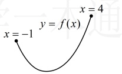
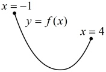

故x=1不是 $ f(x) $的极值点，不合题意；

(iv)当  $ k > e $ 时， $ \ln k > 1 $，所以  $ f'(x) > 0 \Leftrightarrow x < 1 $ 或  $ x > \ln k $， $ f'(x) < 0 \Leftrightarrow 1 < x < \ln k $，

从而  $ f(x) $ 在  $ (-\infty,1) $ 上单调递增，在  $ (1,\ln k) $ 上单调递减，在  $ (\ln k,+\infty) $ 上单调递增，

故x=1是 $ f(x) $的极大值点，不合题意；

综上所述，实数 k 的取值范围是  $ (-\infty, e) $

【反思】当条件给出  $ f(x) $ 在  $ x = x_0 $ 处取得极大值或极小值，且  $ f'(x_0) = 0 $ 恒成立，无法由此求出参数时，可考虑直接讨论  $ f(x) $ 的单调性，研究  $ f(x) $ 在何处取得极值。

## 类型IV：函数的最值分析

【例 8】已知函数  $ f(x) = x^4 + ax^3 $， $ x \in \mathbb{R} $。

（1）若函数  $ f(x) $ 在点  $ (1,f(1)) $ 处的切线过原点，求实数 a 的值；

（2）若a=-4，求函数 $ f(x) $在区间 $ [-1,4] $上的最大值.

解：（1）由题意， $ f(1)=1+a $，所以切点坐标为 $ (1,1+a) $，又 $ f'(x)=4x^3+3ax^2 $，所以 $ f'(1)=4+3a $，故 $ f(x) $在点 $ (1,1+a) $处的切线方程为 $ y-(1+a)=(4+3a)(x-1) $，即 $ y=(4+3a)x-3-2a $，

由题意，该切线过原点，所以 $ 0=(4+3a)\times0-3-2a $，解得： $ a=-\frac{3}{2} $。

（2）（求函数的最大值，常先研究单调性，这里$f(x)$的解析式较复杂，不易直接看出单调性，故求导分析）

当$a=-4$时，$f(x)=x^4-4x^3$，$f'(x)=4x^3-12x^2=4x^2(x-3)$，令$f'(x)=0$得$4x^2(x-3)=0$，解得：$x=0$或$3$，当$x\in[-1,3)$时，$f'(x)\leq0$，所以$f(x)$单调递减；当$x\in(3,4]$时，$f'(x)>0$，所以$f(x)$单调递增，（先↘后↗，有如图所示的两种情况，$f(x)$的最大值只可能在

所以当  $ x \in [-1,4] $ 时， $ f(x)_{\max} = \max\{f(-1), f(4)\} $，

因为  $ f(-1) = (-1)^4 - 4 \times (-1)^3 = 5 $， $ f(4) = 4^4 - 4 \times 4^3 = 0 $，

所以  $ f(-1) > f(4) $，故  $ f(x) $ 在  $ [-1,4] $ 上的最大值为 5。

【反思】连续函数在某闭区间上的最值只可能在区间端点或极值点处取得，所以求这类最值，常先求导分析单调性，得到极值，再与区间端点处函数值进行比较，或者根据单调性画出草图，直接观察最值。不管函数如何变化，方法都是这样，我们再看两个变式。

【变式1】已知函数  $ f(x)=(\sin x-a)^{2}(\sin x+a) $，其中 a>1，若  $ f(x) $ 的最大值为 4，求 a 的值.

【变式 1】已知函数  $ f(x)=(\sin x-a)^2(\sin x+a) $，其中  $ a>1 $，右  $ f(x) $ 的最大值为 4，求  $ a $ 的值。

解：（条件给出  $ f(x)_{\max}=4 $，考虑求出  $ f(x)_{\max} $，由此建立方程求  $ a $，但解析式较复杂，如何求  $ f(x)_{\max} $？观察发现含  $ x $ 的部分以  $ \sin x $ 整体出现，故可考虑将  $ \sin x $ 换元成  $ t $，化简解析式，再分析最值）

设  $ t=\sin x $，则  $ -1\leq t\leq1 $，且  $ f(x)=(t-a)^2(t+a) $，令  $ g(t)=(t-a)^2(t+a) $， $ -1\leq t\leq1 $，

则  $ g'(t)=2(t-a)(t+a)+(t-a)^2=(t-a)(3t+a) $，（观察发现  $ g'(t) $ 有零点  $ a $ 和  $ -\frac{a}{3} $，由于  $ a>1 $，所以  $ a $ 不在定义域内，而  $ -\frac{a}{3}<\frac{1}{3} $，所以  $ -\frac{a}{3} $ 这个零点可能在或不在定义域内，由  $ a $ 与 3 的大小决定，故据此讨论）

当  $ 1<a<3 $ 时， $ -1<-\frac{a}{3}<\frac{1}{3} $，因为  $ t-a<0 $，所以  $ g'(t)>0\Leftrightarrow -1\leq t<-\frac{a}{3} $， $ g'(t)<0\Leftrightarrow -\frac{a}{3}<t\leq1 $，

从而  $ g(t) $ 在  $ \left[-1,-\frac{a}{3}\right) $ 上单调递增，在  $ \left(-\frac{a}{3},1\right] $ 上单调递减，故  $ g(t)_{\max}=g\left(-\frac{a}{3}\right)=\left(-\frac{a}{3}-a\right)^2\left(-\frac{a}{3}+a\right)=\frac{32}{27}a^3 $，

所以  $ f(x)_{\max}=\frac{32}{27}a^3 $，又  $ f(x)_{\max}=4 $，所以  $ \frac{32}{27}a^3=4 $，解得： $ a=\frac{3}{2} $，满足  $ 1<a<3 $；

当  $ a\geq3 $ 时， $ t-a<0 $， $ 3t+a\geq3t+3\geq0 $，所以  $ g'(t)\leq0 $，从而  $ g(t) $ 在  $ [-1,1] $ 上单调递减，