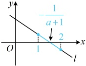

故  $ g(t)_{\max}=g(-1)=(-1-a)^{2}(-1+a)=(a+1)^{2}(a-1) $，即  $ f(x)_{\max}=(a+1)^{2}(a-1) $，

（此时 $f(x)$ 的最大值可能为 4 吗？由于 $a \geq 3$，所以简单估算就能发现 $(a+1)^2(a-1)>4$，下面给出严格证明）因为 $a \geq 3$，所以 $f(x)_{\max} = (a+1)^2(a-1) \geq (3+1)^2 \times (3-1) = 32 > 4$，不合题意；综上所述，实数 $a$ 的值为 $\frac{3}{2}$。

【变式2】已知函数  $ f(x)=\ln x+(a+1)x $，求  $ f(x) $ 在区间  $ [1,2] $ 上的最小值.

解：（求函数的最小值，先求导分析其单调性）由题意， $ f'(x)=\frac{1}{x}+a+1=\frac{(a+1)x+1}{x} $，x>0，

（令  $ f'(x)=0 $ 得  $ x=-\frac{1}{a+1} $，只有当  $ -\frac{1}{a+1} $ 在区间  $ (1,2) $ 上时， $ f(x) $ 在  $ [1,2] $ 上才不单调，此时  $ 1<-\frac{1}{a+1}<2 $，解得： $ -2<a<-\frac{3}{2} $，于是分  $ a\leq-2 $， $ -2<a<-\frac{3}{2} $ 和  $ a\geq-\frac{3}{2} $ 三种情况讨论）

当  $ a<-2 $ 时， $ a+1\leq-1 $，所以当  $ 1<x\leq2 $ 时， $ (a+1)x<-1 $，从而  $ (a+1)x+1<0 $，故  $ f'(x)<0 $。

当 $ a \leq -2 $时， $ a+1 \leq -1 $，所以当 $ 1 \leq x \leq 2 $时， $ (a+1)x \leq -1 $，从而 $ (a+1)x+1 \leq 0 $，故

所以  $ f(x) $ 在  $ [1,2] $ 上单调递减，故  $ f(x)_{\min}=f(2)=\ln2+2a+2 $;

当 $ -2 < a < -\frac{3}{2} $时， $ -1 < a + 1 < -\frac{1}{2} $，所以 $ -2 < \frac{1}{a+1} < -1 $，从而 $ 1 < -\frac{1}{a+1} < 2 $，故直线 $ l: y = (a+1)x + 1 $如图，由图可知，当 $ 1 \leq x < -\frac{1}{a+1} $时， $ (a+1)x + 1 > 0 $，所以 $ f'(x) > 0 $，

同理，当 $ -\frac{1}{a+1}<x\leq2 $时， $ f'(x)<0 $，

所以  $ f(x) $ 在  $ \left[1,-\frac{1}{a+1}\right) $ 上单调递增，在  $ \left(-\frac{1}{a+1},2\right] $ 上单调递减，

（可以想象，先↗后↘， $ f(x) $的最小值只会在左、右端点处取得，故只需比较两个端点处的函数值）

由题意， $ f(1)=a+1 $， $ f(2)=\ln 2+2a+2 $，所以 $ f(2)-f(1)=\ln 2+a+1 $ ①，

 $ (-2<a<-\frac{3}{2}\Rightarrow \ln 2-1<\ln 2+a+1<\ln 2-\frac{1}{2} $，由于 $ \ln 2-1<0 $， $ \ln 2-\frac{1}{2}>0 $，所以式①的正负不定，故讨论；

当 $ -2<a<-1-\ln 2 $时，由①知 $ f(2)-f(1)=\ln 2+a+1<0 $，所以 $ f(2)<f(1) $，故 $ f(x)_{\min}=f(2)=\ln 2+2a+2 $；

当 $ -1-\ln 2\leq a<-\frac{3}{2} $时，由①知 $ f(2)-f(1)=\ln 2+a+1\geq0 $，所以 $ f(2)\geq f(1) $，故 $ f(x)_{\min}=f(1)=a+1 $；

当 $ a\geq-\frac{3}{2} $时， $ a+1\geq-\frac{1}{2} $，所以当 $ 1\leq x\leq2 $时， $ (a+1)x\geq-\frac{1}{2}\times2=-1 $，从而 $ (a+1)x+1\geq0 $，故 $ f'(x)\geq0 $，

所以 $ f(x) $在 $ [1,2] $上单调递增，故 $ f(x)_{\min}=f(1)=a+1 $；

综上所述，当 $ a<-1-\ln2 $时， $ f(x)_{\min}=\ln2+2a+2 $；当 $ a\geq-1-\ln2 $时， $ f(x)_{\min}=a+1 $。

## 补充、拓展

研究函数的极值、最值可以用于证明不等式，我们通过下面的类型V来给大家归纳用导数证明不等式这类问题，请大家跟着例题和反思，去学习用导数证明不等式的基本方法和技巧吧。

类型V：利用导数证明不等式

【例 9】证明：（1） $ e^x \ge x+1 $；（2） $ e^x \ge ex $；（3） $ 1 - \frac{1}{x} \le \ln x \le x-1 $；（4） $ \ln x \le \frac{x}{e} $.

证明：（怎样证明所给的不等式？以  $ e^x \geq x + 1 $ 为例，要证此不等式成立，只需证  $ e^x - x - 1 \geq 0 $，即证  $ (\mathrm{e}^x - x - 1)_{\min} \geq 0 $，于是只需求  $ (\mathrm{e}^x - x - 1)_{\min} $，该函数结构不复杂，可直接构造函数求导分析，其余几个不等式可类似处理）

（1）设  $ f(x) = e^x - x - 1 $， $ x \in \mathbb{R} $，则  $ f'(x) = e^x - 1 $，所以  $ f'(x) < 0 \Leftrightarrow x < 0 $， $ f'(x) > 0 \Leftrightarrow x > 0 $，

从而  $ f(x) $ 在  $ (-\infty, 0) $ 上单调递减，在  $ (0, +\infty) $ 上单调递增，故  $ f(x)_{\min} = f(0) = 0 $，