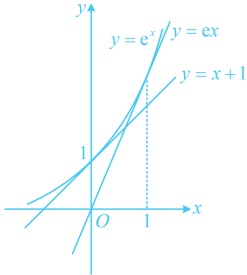
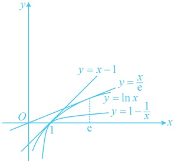

所以  $ f(x) = \mathrm{e}^x - x - 1 \geq 0 $，故  $ \mathrm{e}^x \geq x + 1 $，当且仅当  $ x = 0 $ 时取等号。

（2）设  $ g(x) = \mathrm{e}^x - \mathrm{ex} $， $ x \in \mathbf{R} $，则  $ g'(x) = \mathrm{e}^x - \mathrm{e} $，所以  $ g'(x) < 0 \Leftrightarrow x < 1 $， $ g'(x) > 0 \Leftrightarrow x > 1 $，从而  $ g(x) $ 在  $ (-\infty, 1) $ 上单调递减，在  $ (1, +\infty) $ 上单调递增，故  $ g(x)_{\min} = g(1) = 0 $，所以  $ g(x) = \mathrm{e}^x - \mathrm{ex} \geq 0 $，故  $ \mathrm{e}^x \geq \mathrm{ex} $，当且仅当  $ x = 1 $ 时取等号。

（3）设  $ h(x) = \ln x - x + 1 $， $ x > 0 $，则  $ h'(x) = \frac{1}{x} - 1 = \frac{1 - x}{x} $，所以  $ h'(x) > 0 \Leftrightarrow 0 < x < 1 $， $ h'(x) < 0 \Leftrightarrow x > 1 $，从而  $ h(x) $ 在  $ (0,1) $ 上单调递增，在  $ (1,+\infty) $ 上单调递减，故  $ h(x)_{\max} = h(1) = 0 $，所以  $ h(x) = \ln x - x + 1 \leq 0 $，故  $ \ln x \leq x - 1 $，当且仅当 x = 1 时取等号；

（再用同样的方法证  $ \ln x \geq 1 - \frac{1}{x} $ 可行，但偏麻烦。注意到在  $ x-1 $ 中将  $ x $ 换成  $ \frac{1}{x} $，即可变成  $ \frac{1}{x}-1 $，与右边联系起来，故可尝试直接用此代换来证明  $ \ln x \geq 1 - \frac{1}{x} $）在  $ \ln x \leq x-1 $ 中将  $ x $ 换成  $ \frac{1}{x} $ 得  $ \ln \frac{1}{x} \leq \frac{1}{x}-1 $，所以  $ -\ln x \leq \frac{1}{x}-1 $，故  $ \ln x \geq 1 - \frac{1}{x} $，当且仅当  $ \frac{1}{x}=1 $，即  $ x=1 $ 时取等号；综上所述， $ 1 - \frac{1}{x} \leq \ln x \leq x-1 $。

（4）设  $ r(x) = \ln x - \frac{x}{e} $， $ x > 0 $，则  $ r'(x) = \frac{1}{x} - \frac{1}{e} = \frac{e - x}{ex} $，所以  $ r'(x) > 0 \Leftrightarrow 0 < x < e $， $ r'(x) < 0 \Leftrightarrow x > e $，从而  $ r(x) $ 在  $ (0, e) $ 上单调递增，在  $ (e, +\infty) $ 上单调递减，故  $ r(x)_{\max} = r(e) = 0 $，所以  $ r(x) = \ln x - \frac{x}{e} \leq 0 $，故  $ \ln x \leq \frac{x}{e} $，当且仅当  $ x = e $ 时取等号。

【反思】①当要证明的不等式结构简单，移项后“”时，可考虑直接移项，构造函数求导分析；②本题的4个不等式都有深刻的几何意义。“”的切线方程分别为  $ y = x + 1 $ 和  $ y = ex $，所以  $ e^x \geq x + 1 $， $ e^x \geq ex $，取等号“ $ e, 1 $）处的切线方程分别为  $ y = x - 1 $ 和  $ y = \frac{x}{1} $”常将上面几个不

图1

图2

【变式1】已知函数  $ f(x)=2\mathrm{e}^{x}-ax $，其中  $ a\geq0 $，证明： $ f(a)\geq2a+2 $。

证法1：要证  $ f(a) \geq 2a + 2 $，即证  $ 2\mathrm{e}^a - a^2 \geq 2a + 2 $，（此不等式结构不算复杂，可尝试直接移项，构造函数求导分析）令  $ g(a) = 2\mathrm{e}^a - a^2 - 2a - 2 $， $ a \geq 0 $，则  $ g'(a) = 2\mathrm{e}^a - 2a - 2 = 2[\mathrm{e}^a - (a+1)] $，

（由前面的经典切线放缩不等式， $ e^a \geq a+1 $，所以  $ e^a - (a+1) \geq 0 $，于是  $ g'(a) \geq 0 $，但此为解答题，不宜直接用切线放缩不等式的结论，我们给出严格的证明过程，只需对  $ g'(a) $ 再求导分析）

所以  $ g''(a) = 2(e^a - 1) \geq 0 $，从而  $ g'(a) $ 在  $ [0, +\infty) $ 上单调递增，故  $ g'(a) \geq g'(0) = 2[e^0 - (0 + 1)] = 0 $，所以  $ g(a) $ 在  $ [0, +\infty) $ 上单调递增，故  $ g(a) \geq g(0) = 2e^0 - 0^2 - 2 \times 0 - 2 = 0 $，即  $ 2e^a - a^2 - 2a - 2 \geq 0 $，所以  $ 2e^a - a^2 \geq 2a + 2 $，即  $ f(a) \geq 2a + 2 $。