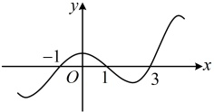

## 强化训练

## A 组 夯实基础

1. （2025·福建福州期中）

已知函数  $ f(x) $ 的定义域为  $ \mathbb{R} $，其导函数  $ f'(x) $ 的部分图象如图所示，则（）

A.  $ f(x) $ 在  $ (3,+\infty) $ 上单调递增

B.  $ f(x) $ 的最大值为 f(1)

C.  $ f(x) $ 的一个极大值点为 -1

D.  $ f(x) $ 的一个减区间为(1,3)

2.（2025·甘肃临夏期末）

(2025·日照临夏期末)

已知函数  $ f(x)=(x+a)e^{x} $ 在 x=1 处有极值.

（1）求a的值；

（2）求 $ f(x) $在 $ [-1,3] $上的最值.

3.（2025·云南大理开学考试（节选））

已知函数  $ f(x) = \tan x - x $，证明： $ \forall x \in \left(0, \frac{\pi}{2}\right) $， $ f(x) > 0 $。