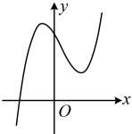

## B组 强化能力

4.（2025·上海期末）

设  $ a,b,c,d \in \mathbb{R} $，若函数  $ f(x) = ax^3 + bx^2 + cx + d $ 的部分图象如图所示，则下列结论正确的是（ ）

A. bcd > 0 B. acd > 0

C.  $ abd > 0 $ D. abc < 0

5.（2025·江西模拟）（多选）

已知函数  $ f(x)=2x^{3}-3x^{2} $，则（）

A. 1 是  $ f(x) $ 的极小值点

B.  $ f(x) $ 的图象关于点  $ \left(\frac{1}{2}, -\frac{1}{2}\right) $ 对称

C.  $ g(x)=f(x)+1 $ 有 3 个零点

D. 当 0 < x < 1 时， $ f(x^{2} - 1) > f(x - 1) $

6.（2025·四川成都模拟）

设函数  $ f(x)=(x+2)\ln(x+1)-x $

（1）设函数  $ g(x)=f'(x) $，求  $ g(x) $ 的单调区间；

（2）求证： $ xf(x)\geq0 $.