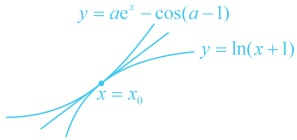

知在  $ x=0 $ 右侧附近  $ f'(x)<0 $，所以  $ f(x)\searrow $，不可能满足  $ f(x)\geq0 $ 在  $ x\geq0 $ 时恒成立，故应有  $ f''(0)\geq0 $，由此可求得  $ a\leq\frac{1}{2} $，讨论的分界点就有了）

当 $ a \leq \frac{1}{2} $时， $ f(x) = \mathrm{e}^x - 1 - x - ax^2 \geq \mathrm{e}^x - 1 - x - \frac{1}{2}x^2 $，设 $ g(x) = \mathrm{e}^x - 1 - x - \frac{1}{2}x^2 $， $ x \geq 0 $，则 $ g'(x) = \mathrm{e}^x - 1 - x $，由（1）可得当 $ x \geq 0 $时， $ \mathrm{e}^x - 1 - x \geq 0 $，所以 $ g'(x) \geq 0 $，故 $ g(x) $在 $ [0, +\infty) $上单调递增，又 $ g(0) = 0 $，所以 $ g(x) \geq 0 $恒成立，故 $ f(x) \geq g(x) \geq 0 $，满足题意；

（再看  $ a > \frac{1}{2} $ 的情况，可以想象此时  $ f(x) \geq 0 $ 在  $ x \geq 0 $ 时不能恒成立的原因是  $ f''(x) $ 在 x=0 右侧附近有一段为负，故抓住这一点来论证即可）当  $ a > \frac{1}{2} $ 时， $ f'(x) = e^x - 1 - 2ax $， $ f''(x) = e^x - 2a $，

因为$2a > 1$，所以$\ln(2a) > 0$，从而当$0 \leq x < \ln(2a)$时，$f''(x) < 0$，故$f'(x)$在$[0, \ln(2a)]$上单调递减，又$f'(0) = 0$，所以当$x \in [0, \ln(2a)]$时，$f'(x) \leq 0$，故$f(x)$在$[0, \ln(2a)]$上单调递减，

因为$f(0) = 0$，所以当$x \in (0, \ln(2a))$时，$f(x) < 0$，故$f(x) \geq 0$在$[0, +\infty)$上不能恒成立，不合题意；

综上所述，实数$a$的取值范围为$\left(-\infty, \frac{1}{2}\right]$。

【例 4】已知函数  $ f(x) = a\mathrm{e}^{x} - \ln(1 + x) - \cos(a - 1) $， $ a \in \mathbf{R} $。

（1）当a=1时，求 $ f(x) $的零点；

（2）若  $ f(x) \geq 0 $，求 a 的取值范围.

解：（1）（研究函数的零点，先求导分析单调性）当 $a=1$ 时，$f(x)=\mathrm{e}^x-\ln(1+x)-1$，$x>-1$，所以 $f'(x)=\mathrm{e}^x-\frac{1}{1+x}$，（不易直接判断正负，考虑继续求导）$f''(x)=\mathrm{e}^x+\frac{1}{(1+x)^2}>0$，

所以  $ f'(x) $ 在  $ (-1,+\infty) $ 上单调递增，又  $ f'(0)=0 $，所以  $ f'(x)<0\Leftrightarrow-1<x<0 $， $ f'(x)>0\Leftrightarrow x>0 $，

从而  $ f(x) $ 在  $ (-1,0) $ 上单调递减，在  $ (0,+\infty) $ 上单调递增，故  $ f(x)_{\min}=f(0)=0 $，所以  $ f(x) $ 的零点是 0.

（2）（有  $ ae^x $ 和  $ \cos(a-1) $，无法分离出  $ a $，也没有端点效应，怎么办呢？此时还可尝试画图分析， $ f(x) \geq 0 $ 可化为  $ ae^x - \cos(a-1) \geq \ln(x+1) $ （i），可以想象，当  $ a \leq 0 $ 时，不等式 (i) 在  $ x \to +\infty $ 时不成立，所以  $ a > 0 $，此时尽管有  $ \cos(a-1) $ 这部分，但它只能在  $ [-1,1] $ 内取值，所以总体来看，若增大  $ a $，则  $ y = ae^x - \cos(a-1) $ 会向上拉伸，若减小  $ a $，则向下压缩，于是满足  $ ae^x - \cos(a-1) \geq \ln(x+1) $ 的临界状态如图，此时两曲线相切（在公共点处有相同的切线），设切点横坐标为  $ x_0 $，则  $ \begin{cases} ae^{x_0} - \cos(a-1) = \ln(x_0 + 1) \\ ae^{x_0} = \frac{1}{x_0 + 1} \end{cases} (x = x_0 $ 处两曲线切线斜率相等），正面解此方程组不易，

可尝试直接观察并猜想. 经尝试,  $ x_{0}=0 $, a=1能满足上述方程组, 由图可知当 $ a\geq1 $时, 不等式(i)恒成立, 怎样严格作答? 可以看到, x=0是关键位置, 可先将x=0代入原不等式, 限定a的范围, 再论证充分性)

因为  $ f(x) \geq 0 $ 恒成立，所以  $ f(0) = a - \cos(a - 1) \geq 0 $ ①，

设  $ \varphi(a) = a - \cos(a - 1) $， $ a \in \mathbb{R} $，则  $ \varphi'(a) = 1 + \sin(a - 1) \geq 0 $

 $$ a\geq1 $$ 

此时  $ f(x)=ae^{x}-\ln(1+x)-\cos(a-1)\geq e^{x}-\ln(1+x)-1 $

由（1）可得  $ \mathrm{e}^x - \ln(1+x) - 1 \geq 0 $ 恒成立，所以  $ f(x) \geq \mathrm{e}^x - \ln(1+x) - 1 \geq 0 $，

满足题意，故  $ a $ 的取值范围为  $ [1, +\infty) $。

【反思】在含参不等式恒成立问题中，当参变分离、端点效应都失效时，还可以考虑将原不等式进行适当的拆分，再画图寻找思路。若通过画图分析发现使  $ u(x) \geq v(x) $ 恒成立的临界状态恰好是两个函数图象相切（两图象在公共点处有公切线）的情形，则可先在草稿纸上按  $ \begin{cases} u(x_0) = v(x_0) \\ u'(x_0) = v'(x_0) \end{cases} $ 求出临界状态，做到心中有数。正式作答时，

