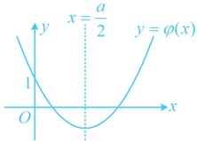

可先用  $ u(x_0) \geq v(x_0) $ 来得出  $ u(x) \geq v(x) $ 成立的必要条件，再证明充分性.

## 类型Ⅲ：多变量问题

【例 5】（2018·新课标Ⅰ卷）已知函数  $ f(x)=\frac{1}{x}-x+a\ln x $.

（1）讨论  $ f(x) $ 的单调性；

（2）若  $ f(x) $ 存在两个极值点  $ x_{1} $， $ x_{2} $，证明： $ \frac{f(x_{1})-f(x_{2})}{x_{1}-x_{2}}<a-2 $.

解：（1）由题意， $ f(x) $的定义域为 $ (0,+\infty) $， $ f'(x)=-\frac{1}{x^2}-1+\frac{a}{x}=-\frac{x^2-ax+1}{x^2} $，

（核心是分析二次函数 $ \varphi(x)=x^2-ax+1 $，它过定点 $ (0,1) $，对称轴为 $ x=\frac{a}{2} $，所以 $ \varphi(x) $在 $ (0,+\infty) $上有变号零点的情况只能如图所示，此时 $ \begin{cases}\frac{a}{2}>0\\\Delta=a^2-4>0\end{cases} $  $ \Rightarrow a>2 $，故考虑分 $ a\leq2 $和 $ a>2 $讨论）

（i）当 $ a\leq2 $时， $ x^2-ax+1\geq x^2-2x+1=(x-1)^2\geq0 $，所以 $ f'(x)\leq0 $，

当且仅当 $ a=2 $且 $ x=1 $时取等号，故 $ f(x) $在 $ (0,+\infty) $上单调递减；

（ii）当 $ a>2 $时，令 $ f'(x)=0 $得 $ x=\frac{a-\sqrt{a^{2}-4}}{2} $或 $ x=\frac{a+\sqrt{a^{2}-4}}{2} $，

且当  $ x \in \left(0, \frac{a - \sqrt{a^2 - 4}}{2}\right) \cup \left(\frac{a + \sqrt{a^2 - 4}}{2}, +\infty\right) $ 时， $ f'(x) < 0 $，当  $ x \in \left(\frac{a - \sqrt{a^2 - 4}}{2}, \frac{a + \sqrt{a^2 - 4}}{2}\right) $ 时， $ f'(x) > 0 $，所以  $ f(x) $ 在  $ \left(0, \frac{a - \sqrt{a^2 - 4}}{2}\right) $， $ \left(\frac{a + \sqrt{a^2 - 4}}{2}, +\infty\right) $ 上单调递减，在  $ \left(\frac{a - \sqrt{a^2 - 4}}{2}, \frac{a + \sqrt{a^2 - 4}}{2}\right) $ 上单调递增。

（2）由（1）可知当且仅当a>2时， $ f(x) $存在两个极值点 $ x_{1} $， $ x_{2} $，

（可以想象，要证的不等式中有 $ x_{1} $， $ x_{2} $和a三个变量，需要消元，于是先寻找变量间的关系）

由（1）可知  $ x_1 $， $ x_2 $ 是方程  $ x^2 - ax + 1 = 0 $ 的两根，所以由韦达定理， $ x_1 + x_2 = a $， $ x_1x_2 = 1 $，不妨设  $ x_1 > x_2 $，则由  $ x_1x_2 = 1 $ 可知  $ 0 < x_2 < 1 < x_1 $，

所以 $ \frac{f(x_{1})-f(x_{2})}{x_{1}-x_{2}}=\frac{\frac{1}{x_{1}}-x_{1}+a\ln x_{1}-\frac{1}{x_{2}}+x_{2}-a\ln x_{2}}{x_{1}-x_{2}}=-\frac{1}{x_{1}x_{2}}-1+\frac{a\ln\frac{x_{1}}{x_{2}}}{x_{1}-x_{2}}=\frac{a\ln\frac{x_{1}}{x_{2}}}{x_{1}-x_{2}}-2 $，

故要证 $ \frac{f(x_1)-f(x_2)}{x_1-x_2}<a-2 $，只需证 $ \frac{a\ln\frac{x_2}{x_1}-2}{x_1-x_2}-2<a-2 $，即证 $ \frac{\ln\frac{x_2}{x_1}}{x_1-x_2}<1 $，也即证 $ \ln\frac{x_1}{x_2}<x_1-x_2 $①，（上述不等式中仍有2个变量，可利用 $ x_1,x_2=1 $来进一步消元，化单变量不等式分析）

由 $ x_1x_2=1 $知 $ x_2=\frac{1}{x_1} $，代入式①知只需证 $ \ln x_1^2<x_1-\frac{1}{x_1} $，即证 $ 2\ln x_1-x_1+\frac{1}{x_1}<0 $，

令 $ g(x)=2\ln x-x+\frac{1}{x} $， $ x>1 $，则 $ g'(x)=\frac{2}{x}-1-\frac{1}{x^2}=-\frac{(x-1)^2}{x^2}<0 $，所以 $ g(x) $在 $ (1,+\infty) $上单调递减，

因为 $ x_1>1 $，所以 $ g(x_1)<g(1)=0 $，从而 $ 2\ln x_1-x_1+\frac{1}{x_1}<0 $，故不等式 $ \frac{f(x_1)-f(x_2)}{x-x_1}<a-2 $成立.

【反思】处理多变量问题的核心思路是消元，本题中涉及到的变量  $ x_1 $， $ x_2 $ 恰好是一元二次方程  $ x^2 - ax + 1 = 0 $ 的两个实根，所以可结合韦达定理来消元，化单变量式子研究。除了结合韦达定理消元外，也还有其它常用的消元方法，我们来看下面的例6和例7。