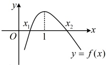

【例 6】已知函数  $ f(x)=a-\frac{1}{x}-\ln x $，其中  $ a \in \mathbb{R} $。

（1）求  $ f(x) $ 的单调区间；

（2）若  $ f(x) $ 有两个零点  $ x_{1} $， $ x_{2}(x_{1}<x_{2}) $，求证： $ x_{1}+x_{2}>2 $。

解：（1）由题意， $ f(x) $的定义域为 $ (0,+\infty) $，且 $ f'(x)=\frac{1}{x^2}-\frac{1}{x}=\frac{1-x}{x^2} $，

所以 $ f'(x)>0\Leftrightarrow0<x<1 $， $ f'(x)<0\Leftrightarrow x>1 $，故 $ f(x) $的单调递增区间是 $ (0,1) $，单调递减区间是 $ (1,+\infty) $。

（2）证法1：如图，当 $ f(x) $有两个零点时， $ f(1)=a-1>0 $，所以a>1，且由图可知 $ 0<x_{1}<1<x_{2} $，

（怎样证  $ x_1 + x_2 > 2 $？可以这么想， $ x_1 $， $ x_2 $ 是自变量的取值，证明自变量的大小关系，可考虑用单调性转化为函数值的大小关系来证明，故先把自变量化到同一个单调区间，观察发现在  $ x_1 + x_2 > 2 $ 中把  $ x_1 $ 移到右边即可）

要证  $ x_1 + x_2 > 2 $，只需证  $ x_2 > 2 - x_1 $，因为  $ 0 < x_1 < 1 < x_2 $，所以  $ x_2 $ 和  $ 2 - x_1 $ 都在  $ (1, +\infty) $ 上，

结合  $ f(x) $ 在  $ (1, +\infty) $ 上单调递减可得要证  $ x_2 > 2 - x_1 $，只需证  $ f(x_2) < f(2 - x_1) $ ①，（不等式①中有  $ x_1 $ 和  $ x_2 $ 两个变量，考虑消元，如何消元？注意到  $ f(x_1) = f(x_2) = 0 $，所以把  $ f(x_2) $ 替换成  $ f(x_1) $，即可实现消元）

因为  $ f(x) = f(x) = 0 $，所以要证不等式① ∵ ∵ ∵ ∵ ∵ ∵ ∵ ∵ ∵ ∵ ∵ ∵ ∵ ∵ ∵ ∵ ∵ ∵ ∵ ∵ ∵ ∵ ∵ ∵ ∵ ∵ ∵ ∵ ∵ ∵ ∵ ∵ ∵ ∵ ∵ ∵ ∵ ∵ ∵ ∵ ∵ ∵ ∵ ∵ ∵ ∵ ∵ ∵ ∵ ∵ ∵ ∵ ∵ ∵ ∵ ∵ ∵ ∵ ∵ ∵ ∵ ∵ ∵ ∵ ∵ ∵ ∵ ∵ ∵ ∵ ∵ ∵ ∵ ∵ ∵ ∵ ∵ ∵ ∵ ∵ ∵ ∵ ∵ ∵ ∵ ∵ ∵ ∵ ∵ ∵ ∵ ∵ ∵ ∵ ∵ ∵ ∵ ∵ ∵ ∵ ∵ ∵ ∵ ∵ ∵ ∵ ∵ ∵ ∵ ∵ ∵ ∵ ∵ ∵ ∵ ∵ ∵ ∵ ∵ ∵ ∵ ∵ ∵ ∵ ∵ ∵ ∵ ∵ ∵ ∵ ∵ ∵ ∵ ∵ ∵ ∵ ∵ ∵ ∵ ∵ ∵ ∵ ∵ ∵ ∵ ∵ ∵ ∵ ∵ ∵ ∵ ∵ ∵ ∵ ∵ ∵ ∵ ∵ ∵ ∵ ∵ ∵ ∵ ∵ ∵ ∵ ∵ ∵ ∵ ∵ ∵ ∵ ∵ ∵ ∵ ∵ ∵ ∵ ∵ ∵ ∵ ∵ ∵ ∵ ∵ ∵ ∵ ∵ ∵ ∵ ∵ ∵ ∵ ∵ ∵ ∵ ∵ ∵ ∵ ∵ ∵ ∵ ∵ ∵ ∵ ∵ ∵ ∵ ∵ ∵ ∵ ∵ ∵ ∵ ∵ ∵ ∵ ∵ ∵ ∵ ∵ ∵ ∵ ∵ ∵ ∵ ∵ ∵ ∵ ∵ ∵ ∵ ∵ ∵ ∵ ∵ ∵ ∵ ∵ ∵ ∵ ∵ ∵ ∵ ∵ ∵ ∵ ∵ ∵ ∵ ∵ ∵ ∵ ∵ ∵ ∵ ∵ ∵ ∵ ∵ ∵ ∵ ∵ ∵ ∵ ∵ ∵ ∵ ∵ ∵ ∵ ∵ ∵ ∵ ∵ ∵ ∵ ∵ ∵ ∵ ∵ ∵ ∵ ∵ ∵ ∵ ∵ ∵ ∵ ∵ ∵ ∵ ∵ ∵ ∵ ∵ ∵ ∵ ∵ ∵ ∵ ∵ ∵ ∵ ∵ ∵ ∵ ∵ ∵ ∵ ∵ ∵ ∵ ∵ ∵ ∵ ∵ ∵ ∵ ∵ ∵ ∵ ∵ ∵ ∵ ∵ ∵ ∵ ∵ ∵ ∵ ∵ ∵ ∵ ∵ ∵ ∵ ∵ ∵ ∵ ∵ ∵ ∵ ∵ ∵ ∵ ∵ ∵ ∵ ∵ ∵ ∵ ∵ ∵ ∵ ∵ ∵ ∵ ∵ ∵ ∵ ∵ ∵ ∵ ∵ ∵ ∵ ∵ ∵ ∵ ∵ ∵ ∵ ∵ ∵ ∵ ∵ ∵ ∵ ∵ ∵ ∵ ∵ ∵ ∵ ∵ ∵ ∵ ∵ ∵ ∵ ∵ ∵ ∵ ∵ ∵ ∵ ∵ ∵ ∵ ∵ ∵ ∵ ∵ ∵ ∵ ∵ ∵ ∵ ∵ ∵ ∵ ∵ ∵ ∵ ∵ ∵ ∵ ∵ ∵ ∵ ∵ ∵ ∵ ∵ ∵ ∵ ∵ ∵ ∵ ∵ ∵ ∵ ∵ ∵ ∵ ∵ ∵ ∵ ∵ ∵ ∵ ∵ ∵ ∵ ∵ ∵ ∵ ∵ ∵ ∵ ∵ ∵ ∵ ∵ ∵ ∵ ∵ ∵ ∵ ∵ ∵ ∵ ∵ ∵ ∵ ∵ ∵ ∵ ∵ ∵ ∵ ∵ ∵ ∵ ∵ ∵ ∵ ∵ ∵ ∵ ∵ ∵ ∵ ∵ ∵ ∵ ∵ ∵ ∵ ∵ ∵ ∵ ∵ ∵ ∵ ∵ ∵ ∵ ∵ ∵ ∵ ∵ ∵ ∵ ∵ ∵ ∵ ∵ ∵ ∵ ∵ ∵ ∵ ∵ ∵ ∵ ∵ ∵ ∵ ∵ ∵ ∵ ∵ ∵ ∵ ∵ ∵ ∵ ∵ ∵ ∵ ∵ ∵ ∵ ∵ ∵ ∵ ∵ ∵ ∵ ∵ ∵ ∵ ∵ ∵ ∵ ∵ ∵ ∵ ∵ ∵ ∵ ∵ ∵ ∵ ∵ ∵ ∵ ∵ ∵ ∵ ∵ ∵ ∵ ∵ ∵ ∵ ∵ ∵ ∵ ∵ ∵ ∵ ∵ ∵ ∵ ∵ ∵ ∵ ∵ ∵ ∵ ∵ ∵ ∵ ∵ ∵ ∵ ∵ ∵ ∵ ∵ ∵ ∵ ∵ ∵ ∵ ∵ ∵ ∵ ∵ ∵ ∵ ∵ ∵ ∵ ∵ ∵ ∵ ∵ ∵ ∵ ∵ ∵ ∵ ∵ ∵ ∵ ∵ ∵ ∵ ∵ ∵ ∵ ∵ ∵ ∵ ∵ ∵ ∵ ∵ ∵ ∵ ∵ ∵ ∵ ∵ ∵ ∵ ∵ ∵ ∵ ∵ ∵ ∵ ∵ ∵ ∵ ∵ ∵ ∵ ∵ ∵ ∵ ∵ ∵ ∵ ∵ ∵ ∵ ∵ ∵ ∵ ∵ ∵ ∵ ∵ ∵ ∵ ∵ ∵ ∵ ∵ ∵ ∵ ∵ ∵ ∵ ∵ ∵ ∵ ∵ ∵ ∵ ∵ ∵ ∵ ∵ ∵ ∵ ∵ ∵ ∵ ∵ ∵ ∵ ∵ ∵ ∵ ∵ ∵ ∵ ∵ ∵ ∵ ∵ ∵ ∵ ∵ ∵ ∵ ∵ ∵ ∵ ∵ ∵ ∵ ∵ ∵ ∵ ∵ ∵ ∵ ∵ ∵ ∵ ∵ ∵ ∵ ∵ ∵ ∵ ∵ ∵ ∵ ∵ ∵ ∵ ∵ ∵ ∵ ∵ ∵ ∵ ∵ ∵ ∵ ∵ ∵ ∵ ∵ ∵ ∵ ∵ ∵ ∵ ∵ ∵ ∵ ∵ ∵ ∵ ∵ ∵ ∵ ∵ ∵ ∵ ∵ ∵ ∵ ∵ ∵ ∵ ∵ ∵ ∵ ∵ ∵ ∵ ∵ ∵ ∵ ∵ ∵ ∵ ∵ ∵ ∵ ∵ ∵ ∵ ∵ ∵ ∵ ∵ ∵ ∵ ∵ ∵ ∵ ∵ ∵ ∵ ∵ ∵ ∵ ∵ ∵ ∵ ∵ ∵ ∵ ∵ ∵ ∵ ∵ ∵ ∵ ∵ ∵ ∵ ∵ ∵ ∵ ∵ ∵ ∵ ∵ ∵ ∵ ∵ ∵ ∵ ∵ ∵ ∵ ∵ ∵ ∵ ∵ ∵ ∵ ∵ ∵ ∵ ∵ ∵ ∵ ∵ ∵ ∵ ∵ ∵ ∵ ∵ ∵ ∵ ∵ ∵ ∵ ∵ ∵ ∵ ∵ ∵ ∵ ∵ ∵ ∵ ∵ ∵ ∵ ∵ ∵ ∵ ∵ ∵ ∵ ∵ ∵ ∵ ∵ ∵ ∵ ∵ ∵ ∵ ∵ ∵ ∵ ∵ ∵ ∵ ∵ ∵ ∵ ∵ ∵ ∵ ∵ ∵ ∵ ∵ ∵ ∵ ∵ ∵ ∵ ∵ ∵ ∵ ∵ ∵ ∵ ∵ ∵ ∵ ∵ ∵ ∵ ∵ ∵ ∵ ∵ ∵ ∵ ∵ ∵ ∵ ∵ ∵ ∵ ∵ ∵ ∵ ∵ ∵ ∵ ∵ ∵ ∵ 

因为  $ f(x_2) = f(x_1) = 0 $，所以要证不等式①，又只需证  $ f(x_1) < f(2 - x_1) $，即证  $ f(x_1) - f(2 - x_1) < 0 $ ②，

令  $ g(x) = f(x) - f(2 - x) $， $ 0 < x < 1 $，则  $ g'(x) = f'(x) + f'(2 - x) = \frac{1 - x}{x^2} + \frac{1 - (2 - x)}{(2 - x)^2} $

 $ = \frac{1 - x}{x^2} + \frac{x - 1}{(2 - x)^2} = (1 - x)\left[\frac{1}{x^2} - \frac{1}{(2 - x)^2}\right] = (1 - x) \cdot \frac{(2 - x)^2 - x^2}{x^2(2 - x)^2} = \frac{4(1 - x)^2}{x^2(2 - x)^2} > 0 $，

所以  $ g(x) $ 在  $ (0,1) $ 上单调递增，又  $ g(1) = f(1) - f(1) = 0 $，所以  $ g(x) < 0 $，

取  $ x = x_1 $ 得  $ g(x_1) = f(x_1) - f(2 - x_1) < 0 $，即不等式②成立，所以  $ x_1 + x_2 > 2 $ 成立。

证法2：（若没想到证法1的思路，也可考虑先翻译 $ x_1 $， $ x_2 $是 $ f(x) $的零点，再作观察）如图，当 $ f(x) $有两个零点时， $ f(1)=a-1>0 $，所以 $ a>1 $，且由图可知 $ 0<x_1<1<x_2 $，

由题意， $ \left\{\begin{aligned}f(x_{1})&=a-\frac{1}{x_{1}}-\ln x_{1}=0\\ f(x_{2})&=a-\frac{1}{x_{2}}-\ln x_{2}=0\end{aligned}\right. $，所以 $ \left\{\begin{aligned}\frac{1}{x_{1}}+\ln x_{1}&=a\\ \frac{1}{x_{2}}+\ln x_{2}&=a\end{aligned}\right. $，（要证的不等式中不含a，故考虑消去a）

两式作差得  $ \frac{1}{x_1} + \ln x_1 - \frac{1}{x_2} - \ln x_2 = 0 $，所以  $ \frac{x_2 - x_1}{x_1 x_2} - \ln \frac{x_2}{x_1} = 0 $，从而  $ x_1 x_2 = \frac{x_2 - x_1}{\ln \frac{x_2}{x_1}} $，故  $ x_1 = \frac{1 - \frac{x_1}{x_2}}{\ln \frac{x_2}{x_1}} $， $ x_2 = \frac{\frac{x_2}{x_1} - 1}{\ln \frac{x_2}{x_1}} $，

所以要证  $ x_1 + x_2 > 2 $，只需证  $ \frac{1 - \frac{x_1}{x_2}}{\ln \frac{x_2}{x_1}} + \frac{\frac{x_2}{x_1} - 1}{\ln \frac{x_2}{x_1}} > 2 $，即证  $ \frac{\frac{x_2}{x_1} - \frac{x_1}{x_2}}{\ln \frac{x_2}{x_1}} > 2 $ ③，

（观察发现变量以 $ \frac{x_{2}}{x_{1}} $这一整体结构出现，故可考虑将其换元成t，从而统一变量）

设 $ t=\frac{x_2}{x_1} $，则 $ t>1 $，且不等式③即为 $ \frac{t-\frac{1}{t}}{\ln t}>2 $，所以只需证 $ 2\ln t-t+\frac{1}{t}<0 $④，

设 $ p(t)=2\ln t-t+\frac{1}{t} $， $ t>1 $，则 $ p'(t)=\frac{2}{t}-1-\frac{1}{t^2}=-\frac{(t-1)^2}{t^2}<0 $，所以 $ p(t) $在 $ (1,+\infty) $上单调递减，

又因为 $ p(1)=0 $，所以 $ p(t)<0 $，即 $ 2\ln t-t+\frac{1}{t}<0 $，从而不等式④成立，故 $ x_1+x_2>2 $成立。

【反思】本题第（2）问是典型的极值点偏移问题，有深刻的图形背景。 $ x_1 + x_2 > 2 \Leftrightarrow \frac{x_1 + x_2}{2} > 1 $，反映到图象上