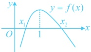

即  $ f(x) $ 在极值点 x=1 左侧上升迅速，右侧下降缓慢，造成  $ f(x) $ 在极值点两侧的图象不对称，而且是向左偏移的，如图，这样的图象与 x 轴的两个交点的中点必定在极值点右侧，所以  $ \frac{x_1 + x_2}{2} > 1 $。

极值点偏移问题常有两种解法，一是像证法1那样利用单调性将自变量不等式转化为函数值不等式来证明，再消元构造对称差函数求导分析；二是像证法2那样通过代数变形，再换元化单变量不等式求导证明。

【例 7】定义：如果函数  $ f(x) $ 在定义域内存在极大值  $ f(x_1) $ 和极小值  $ f(x_2) $，且存在一个常数  $ k $，使  $ f(x_1) - f(x_2) = k(x_1 - x_2) $ 成立，则称函数  $ f(x) $ 为极值可差比函数，常数  $ k $ 称为该函数的极值差比系数．已知函数  $ f(x) = x - \frac{1}{x} - a\ln x $．

（1）当 $ a=\frac{5}{2} $时，判断 $ f(x) $是否为极值可差比函数，并说明理由；

（2）是否存在 a 使  $ f(x) $ 的极值差比系数为 2-a？若存在，求出 a 的值；若不存在，请说明理由；

（3）若 $ \frac{3\sqrt{2}}{2}\leq a\leq\frac{5}{2} $，求 $ f(x) $的极值差比系数的取值范围.

解：（1）（要判断 $f(x)$ 是否为极值可差比函数，就看 $f(x)$ 是否存在极大值和极小值，故求导分析）

当 $a=\frac{5}{2}$ 时，$f(x)=x-\frac{1}{x}-\frac{5}{2}\ln x$，$x>0$，所以 $f'(x)=1+\frac{1}{x^2}-\frac{5}{2x}=\frac{(2x-1)(x-2)}{2x^2}$，

从而 $f'(x)>0 \Leftrightarrow 0<x<\frac{1}{2}$ 或 $x>2$，$f'(x)<0 \Leftrightarrow \frac{1}{2}<x<2$，故 $f(x)$ 在 $\left(0,\frac{1}{2}\right)$，$(2,+\infty)$ 上单调递增，

在 $\left(\frac{1}{2},2\right)$ 上单调递减，所以 $f(x)$ 有极大值 $f\left(\frac{1}{2}\right)=\frac{5}{2}\ln 2-\frac{3}{2}$，极小值 $f(2)=\frac{3}{2}-\frac{5}{2}\ln 2$，

故 $\frac{f\left(\frac{1}{2}\right)-f(2)}{\frac{1}{2}-2}=\frac{\frac{5}{2}\ln 2-\frac{3}{2}-\left(\frac{3}{2}-\frac{5}{2}\ln 2\right)}{-\frac{3}{2}}=2-\frac{10}{3}\ln 2$，

所以存在常数 $k=2-\frac{10}{3}\ln 2$，使 $f\left(\frac{1}{2}\right)-f(2)=k\left(\frac{1}{2}-2\right)$，故 $f(x)$ 是极值可差比函数。

所以存在常数  $ k = 2 - \frac{10}{3} \ln 2 $，使  $ f\left(\frac{1}{2}\right) - f(2) = k\left(\frac{1}{2} - 2\right) $，故  $ f(x) $ 是极值可差比函数.

（2）由题意， $ f(x) $的定义域为 $ (0,+\infty) $， $ f'(x)=1+\frac{1}{x^2}-\frac{a}{x}=\frac{x^2-ax+1}{x^2} $，

（若  $ f(x) $ 为极值可差比函数，则  $ f(x) $ 有极大值和极小值，可先由此求出  $ a $ 的范围，再做进一步的分析）假设存在  $ a $ 使  $ f(x) $ 的极值差比系数为  $ 2 - a $，则  $ x_1 $， $ x_2 $ 是方程  $ x^2 - ax + 1 = 0 $ 的两个不等正实根，所以  $ \begin{cases} \Delta = a^2 - 4 > 0 \\ x_1 + x_2 = a > 0 \\ x_1 x_2 = 1 > 0 \end{cases} $，解得： $ a > 2 $，不妨设  $ x_1 < x_2 $，则  $ 0 < x_1 < 1 < x_2 $，

（下面我们求极值差比系数 k，显然  $ k = \frac{f(x_1) - f(x_2)}{x_1 - x_2} $，方便起见，我们先求  $ f(x_1) - f(x_2) $，再作观察）因为  $ f(x_1) - f(x_2) = x_1 - \frac{1}{x_1} - a \ln x_1 - \left( x_2 - \frac{1}{x_2} - a \ln x_2 \right) = x_1 - x_2 + \frac{x_1 - x_2}{x_1 x_2} - a (\ln x_1 - \ln x_2) $