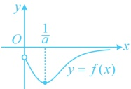
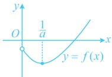
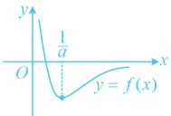
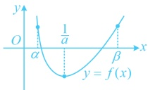

将含  $ x_{1} $， $ x_{2} $ 的部分化为  $ \frac{x_{1}}{x_{2}} $，或  $ \frac{x_{2}}{x_{1}} $， $ x_{1}-x_{2} $ 等形式的整体结构，再通过换元来实现变量的统一，上面例6的证法2和例7第（3）问都用到了这种方法.

## 类型IV：零点问题

【例 8】设函数  $ f(x)=a^{2}x^{2}+ax-3\ln x+1 $，其中 a>0.

（1）讨论  $ f(x) $ 的单调性；

（2）讨论 $ f(x) $的零点个数.

解：（1）由题意， $ f(x) $的定义域为 $ (0,+\infty) $，且 $ f'(x)=2a^2x+a-\frac{3}{x}=\frac{2a^2x^2+ax-3}{x}=\frac{(2ax+3)(ax-1)}{x} $，因为 $ a>0 $， $ x>0 $，所以 $ 2ax+3>0 $，从而 $ f'(x)<0\Leftrightarrow0<x<\frac{1}{a} $， $ f'(x)>0\Leftrightarrow x>\frac{1}{a} $，故 $ f(x) $在 $ \left(0,\frac{1}{a}\right) $上单调递减，在 $ \left(\frac{1}{a},+\infty\right) $上单调递增。

（2）解法1：（已得到$f(x)$先$\searrow$后$\nearrow$，则极小值$f\left(\frac{1}{a}\right)$的正负对零点个数有影响，故据此讨论）

由（1）可得函数$f(x)$有极小值$f\left(\frac{1}{a}\right)=3-3\ln\frac{1}{a}=3\left(1-\ln\frac{1}{a}\right)$，

(i)当$a>\frac{1}{e}$时，$f\left(\frac{1}{a}\right)>0$，所以$f(x)>0$恒成立，故$f(x)$没有零点；

(ii)当 $ a=\frac{1}{e} $时， $ f\left(\frac{1}{a}\right)=0 $，此时 $ f(x) $有唯一的零点 $ x=e $；

(iii)当  $ 0 < a < \frac{1}{e} $ 时， $ f\left(\frac{1}{a}\right) < 0 $，（此时  $ f(x) $ 一定有 2 个零点吗？不一定，如图 1，图 2 和图 3，即使  $ f\left(\frac{1}{a}\right) < 0 $， $ f(x) $ 也可能没有零点或有 1 个零点，但这里我们通过分析极限可发现当  $ x \to 0 $ 或  $ x \to +\infty $ 时，都有  $ f(x) \to +\infty $，故  $ f(x) $ 实际的图象如图 4， $ f(x) $ 有 2 个零点，怎样严格论证？需在  $ \frac{1}{a} $ 左右两侧各取一个使  $ f(x) > 0 $ 的点，先看左边的点  $ \alpha $ 怎么取，考虑到  $ \frac{1}{a} > e $，所以左边的点可以考虑直接取  $ x = e $ 或  $ x = 1 $ 等）

图1

图2

图3

图4

又因为  $ f(1)=a^{2}+a+1>0 $，且  $ \frac{1}{a}>e>1 $，所以  $ f(x) $ 在  $ \left(1,\frac{1}{a}\right) $ 上有 1 个零点，

（再看右边的点β怎么取，可以想象，由于 $ \frac{1}{a} > e $，所以若再像左边那样取常数，则不一定能保证取出的点在 $ \frac{1}{a} $的右边，怎么办呢？可尝试在 $ \frac{1}{a} $的基础上调整，调整的方法可以是加一个正数，或者2倍，平方等等，经尝试，平方能满足要求，故可取 $ \beta = \frac{1}{a^2} $由题意， $ f\left(\frac{1}{a^2}\right) = a^2\left(\frac{1}{a^2}\right)^2 + a \cdot \frac{1}{a^2} - 3\ln\frac{1}{a^2} + 1 = \frac{1}{a^2} + \frac{1}{a} - 6\ln\frac{1}{a} + 1 $，设 $ t = \frac{1}{a} $，则 $ t > e $，且 $ f\left(\frac{1}{a^2}\right) = t^2 + t - 6\ln t + 1 $，令 $ u(t) = t^2 + t - 6\ln t + 1 $， $ t > e $，则 $ u'(t) = 2t + 1 - \frac{6}{t} $