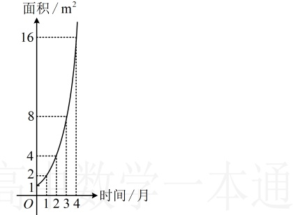

7.（2025 · 江苏扬州期中）

7.（2025·江苏扬州期中）

已知定义在  $ \mathbb{R} $ 上的函数  $ f(x) $ 的导函数为  $ f'(x) $，若  $ f'(1) = 2025 $，则  $ \lim_{\Delta x \to 0} \frac{f(1 + \Delta x) - f(1 - \Delta x)}{\Delta x} =  $ ___.

### 8. （2025 · 全国模拟）（多选）

某池塘中野生水葫芦的面积与时间的函数关系如图所示。假设其关系为指数函数，并给出下列说法，其中说法正确的是（）

A. 野生水葫芦每月的面积增长率为 1

B. 野生水葫芦的面积从  $ 4m^2 $ 蔓延到  $ 12m^2 $ 只需 1.5 个月

C. 设野生水葫芦面积蔓延到  $ 10m^2 $， $ 20m^2 $， $ 30m^2 $ 时的时间分别为  $ t_1 $， $ t_2 $， $ t_3 $，则有  $ t_1 + t_3 < 2t_2 $

D. 野生水葫芦的面积从第 1 个月到第 3 个月蔓延的平均速度等于其从第 2 个月到第 4 个月蔓延的平均速度

9.（2025·全国模拟）

利用导数的定义，求  $ f(x)=\sqrt{x^{2}+1} $ 在 x=1 处的导数.