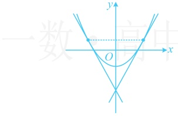
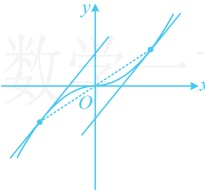

 $ f(x) $ 在点  $ (0,0) $ 处的切线方程为（）

A. y = -2x B. y = -x C. y = 2x D. y = x

解析：观察发现  $ y = x^3 $ 和  $ y = ax $ 都是奇函数， $ y = (a-1)x^2 $ 是偶函数，故要使  $ f(x) $ 为奇函数，就不能有偶函数这部分，因为  $ f(x) $ 为奇函数，所以  $ a-1=0 $，从而  $ a=1 $，故  $ f(x)=x^3 + x $，所以  $ f'(x)=3x^2 + 1 $，从而  $ f'(0)=1 $，故所求切线方程为  $ y-0=1\cdot(x-0) $，即  $ y=x $。

答案：D

【变式 3】（2016·新课标Ⅲ卷）已知  $ f(x) $ 为偶函数，当 x < 0 时， $ f(x) = \ln(-x) + 3x $，则曲线  $ y = f(x) $ 在点  $ (1, -3) $ 处的切线方程是___。

解析：给的是x<0的解析式，让求的是 $ (1,-3) $处的切线，不在x<0这段，要先把x>0的解析式求出来，再求导吗？不用，直接利用偶函数及其切线的对称性即可，

由题意，当x<0时， $ f'(x)=\frac{1}{-x}\cdot(-1)+3=\frac{1}{x}+3 $，所以 $ f'(-1)=2 $，

因为 $ f(x) $为偶函数，其图象关于y轴对称，所以 $ f'(1)=-f'(-1)=-2 $，

故所求切线方程为 $ y-(-3)=-2(x-1) $，即 $ 2x+y+1=0 $。

答案：2x+y+1=0

【反思】①偶函数的图象上关于y轴对称的两个点处切线斜率互为相反数，如图1；②奇函数的图象上关于原点对称的两个点处切线斜率相等，如图2.

图1

图2

【变式4】（2019·江苏卷）在平面直角坐标系xOy中，点A在曲线 $ y=\ln x $上，且该曲线在点A处的切线经过点 $ (-e,-1)(e $为自然对数的底数 $ ) $，则点A的坐标是___。

解析：不知道切点，先设切点，写出切线方程，并把切线所过的点代入，求出切点，

设  $ A(x_0, \ln x_0) $，因为  $ y' = \frac{1}{x} $，所以曲线  $ y = \ln x $ 在点  $ A $ 处的切线方程为  $ y - \ln x_0 = \frac{1}{x_0}(x - x_0) $，

将点  $ (-e, -1) $ 代入上述切线方程得  $ -1 - \ln x_0 = \frac{1}{x_0} (-e - x_0) $，整理得：  $ x_0 \ln x_0 = e $ ①，

观察发现  $ x_{0}=e $ 是方程①的解，还有其它解吗？要搞清楚这个问题，可构造函数分析，

令  $ g(x) = x \ln x $， $ x > 0 $，则  $ g'(x) = \ln x + 1 $，所以  $ g'(x) < 0 \Leftrightarrow 0 < x < \mathrm{e}^{-1} $， $ g'(x) > 0 \Leftrightarrow x > \mathrm{e}^{-1} $。故  $ g(x) $ 在  $ (0, \mathrm{e}^{-1}) $ 上  $ \searrow $，在  $ (\mathrm{e}^{-1}, +\infty) $ 上  $ \nearrow $，

当  $ x \in (0, e^{-1}) $ 时，因为  $ \ln x < 0 $，所以  $ g(x) < 0 $，故方程①在  $ (0, e^{-1}) $ 上无解；

当  $ x \in (e^{-1}, +\infty) $ 时， $ g(e) = e $，结合  $ g(x) $ 在  $ (e^{-1}, +\infty) $ 上  $ \nearrow $ 知方程①只有一个解  $ x_0 = e $，所以  $ A(e, 1) $。

【变式 5】（2015 · 新课标Ⅱ卷）已知曲线  $ y = x + \ln x $ 在点  $ (1,1) $ 处的切线与曲线  $ y = ax^{2} + (a+2)x + 1 $