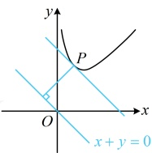
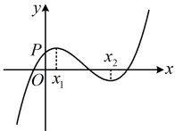
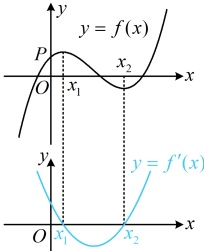

相切，则 $ a= $___.

解析： $ y = x + \ln x \Rightarrow y' = 1 + \frac{1}{x} \Rightarrow y'|_{x=1} = 2 $，所以  $ y = x + \ln x $ 在点  $ (1,1) $ 处的切线方程为  $ y - 1 = 2(x - 1) $，

整理得： $ y = 2x - 1 $，由题意，直线  $ y = 2x - 1 $ 与曲线  $ y = ax^2 + (a + 2)x + 1 $ 相切，

直线与二次函数相切，可联立二者的方程，消无后用判别式处理，

联立  $ \begin{cases} y = 2x - 1 \\ y = ax^2 + (a + 2)x + 1 \end{cases} $ 消去  $ y $ 可得  $ ax^2 + ax + 2 = 0 $，因为二者相切，所以  $ a \neq 0 $，且  $ \Delta = a^2 - 8a = 0 \Rightarrow a = 8 $。

答案：8

【变式 6】（2019·江苏卷）在平面直角坐标系 xOy 中，P 是曲线  $ y = x + \frac{4}{x}(x > 0) $ 上的一个动点，则点 P 到直线  $ x + y = 0 $ 的距离的最小值是___.

解法1：可引入点P的坐标为变量，计算点P到直线 $ x+y=0 $的距离，再求最小值，

设  $ P\left(a,a+\frac{4}{a}\right)(a>0) $，则点  $ P $ 到直线  $ x+y=0 $ 的距离  $ d=\frac{|a+a+\frac{4}{a}|}{\sqrt{2}}=\sqrt{2}\left(a+\frac{2}{a}\right)\geq\sqrt{2}\times2\sqrt{a\cdot\frac{2}{a}}=4 $，当且仅当  $ a=\frac{2}{a} $，即  $ a=\sqrt{2} $ 时等号成立，所以  $ d_{\min}=4 $。

解法 2：也可结合图象来求解，如图，将直线  $ x+y=0 $ 向上平移至与曲线  $ y=x+\frac{4}{x}(x>0) $ 相切，该切点  $ P $ 到直线  $ x+y=0 $ 的距离最小，下面求解该距离，

设切点横坐标为  $ x_0(x_0>0) $，因为  $ y'=1-\frac{4}{x^2} $，所以  $ y'\mid_{x=x_0}=-1\Rightarrow1-\frac{4}{x_0^2}=-1\Rightarrow x_0=\sqrt{2} $，从而  $ P(\sqrt{2},3\sqrt{2}) $，故点  $ P $ 到直线  $ x+y=0 $ 的距离的最小值  $ d_{\min}=\frac{|\sqrt{2}+3\sqrt{2}|}{\sqrt{2}}=4 $。

答案：4

## 类型Ⅲ：单调性、极值、最值的分析

【例 3】（2015·安徽卷）函数  $ f(x)=ax^3+bx^2+cx+d $ 的图象如图所示，则下列结论成立的是（ ）

A.  $ a>0 $， $ b<0 $， $ c>0 $， $ d>0 $  

B.  $ a>0 $， $ b<0 $， $ c<0 $， $ d>0 $  

C.  $ a<0 $， $ b<0 $， $ c<0 $， $ d>0 $  

D.  $ a>0 $， $ b>0 $， $ c>0 $， $ d<0 $

解析：图中标注的  $ x_1 $， $ x_2 $ 是  $ f(x) $ 的两个极值点，故考虑结合  $ f'(x) $ 来分析，由题意， $ f'(x) = 3ax^2 + 2bx + c $，根据  $ f(x) $ 的图象可画出  $ f'(x) $ 的草图如图，由图可知， $ f'(x) $ 是开口向上的二次函数，所以  $ a > 0 $，

且  $ f'(x) $ 的两个零点  $ x_{1} $ 和  $ x_{2} $ 均为正数，

所以  $ x_1 + x_2 = -\frac{2b}{3a} > 0 $， $ x_1 x_2 = \frac{c}{3a} > 0 $，故  $ b < 0 $， $ c > 0 $，

还差 d 的正负，如何判断？所给图象中专门标了个点 P，由它可以得出  $ f(0) > 0 $，而  $ f(0) $ 恰好为 d，于是 d 的正负就有了，由  $ f(x) $ 的图象上的点 P 可知  $ f(0) = d > 0 $。

答案：A

