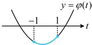

【例4】（2023·全国甲卷（节选））已知函数  $ f(x)=ax-\frac{\sin x}{\cos^2 x} $， $ x\in\left(0,\frac{\pi}{2}\right) $，当 a=1 时，讨论  $ f(x) $ 的单调性.

解：当 $a=1$ 时，$f(x)=x-\frac{\sin x}{\cos^2 x}$，$f'(x)=1-\frac{\cos x\cdot\cos^2 x-2\cos x\cdot(-\sin x)\cdot\sin x}{\cos^4 x}$

$=1-\frac{\cos^2 x+2\sin^2 x}{\cos^3 x}=\frac{\cos^3 x-\cos^2 x-2\sin^2 x}{\cos^3 x}$，（观察发现将 $\sin^2 x$ 换成 $1-\cos^2 x$，可将函数名统一成余弦）

所以 $f'(x)=\frac{\cos^3 x-\cos^2 x-2(1-\cos^2 x)}{\cos^3 x}=\frac{\cos^2 x(\cos x-1)-2(1+\cos x)(1-\cos x)}{\cos^3 x}$

$=\frac{(\cos x-1)(\cos^2 x+2\cos x+2)}{\cos^3 x}=\frac{(\cos x-1)[(\cos x+1)^2+1]}{\cos^3 x}$，

当 $x\in\left(0,\frac{\pi}{2}\right)$ 时，$\cos x-1<0$，$(\cos x+1)^2+1>0$，$\cos^3 x>0$，所以 $f'(x)<0$，故 $f(x)$ 在 $\left(0,\frac{\pi}{2}\right)$ 上单调递减。

【变式】（2016·新课标Ⅰ卷）若函数  $ f(x)=x-\frac{1}{3}\sin 2x+a\sin x $ 在  $ \mathbb{R} $ 上单调递增，则  $ a $ 的取值范围是（ ）

A.  $ [-1,1] $ \quad B.  $ \left[-1,\frac{1}{3}\right] $ \quad C.  $ \left[-\frac{1}{3},\frac{1}{3}\right] $ \quad D.  $ \left[-1,-\frac{1}{3}\right] $

解析：解析式较复杂，故求导分析单调性，

解析：解析式较复杂，故求导分析单调性，

因为  $ f(x) $ 在  $ \mathbf{R} $ 上  $ \nearrow $，所以  $ f'(x) = 1 - \frac{2}{3}\cos 2x + a\cos x \ge 0 $ 对任意的  $ x \in \mathbf{R} $ 恒成立，

观察发现用二倍角公式可将导函数统一化为关于  $ \cos x $ 的式子，再换元处理，

所以  $ 1 - \frac{2}{3}(2\cos^2 x - 1) + a\cos x \ge 0 $，整理得： $ \frac{4}{3}\cos^2 x - a\cos x - \frac{5}{3} \le 0 $ ①，

令  $ t = \cos x $，则  $ t \in [-1,1] $，不等式①对任意的  $ x \in \mathbf{R} $ 恒成立  $ \Leftrightarrow \frac{4}{3}t^2 - at - \frac{5}{3} \le 0 $ 对任意的  $ t \in [-1,1] $ 恒成立，

开口向上的二次函数要在某区间小于等于0恒成立，只需考虑端点，如图，

设  $ \varphi(t)=\frac{4}{3}t^{2}-at-\frac{5}{3} $，则  $ \begin{cases} \varphi(-1)=a-\frac{1}{3}\leq0 \\ \varphi(1)=-a-\frac{1}{3}\leq0 \end{cases} $，解得： $ -\frac{1}{3}\leq a\leq\frac{1}{3} $。

答案：C

【例 5】(2013·浙江卷)已知 e 为自然对数的底数，设函数  $ f(x)=(\mathrm{e}^{x}-1)(x-1)^{k}(k=1,2) $，则（ ）

A. 当 k=1 时， $ f(x) $ 在 x=1 处取到极小值

B. 当 k=1 时， $ f(x) $ 在 x=1 处取到极大值

C. 当 k=2 时， $ f(x) $ 在 x=1 处取到极小值

D. 当 k=2 时， $ f(x) $ 在 x=1 处取到极大值

解析：当 k=1 时，  $ f(x)=(\mathrm{e}^{x}-1)(x-1) $，  $ f'(x)=\mathrm{e}^{x}(x-1)+\mathrm{e}^{x}-1 $，

所以  $ f'(1)=\mathrm{e}-1 \neq 0 $，从而 x=1 不是  $ f(x) $ 的极值点，故 A 项、B 项均错误；