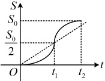

10.（2025·上海模拟）

一质点按规律  $ s(t)=2t^{3} $ 运动.

（1）求其在时间段 $ [1,2] $内的平均速度；

（2）求其在t=1时的瞬时速度.

11.（2025·吉林白山模拟）

（1）求曲线  $ f(x)=x^{3}-2x $ 在 x=1 处的切线；

（2）求过点 $ (1,-1) $与曲线 $ f(x)=x^{3}-2x $相切的直线的方程.

## 一 数·高中数学一本通

## C组 拓展提升

### 12. （2025 · 辽宁模拟）（多选）

午饭时间，小明从教室到食堂的路程 S 与时间 t 的函数关系如图，记 t 时刻的瞬时速度为  $ V(t) $，区间  $ [0, t_1] $， $ [0, t_2] $， $ [t_1, t_2] $ 上的平均速度分别为  $ V_1 $， $ V_2 $， $ V_3 $，则下列判断正确的有（）

A.  $ V_1 < V_2 < V_3 $

B.  $ \frac{V_1 + V_3}{2} < V_2 $

C. 整个过程小明行走的速度一直在加快

D. 对于 $ V_i (i=1,2,3) $，存在 $ m_i \in (0, t_2) $，使 $ V(m_i) = V_i $