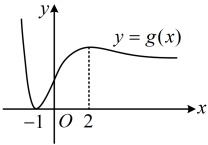

【例 9】（2015·北京卷（节选））已知函数  $ f(x)=\ln\frac{1+x}{1-x} $.

（1）求曲线  $ y = f(x) $ 在点  $ (0, f(0)) $ 处的切线方程；

（2）求证：当 $ x\in(0,1) $时， $ f(x)>2\left(x+\frac{x^3}{3}\right) $.

解：（1）由题意， $ f'(x)=\frac{1-x}{1+x}\cdot\left(\frac{1+x}{1-x}\right)'=\frac{1-x}{1+x}\cdot\frac{1-x-(-1)\cdot(1+x)}{(1-x)^2}=\frac{2}{1-x^2} $，

所以  $ f'(0)=2 $，又  $ f(0)=0 $，所以曲线  $ y=f(x) $ 在点  $ (0,f(0)) $ 处的切线方程为 y=2x。

（2）要证  $ f(x)>2\left(x+\frac{x^{3}}{3}\right) $，即证  $ \ln\frac{1+x}{1-x}>2\left(x+\frac{x^{3}}{3}\right) $ ①，

（不等式 $ \textcircled{1} $结构不复杂，且其中的 $ \ln\frac{1+x}{1-x} $是孤立的，故可考虑直接移项，构造函数求导分析）

令 $ F(x)=\ln\frac{1+x}{1-x}-2\left(x+\frac{x^3}{3}\right) $， $ x\in(0,1) $，则 $ F'(x)=\frac{2}{1-x^2}-2(1+x^2)=\frac{2x^4}{1-x^2}>0 $，

所以 $ F(x) $在 $ (0,1) $上单调递增，从而 $ F(x)>F(0)=0 $，即 $ \ln\frac{1+x}{1-x}-2\left(x+\frac{x^3}{3}\right)>0 $，故 $ \ln\frac{1+x}{1-x}>2\left(x+\frac{x^3}{3}\right) $，

所以不等式 $ \textcircled{1} $成立，故不等式 $ f(x)>2\left(x+\frac{x^3}{3}\right) $成立.

【例 10】（2018·新课标Ⅲ卷）已知函数  $ f(x)=\frac{ax^2+x-1}{e^x} $.

（1）求曲线  $ y = f(x) $ 在点  $ (0, -1) $ 处的切线方程；

（2）证明：当 $ a \geq 1 $时， $ f(x) + e \geq 0 $。

解：（1）由题意， $ f'(x)=\frac{(2ax+1)\mathrm{e}^x-(ax^2+x-1)\mathrm{e}^x}{(\mathrm{e}^x)^2}=\frac{-ax^2+(2a-1)x+2}{\mathrm{e}^x} $，所以 $ f'(0)=2 $，故所求切线方程为 $ y-(-1)=2(x-0) $，整理得： $ y=2x-1 $。

（2）（尽管 $ f(x) $含参，但给了参数范围，可先用它进行放缩，转化为不含参的不等式来证）

当$a\geq1$时，$f(x)+\mathrm{e}=\frac{ax^2+x-1}{\mathrm{e}^x}+\mathrm{e}\geq\frac{x^2+x-1}{\mathrm{e}^x}+\mathrm{e}$①，（于是要证$f(x)+\mathrm{e}\geq0$，只需证$\frac{x^2+x-1}{\mathrm{e}^x}+\mathrm{e}\geq0$）令$g(x)=\frac{x^2+x-1}{\mathrm{e}^x}+\mathrm{e}$，则$g'(x)=-\frac{(x+1)(x-2)}{\mathrm{e}^x}$，所以$g'(x)<0\Leftrightarrow x<-1$或$x>2$，$g'(x)>0\Leftrightarrow-1<x<2$，故$g(x)$在$(-\infty,-1)$上单调递减，在$(-1,2)$上单调递增，在$(2,+\infty)$上单调递减，

如图，由  $ g(-1)=0 $ 知当  $ x\in(-\infty,2] $ 时， $ g(x)\geq0 $，

（还需论证当 $x>2$ 时 $g(x)\geq0$，此时观察 $g(x)$ 的解析式发现两部分都为正，故可直接得到 $g(x)>0$）另一方面，当 $x>2$ 时，$g(x)=\frac{x^2+x-1}{e^x}+e>0$，所以 $g(x)\geq0$ 对 $\forall x\in\mathbb{R}$ 恒成立，又由①知 $f(x)+e\geq g(x)$，所以 $f(x)+e\geq0$。

## 类型VI：三次函数

【例 11】（2015·安徽卷）设  $ x^3 + ax + b = 0 $，其中  $ a, b $ 均为实数，下列条件中，使得该三次方程仅有一个实根的是___。（写出所有正确条件的编号）