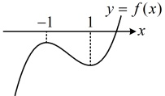
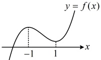
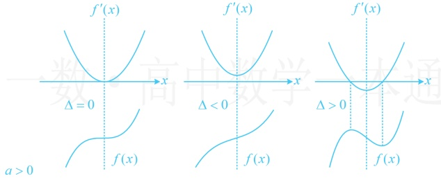
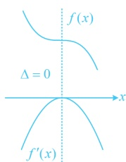
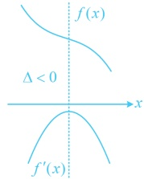
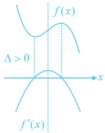
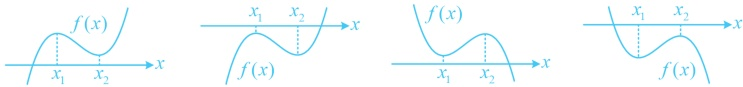

① $ a=-3,\quad b=-3 $; ② $ a=-3,\quad b=2 $; ③ $ a=-3,\quad b>2 $; ④ $ a=0,\quad b=2 $; ⑤ $ a=1,\quad b=2 $

解析：前三个选项给出的  $ a $ 都为 -3， $ b $ 不同，故可先研究当  $ a = -3 $ 时，原方程仅有一个实根的充要条件，当  $ a = -3 $ 时，原方程即为  $ x^3 - 3x + b = 0 $，设  $ f(x) = x^3 - 3x + b $，则  $ f'(x) = 3x^2 - 3 = 3(x + 1)(x - 1) $，

所以  $ f'(x) < 0 \Leftrightarrow -1 < x < 1 $， $ f'(x) > 0 \Leftrightarrow x < -1 $ 或  $ x > 1 $。

故  $ f(x) $ 在  $ (-\infty,-1) $ 上  $ \nearrow $，在  $ (-1,1) $ 上  $ \searrow $，在  $ (1,+\infty) $ 上  $ \nearrow $。

怎样能使  $ f(x) $ 仅有 1 个零点？如图，只需两个极值同号，

又  $ f(-1)=b+2 $， $ f(1)=b-2 $，所以  $ f(x) $ 仅有 1 个零点的充要条件是  $ f(-1)f(1)>0 $，

即 $ (b+2)(b-2)>0 $，解得：b>2或b<-2，故①③正确，②错误；

对于④，当 $ a=0 $， $ b=2 $时，原方程即为 $ x^3+2=0 $，解得： $ x=-\sqrt[3]{2} $，原方程仅有一根，故④正确；对于⑤，当 $ a=1 $， $ b=2 $时，原方程即为 $ x^3+x+2=0 $，注意到函数 $ y=x^3+x+2 $在 $ \mathbb{R} $上为增函数，

结合三次函数值域必为  $ \mathbb{R} $ 知方程  $ x^{3} + x + 2 = 0 $ 仅有一根，故⑤正确.

答案：①③④⑤

【反思】形如  $ f(x)=ax^{3}+bx^{2}+cx+d(a\neq0) $ 的函数叫做三次函数，三次函数有以下常用性质：

1. 三次函数有以下6种可能的图象：

2. 三次函数的零点个数

①若方程  $ f'(x) = 0 $ 的判别式  $ \Delta \leq 0 $，则  $ f(x) $ 在  $ \mathbb{R} $ 上是单调函数，无极值，值域为  $ (-\infty, +\infty) $，函数  $ f(x) $ 在  $ \mathbb{R} $ 上有唯一的零点。

②若方程  $ f'(x)=0 $ 的判别式  $ \Delta>0 $，则  $ f'(x) $ 有两个零点：

(i)  $ f(x) $ 有一个零点  $ \Leftrightarrow f(x_1) \cdot f(x_2) > 0 $，如下图所示：

(ii)  $ f(x) $ 有两个零点  $ \Leftrightarrow f(x_1) \cdot f(x_2) = 0 $，如下图所示：