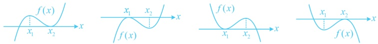
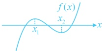
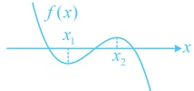

(iii)  $ f(x) $ 有三个零点  $ \Leftrightarrow f(x_1) \cdot f(x_2) < 0 $，如下图所示：

3. 对称中心：三次函数的图象一定是中心对称图形，对称中心是 $ \left(-\frac{b}{3a}, f\left(-\frac{b}{3a}\right)\right) $.

## 类型Ⅶ：综合大题

【例 12】（2019·新课标Ⅱ卷）已知函数  $ f(x)=\ln x-\frac{x+1}{x-1} $.

（1）讨论  $ f(x) $ 的单调性，并证明  $ f(x) $ 有且仅有两个零点；

（2）设 $ x_{0} $是 $ f(x) $的一个零点，证明曲线 $ y=\ln x $在点 $ A(x_{0},\ln x_{0}) $处的切线也是曲线 $ y=e^{x} $的切线.

解：（1）由题意， $ f(x) $的定义域为 $ (0,1)\cup(1,+\infty) $， $ f'(x)=\frac{1}{x}-\frac{x-1-(x+1)}{(x-1)^2}=\frac{1}{x}+\frac{2}{(x-1)^2}>0 $，

所以  $ f(x) $ 在  $ (0,1) $ 上单调递增，在  $ (1,+\infty) $ 上单调递增，

（要证明 $f(x)$ 有 2 个零点，需要取点，结合解析式中有 $\ln x$ 这一项，可考虑取 $e^{-2}$，$e^{-1}$，$e$，$e^2$ 这些点因为 $f(e^{-2})=-2-\frac{e^{-2}+1}{e^{-2}-1}=\frac{3-e^2}{e^2-1}<0$，$f(e^{-1})=-1-\frac{e^{-1}+1}{e^{-1}-1}=\frac{2}{e-1}>0$，所以 $f(x)$ 在 $(0,1)$ 上有一个零点，又 $f(e)=1-\frac{e+1}{e-1}=-\frac{2}{e-1}<0$，$f(e^2)=2-\frac{e^2+1}{e^2-1}=\frac{e^2-3}{e^2-1}>0$，所以 $f(x)$ 在 $(1,+\infty)$ 上有一个零点，综上所述，$f(x)$ 有且仅有两个零点

综上所述， $ f(x) $ 有且仅有两个零点.

（2）证法1：曲线  $ y = \ln x $ 在点  $ A(x_0, \ln x_0) $ 处的切线为  $ y - \ln x_0 = \frac{1}{x_0}(x - x_0) $，即  $ y = \frac{1}{x_0}x + \ln x_0 - 1 $，

（下面证明此直线与曲线  $ y = e^x $ 也相切，由于不知道切点，可先设切点）

设  $ P(x_1, e^{x_1}) $ 为曲线  $ y = e^x $ 上一点，则该曲线在点  $ P $ 处的切线为  $ y - e^{x_1} = e^{x_1}(x - x_1) $，即  $ y = e^{x_1}x + (1 - x_1)e^{x_1} $，

问题等价于证明存在实数  $ x_1 $，使得  $ \begin{cases} \frac{1}{x_0} = e^{x_1} \\ \ln x_0 - 1 = (1 - x_1)e^{x_1} \end{cases} $ ①，

（上述方程组中  $ x_0 $ 是  $ f(x) $ 的零点，是已知量，所以要解的其实是  $ x_1 $，可由①求出  $ x_1 $，再验证它满足②）由①可得  $ x_1 = -\ln x_0 $，代入②得  $ \ln x_0 - 1 = (1 + \ln x_0) \cdot \frac{1}{x_0} $，整理得： $ \ln x_0 - \frac{x_0 + 1}{x_0 - 1} = 0 $ ③，

结合  $ x_0 $ 是  $ f(x) $ 的一个零点可知式③成立，即存在实数  $ x_1 $ 使得  $ \begin{cases} \dfrac{1}{x_0} = e^{x_1} \\ \ln x_0 - 1 = (1 - x_1)e^{x_1} \end{cases} $ 成立，

所以曲线  $ y = \ln x $ 在点  $ A(x_{0}, \ln x_{0}) $ 处的切线也是曲线  $ y = e^{x} $ 的切线.

证法2：（先写出  $ y = \ln x $ 在点 A 处的切线方程，再来进一步分析）

证法2：（先写出  $ y = \ln x $ 在点 A 处的切线方程，再求进一步分析）

曲线  $ y = \ln x $ 在点  $ A(x_{0}, \ln x_{0}) $ 处的切线为  $ y - \ln x_{0} = \frac{1}{x_{0}}(x - x_{0}) $，即  $ y = \frac{1}{x_{0}}x + \ln x_{0} - 1 $ ④

（要证直线④与  $ y = e^x $ 也相切，我们自然会想，切点是谁？为了探究问题的答案，可设出切点  $ B(x_2, e^{x_2}) $，写出  $ y = e^x $ 在  $ B $ 处的切线方程，并与④比较，找到  $ x_2 $ 和  $ x_0 $ 的关系，从而得出切点就是下面的点  $ B $，上述探究的过程