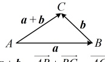
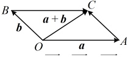
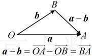
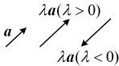

## 知识点2：空间向量的线性运算

### 1. 加、减运算的运算法则

<table border=1 style='margin: auto; word-wrap: break-word;'><tr><td colspan="2"></td><td style='text-align: center; word-wrap: break-word;'>语言表述</td><td style='text-align: center; word-wrap: break-word;'>图形表示</td></tr><tr><td rowspan="2">加法运算</td><td style='text-align: center; word-wrap: break-word;'>三角形法则</td><td style='text-align: center; word-wrap: break-word;'>设向量 b 的起点与向量 a 的终点重合（不重合时可通过平移使其重合），则  $ a+b $ 为 a 的起点指向 b 的终点的向量</td><td style='text-align: center; word-wrap: break-word;'>\n $ u+v=AD+BC=AC $</td></tr><tr><td style='text-align: center; word-wrap: break-word;'>平行四边形法则</td><td style='text-align: center; word-wrap: break-word;'>设向量 a 与 b 共起点 O（不共起点时可先平移至共起点），以两个向量的所在边为邻边作平行四边形，则  $ a+b $ 为该平行四边形一条对角线构成的向量（从 O 出发）</td><td style='text-align: center; word-wrap: break-word;'>\n $ a+b=OA+OB=OC $</td></tr><tr><td style='text-align: center; word-wrap: break-word;'>减法运算</td><td style='text-align: center; word-wrap: break-word;'>三角形法则</td><td style='text-align: center; word-wrap: break-word;'>设向量 a 与 b 共起点 O（不共起点时可先平移至共起点），则  $ a-b $ 为从 b 的终点指向 a 的终点的向量</td><td style='text-align: center; word-wrap: break-word;'></td></tr></table>

注：若首尾顺次相接的若干空间向量构成封闭图形，则它们的和为  $ \mathbf{0} $，即  $ \overrightarrow{A_1A_2} + \overrightarrow{A_2A_3} + \cdots + \overrightarrow{A_{n-1}A_n} + \overrightarrow{A_nA_1} = \mathbf{0} $。

2. 空间向量的数乘运算

<table border=1 style='margin: auto; word-wrap: break-word;'><tr><td style='text-align: center; word-wrap: break-word;'>定义</td><td colspan="3">与平面向量一样，实数  $ \lambda $ 与空间向量  $ a $ 的乘积  $ \lambda a $ 仍然是一个向量，我们把这称为空间向量的数乘</td></tr><tr><td rowspan="4">几何意义</td><td style='text-align: center; word-wrap: break-word;'>$ \lambda &gt; 0 $</td><td style='text-align: center; word-wrap: break-word;'>$ \lambda a $ 与向量  $ a $ 的方向相同</td><td rowspan="3"></td></tr><tr><td style='text-align: center; word-wrap: break-word;'>$ \lambda &lt; 0 $</td><td style='text-align: center; word-wrap: break-word;'>$ \lambda a $ 与向量  $ a $ 的方向相反</td></tr><tr><td style='text-align: center; word-wrap: break-word;'>$ \lambda = 0 $</td><td style='text-align: center; word-wrap: break-word;'>$ \lambda a = 0 $，方向是任意的</td></tr><tr><td colspan="3">$ \lambda a $ 的长度是  $ a $ 长度的  $ |\lambda| $ 倍</td></tr></table>

注：①与平面向量相同，实数与空间向量不能进行加法和减法运算.

②若 $ a=0 $，则 $ \lambda a=0 $；若 $ \lambda a=0 $，则 $ \lambda=0 $或 $ a=0 $。

3. 线性运算的运算律（下述  $ \lambda $， $ \mu $ 为实数）

法则， $ \overrightarrow{AB} + \overrightarrow{AD} = \overrightarrow{AC} $，

所以  $ \overrightarrow{AB} + \overrightarrow{AD} + \overrightarrow{CC_1} = \overrightarrow{AC} + \overrightarrow{CC_1} = \overrightarrow{AC_1} $。

<table border=1 style='margin: auto; word-wrap: break-word;'><tr><td style='text-align: center; word-wrap: break-word;'>交换律</td><td style='text-align: center; word-wrap: break-word;'>$ a + b = b + a $</td></tr><tr><td style='text-align: center; word-wrap: break-word;'>结合律</td><td style='text-align: center; word-wrap: break-word;'>$ (a + b) + c = a + (b + c) $,  $ \lambda(\mu a) = (\lambda \mu)a $</td></tr><tr><td style='text-align: center; word-wrap: break-word;'>分配律</td><td style='text-align: center; word-wrap: break-word;'>$ (\lambda + \mu)a = \lambda a + \mu a $,  $ \lambda(a + b) = \lambda a + \lambda b $</td></tr></table>

答案：C

【例3】如图，在四面体ABCD中，E是BC的中点， $ \overrightarrow{AE}=4\overrightarrow{AF} $，则（）

A.  $ \overrightarrow{DF} = \frac{1}{4}\overrightarrow{AB} + \frac{1}{4}\overrightarrow{AC} - \overrightarrow{AD} $

B.  $ \overrightarrow{DF} = \frac{1}{8}\overrightarrow{AB} + \frac{1}{8}\overrightarrow{AC} - \overrightarrow{AD} $

C.  $ \overrightarrow{DF} = -\frac{1}{4}\overrightarrow{AB} - \frac{1}{4}\overrightarrow{AC} + \overrightarrow{AD} $

D.  $ \overrightarrow{DF} = -\frac{1}{8}\overrightarrow{AB} - \frac{1}{8}\overrightarrow{AC} + \overrightarrow{AD} $

解析：结合选项可知，需要把$\overrightarrow{DF}$用$\overrightarrow{AB}$，$\overrightarrow{AC}$，$\overrightarrow{AD}$表示，观察图形可发现，由$D$到$F$，与上述三个向量关联较强的路径可以是$D\to A\to F$，由图可知$\overrightarrow{DF}=\overrightarrow{DA}+\overrightarrow{AF}=-\overrightarrow{AD}+\frac{1}{4}\overrightarrow{AE}$ ①，还需把$\overrightarrow{AE}$化掉，可结合$E$为$BC$中点来化，因为点$E$是$BC$的中点，所以$\overrightarrow{AE}=\frac{1}{2}(\overrightarrow{AB}+\overrightarrow{AC})$，代入①得$\overrightarrow{DF}=-\overrightarrow{AD}+\frac{1}{4}\times\frac{1}{2}(\overrightarrow{AB}+\overrightarrow{AC})$}}=\frac{1}{8}\overrightarrow{AB}+\frac{1}{8}\overrightarrow{AC}-\overrightarrow{AD}$。

答案：B

## 知识点3

【例4】（多选）下列说法中，正确的有（）

A. 设  $ \overrightarrow{a} $,  $ \overrightarrow{b} $,  $ \overrightarrow{c} $ 是空间向量，若  $ \overrightarrow{a} $ 与  $ \overrightarrow{b} $