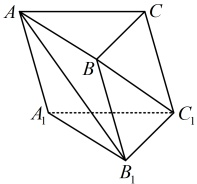

解析：所求为向量的夹角余弦，想到夹角余弦公式，下面先算  $ |\overrightarrow{OE}| $ 和  $ |\overrightarrow{BF}| $，

不妨设正四面体  $ OABC $ 的棱长为 2，则  $ |\overrightarrow{OE}| = |\overrightarrow{BF}| = \sqrt{3} $，

再算  $ \overrightarrow{OE} \cdot \overrightarrow{BF} $，直接用定义求此数量积不易，注意到  $ \overrightarrow{OA} $， $ \overrightarrow{OB} $， $ \overrightarrow{OC} $ 已知长度和两两夹角，故考虑先将  $ \overrightarrow{OE} $ 和  $ \overrightarrow{BF} $ 用它们表示，再计算  $ \overrightarrow{OE} \cdot \overrightarrow{BF} $，

由图可知， $ \overrightarrow{OE} = \frac{1}{2}\overrightarrow{OA} + \frac{1}{2}\overrightarrow{OB} $， $ \overrightarrow{BF} = \overrightarrow{BO} + \overrightarrow{OF} = -\overrightarrow{OB} + \frac{1}{2}\overrightarrow{OC} $，

所以  $ \overrightarrow{OE} \cdot \overrightarrow{BF} = \left( \frac{1}{2}\overrightarrow{OA} + \frac{1}{2}\overrightarrow{OB} \right) \cdot \left( -\overrightarrow{OB} + \frac{1}{2}\overrightarrow{OC} \right) = -\frac{1}{2}\overrightarrow{OA} \cdot \overrightarrow{OB} + \frac{1}{4}\overrightarrow{OA} \cdot \overrightarrow{OC} - \frac{1}{2}\overrightarrow{OB}^2 + \frac{1}{4}\overrightarrow{OB} \cdot \overrightarrow{OC} = -\frac{1}{2} \times 2 \times 2 \times \cos \frac{\pi}{3} + \frac{1}{4} \times 2 \times 2 \times \cos \frac{\pi}{3} - \frac{1}{2} \times 2^2 + \frac{1}{4} \times 2 \times 2 \times \cos \frac{\pi}{3} = -2 $，

故  $ \cos \langle \overrightarrow{OE}, \overrightarrow{BF} \rangle = \frac{\overrightarrow{OE} \cdot \overrightarrow{BF}}{|\overrightarrow{OE}| \cdot |\overrightarrow{BF}|} = \frac{-2}{\sqrt{3} \times \sqrt{3}} = -\frac{2}{3} $。

答案： $ -\frac{2}{3} $

【变式 2】如图，在三棱柱  $ ABC-A_1B_1C_1 $ 中，底面边长和侧棱长都相等，

 $ \angle BAA_1 = \angle CAA_1 = 60^\circ $，则直线  $ AB_1 $ 与  $ BC_1 $ 所成角的余弦值为（ ）

A.  $ \frac{\sqrt{3}}{3} $

B.  $ \frac{\sqrt{3}}{6} $

C.  $ \frac{\sqrt{6}}{6} $

D.  $ \frac{\sqrt{6}}{3} $

解析：能用向量法求  $ AB_1 $ 与  $ BC_1 $ 所成的角吗？可以想象， $ AB_1 $ 与  $ BC_1 $ 的夹角要么等于  $ AB_1 $ 与  $ BC_1 $ 所成的角  $ \theta $，

那么等于  $ \theta $ 的补角，于是必有  $ \cos \theta = |\cos \langle \overrightarrow{AB_1}, \overrightarrow{BC_1} \rangle| $，故可先用夹角余弦公式求  $ \cos \langle \overrightarrow{AB_1}, \overrightarrow{BC_1} \rangle $，

设三棱柱  $ ABC-A_1B_1C_1 $ 的所有棱长都为 2，则由题意， $ \overrightarrow{AA_1} $， $ \overrightarrow{AB} $， $ \overrightarrow{AC} $ 的长度都为 2，且两两夹角为  $ 60^\circ $，

由图可知， $ \overrightarrow{AB_1} = \overrightarrow{AA_1} + \overrightarrow{A_1B_1} = \overrightarrow{AA_1} + \overrightarrow{AB} $， $ \overrightarrow{BC_1} = \overrightarrow{BA} + \overrightarrow{AC} + \overrightarrow{CC_1} = -\overrightarrow{AB} + \overrightarrow{AC} + \overrightarrow{AA_1} $，

所以  $ \overrightarrow{AB_1} \cdot \overrightarrow{BC_1} = (\overrightarrow{AA_1} + \overrightarrow{AB}) \cdot (-\overrightarrow{AB} + \overrightarrow{AC} + \overrightarrow{AA_1}) = -\overrightarrow{AA_1} \cdot \overrightarrow{AB} + \overrightarrow{AA_1} \cdot \overrightarrow{AC} + \overrightarrow{AA_1}^2 - \overrightarrow{AB}^2 + \overrightarrow{AB} \cdot \overrightarrow{AC} + \overrightarrow{AB} \cdot \overrightarrow{AA_1} = \overrightarrow{AA_1} \cdot \overrightarrow{AC} + \overrightarrow{AA_1}^2 - \overrightarrow{AB}^2 + \overrightarrow{AB} \cdot \overrightarrow{AC} = 2 \times 2 \times \cos 60^\circ + 2^2 - 2^2 + 2 \times 2 \times \cos 60^\circ = 4 $，

因为  $ \overrightarrow{AB_1}^2 = (\overrightarrow{AA_1} + \overrightarrow{AB})^2 = \overrightarrow{AA_1}^2 + \overrightarrow{AB}^2 + 2\overrightarrow{AA_1} \cdot \overrightarrow{AB} = 2^2 + 2^2 + 2 \times 2 \times 2 \times \cos 60^\circ = 12 $，所以  $ |\overrightarrow{AB_1}| = 2\sqrt{3} $，

因为  $ \overrightarrow{BC_1}^2 = (-\overrightarrow{AB} + \overrightarrow{AC} + \overrightarrow{AA_1})^2 = \overrightarrow{AB}^2 + \overrightarrow{AC}^2 + \overrightarrow{AA_1}^2 - 2\overrightarrow{AB} \cdot \overrightarrow{AC} - 2\overrightarrow{AB} \cdot \overrightarrow{AA_1} + 2\overrightarrow{AC} \cdot \overrightarrow{AA_1} = 2^2 + 2^2 + 2^2 - 2 \times 2 \times 2 \times \cos 60^\circ - 2 \times 2 \times 2 \times \cos 60^\circ + 2 \times 2 \times 2 \times \cos 60^\circ = 8 $，所以  $ |\overrightarrow{BC_1}| = 2\sqrt{2} $，

设直线  $ AB_1 $ 与  $ BC_1 $ 所成的角为  $ \theta $，则  $ \cos \theta = |\cos \langle \overrightarrow{AB_1}, \overrightarrow{BC_1} \rangle| = \frac{|\overrightarrow{AB_1} \cdot \overrightarrow{BC_1}|}{|\overrightarrow{AB_1}| \cdot |\overrightarrow{BC_1}|} = \frac{4}{2\sqrt{3} \times 2\sqrt{2}} = \frac{\sqrt{6}}{6} $。

答案：C