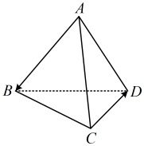
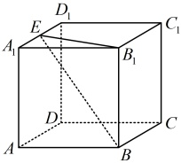
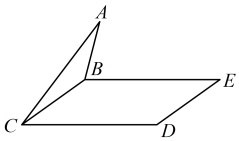

## B 组 强化能力

### 4. （2025·四川内江期末）

4.（2025·四川内江期末）

如图，已知三棱锥  $ A-BCD $ 的每条棱长都为 2，则  $ \overrightarrow{AB} \cdot \overrightarrow{CD} = $ （ ）

A.  $ 2\sqrt{3} $ B.  $ \sqrt{3} $ C. 2 D. 0

### 5. （2025·新疆博尔塔拉期末）

如图，在棱长为2的正方体  $ ABCD-A_{1}B_{1}C_{1}D_{1} $ 中，E 是棱  $ A_{1}D_{1} $ 的中点，则  $ \overrightarrow{EB_{1}}\cdot\overrightarrow{EB}= $ （ ）

A. 4

B. 5

C. 6

D.  $ 4\sqrt{2} $

6.（2025·山东菏泽期末）

如图，已知正三角形 ABC 和正方形 BCDE 的边长均为 2，且二面角 A-BC-D 的大小为  $ \frac{\pi}{3} $，则  $ \overrightarrow{AC} \cdot \overrightarrow{BD} = (\quad) $

A.  $ 2-\sqrt{3} $ B.  $ 2+\sqrt{3} $ C.  $ -2-\sqrt{3} $ D.  $ -2+\sqrt{3} $

