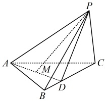

12\. （2025·浙江台州模拟）

如图，在三棱锥  $ P-ABC $ 中，若  $ AB = AC = 3 $， $ AP = 4 $， $ \angle BAC = \angle PAC = \angle BAP = 60^\circ $，点  $ D $ 为棱  $ BC $ 上一点，且  $ CD = 2BD $，点  $ M $ 为线段  $ AD $ 的中点。

（1）求PM的长；

（2）求异面直线PM与AC所成角的余弦值.

## 一 数·高中数学一本通

## C组 拓展提升

13\. (2025 · 安徽模拟)

已知  $ a $,  $ b $,  $ c $ 是空间中不共面的三个向量,  $ \overrightarrow{OA} $

 $ a - 2b + c $， $ \overrightarrow{OB} = pa + b + qc $， $ \overrightarrow{OC} = 2a + b - 2c $，若  $ O, A, B, C $ 共面，则  $ 3p + 5q = \underline{\quad} $.