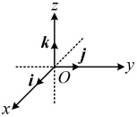
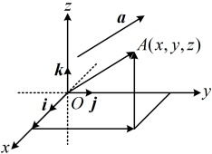
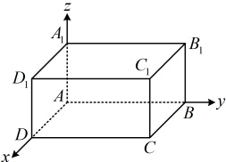

们都叫做坐标轴。这时我们就建立了一个空间直角坐标系 Oxyz，O 叫做原点，i，j，k 都叫做坐标向量，通过每两条坐标轴的平面叫做坐标平面，分别称为 Oxy 平面，Oyz 平面，Ozx 平面，它们把空间分成八个部分。

### 2. 空间直角坐标系的作法

画空间直角坐标系 Oxyz 时，一般使  $ \angle xOy = 135^\circ $（或  $ 45^\circ $）， $ \angle yOz = 90^\circ $。在空间直角坐标系中，让右手拇指指向 x 轴的正方向，食指指向 y 轴的正方向，如果中指指向 z 轴的正方向，则称这个坐标系为右手直角坐标系，一般使用的坐标系都是右手直角坐标系。

### 3. 空间点的坐标与空间向量的坐标

在空间直角坐标系 Oxyz 中，给定向量  $ \boldsymbol{a} $，如图，作  $ \overrightarrow{OA} = \boldsymbol{a} $，由空间向量基本定理，存在唯一的有序实数组  $ (x, y, z) $，使  $ \boldsymbol{a} = x\dot{\boldsymbol{i}} + y\dot{\boldsymbol{j}} + z\boldsymbol{k} $。

有序实数组 $ (x,y,z) $叫做a在空间直角坐标系Oxyz中的坐标，上式可简记作 $ \boldsymbol{a}=(x,y,z) $。 $ (x,y,z) $也称为点A的空间直角坐标，记作 $ A(x,y,z) $，其中x叫做点A的横坐标，y叫做点A的纵坐标，z叫做点A的竖坐标。

注：(x,y,z)既可以表示向量，也可以表示点，在书写时要注意表示向量时带有等号，如  $ \boldsymbol{a}=(1,0,-1) $，在表示点时不带等号，如  $ A(1,0,-1) $。

4. 空间中点的坐标的确定

①垂面法：过点A分别作垂直于x轴、y轴、z轴的平

## 知识点2

【例2】如图所示，以长方体 $ ABCD-A_{1}B_{1}C_{1}D_{1} $的顶点A为坐标原点，过A的三条棱所在的直线为坐标轴，建立空间直角坐标系.若AB=4，AD=3， $ AA_{1}=2 $，写出长方体各顶点的坐标.

解：（坐标轴上的点坐标最好写，故先写A，B，D， $ A_{1} $的坐标）

由图可知， $ A(0,0,0) $， $ B(0,4,0) $，

 $ D(3,0,0) $， $ A_{1}(0,0,2) $，

（坐标平面内的点的坐标也比较好写，于是

接下来写C， $ B_{1} $， $ D_{1} $的坐标）

由图可知， $ C(3,4,0) $， $ B_{1}(0,4,2) $， $ D_{1}(3,0,2) $，

（最后写 $ C_{1} $的坐标，可先找它在三条坐标

轴上的射影）由长方体的性质， $ C_{1} $ 在 x 轴、

y 轴、z 轴上的射影分别为 D，B， $ A_{1} $，

又  $ D(3,0,0) $， $ B(0,4,0) $， $ A_{1}(0,0,2) $，

所以  $ C_{1}(3,4,2) $.

【反思】找某个点的坐标时，初学时可先找该点在 x 轴、y 轴、z 轴上的射影，再由三个射影的坐标来确定该点的坐标。熟练之后，也可以先找该点在坐标平面 Oxy 上的射影，以本题为例，注意到  $ C_{1}C \perp $ 平面 ABCD，于是  $ C_{1} $ 和 C 的横坐标、纵坐标是一样的， $ C_{1} $ 的竖坐标即为  $ CC_{1} $ 的长，这样也能快速找到  $ C_{1} $ 的坐标.

【例3】若向量 $ \boldsymbol{a}=(1,2,-3) $，则a在坐标平面Oyz上的投影向量是（）

A.  $ (0,2,3) $ B.  $ (0,2,-3) $

C.  $ (1,2,0) $ D.  $ (1,2,-3) $

解析：直接求投影向量不易，可将向量的起点放到原点，通过寻找终点在平面 Oyz 上